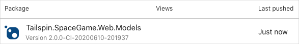

At this point, you have two pipelines. One publishes the Models package to Azure Artifacts, and one is for the _Space Game_ web app. The build configuration for the web app references the Models package so that it can access the model classes.

Here, you practice the process of updating the Models package and consuming that change from the web app.

To do that, you start by adding a property to one of the model classes, bumping the package version. Then, you submit the change to GitHub, so that the pipeline can build the package, and publish it to Microsoft Azure Artifacts.

You update the web app to reference the newer version number of the Models package, so that it can use the added property.

## Create a branch

Let's start by creating a branch to hold our work. Create a branch named `add-game-style`, which is based off the `master` branch.

At this point, you have two copies of Visual Studio Code open, one for the *Tailspin.SpaceGame.Web.Models* project and one for the _Space Game_ web app project, *Tailspin.SpaceGame.Web*. Here, you'll work from the copy for the *Tailspin.SpaceGame.Web.Models* project.

1. From Visual Studio Code, open the integrated terminal.
1. From the terminal, to create a branch named `add-game-style`, run the following `git checkout` command.

    ```bash
    git checkout -b add-game-style
    ```

## Add a property to the Models package

Add a property to one of the model classes, named `Score`, that provides the game style, or difficulty, the score is associated with.

Here, you'll work from the copy of Visual Studio Code for the **Tailspin.SpaceGame.Web.Models** project.

1. From Visual Studio Code, open *Tailspin.SpaceGame.Web.Models/Models/Score.cs*. Add the following highlighted property to the list of properties already there.

    [!code-csharp[](code/7-score-property.cs?highlight=23-25)]

    > [!NOTE]
    > You're making a change to a file in the project to demonstrate where you bump up the version number. However, we won't update the web app to use the new property.

1. Save the file.

1. To verify your work, build the project.

    ```bash
    dotnet build --configuration Release
    ```

    In practice, you might perform additional verification steps, such as running tests or testing the new package with an app that uses it.

## Build and publish the package

Now that you've added the new property to the `Score` class, and verified the project builds successfully, you can update the package's version. You can then push your change to GitHub so that Azure Pipelines can build and publish the updated package.

1. Open *azure-pipelines.yml*, and change the `majorVersion` from `1` to `2`, and save the file.

    ```yml
    majorVersion: '2'
    ```

    Here, we bump the version from 1.0.0 to 2.0.0 to make the change clear. In practice, you would follow the versioning scheme for the kind of package you're working with.

    For example, according to Semantic Versioning, bumping the major version to 2 tells others that the package is not backward compatible with apps that use version 1 of that package. Those who use the package would need to modify their app to adapt to any breaking changes.

    Popular open source projects provide documentation in the form of a _changelog_ that explains the changes made in each version, as well as how to migrate from one major version to the next.

1. Stage, commit, and push your changes.

    ```bash
    git add .
    git commit -m "Add GameStyle property"
    git push origin add-game-style
    ```

1. From Microsoft Azure Pipelines, go to the **Tailspin.SpaceGame.Web.Models** project, and watch the build run.

1. Open the **Artifacts** tab and note the new version. Don't worry. Your old version is still there for any projects that still reference it.

    

1. As you did previously, write down the new version for the next unit.

## Reference the new version of the Models package

Now, change the **Tailspin.SpaceGame.Web** project to use the new version of the **Tailspin.SpaceGame.Web.Models** package.

Here, you'll work from the copy of Visual Studio Code for the _Space Game_ web app project, **Tailspin.SpaceGame.Web**.

1. From Visual Studio Code, open **Tailspin.SpaceGame.Web.csproj**, and change `PackageReference` to the version number of the **Tailspin.SpaceGame.Web.Models** package you just created in Azure Artifacts. Then, save the file.

    Here's an example.

    ```xml
    <PackageReference Include="Tailspin.SpaceGame.Web.Models" Version="2.0.0-CI-20200610-201937" />
    ```

    If Visual Studio Code asks you to restore packages, you can safely ignore that message. For brevity, we won't build the web app locally.

1. From the terminal, stage, commit, and push the changes.

    ```bash
    git add .
    git commit -m "Bump Models package to 2.0.0"
    git push origin models-package
    ```

1. From Azure Pipelines, go to the **Tailspin.SpaceGame.Web** project, and watch the build run.

    You see from the build output that it gets the latest dependency, builds the app, and publishes the artifact for the web app.
