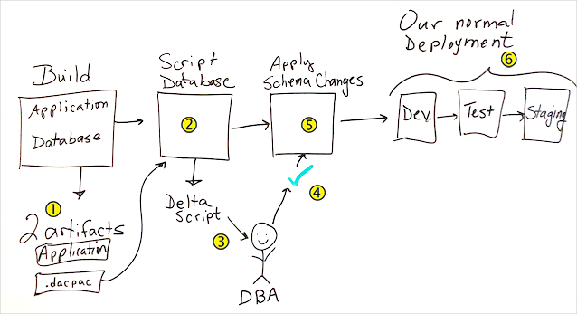

The team has decided it's time to connect their website to a live database. To coordinate the work, they need to work with the Tailspin DBA. The DBA is responsible for maintaining the integrity of the database. That person will work with the team to understand what they need and to design a schema. If the team later wants to change the schema, the DBA needs to approve the changes before they can take effect. 

Now that the team understands the benefits of automation, they want to make the approval process a part of their release pipeline.

In this section, you:

> [!div class="checklist"]
> * Choose a database technology for your application.
> * Learn how to configure Azure App Service to use a database connection string.
> * Understand the role of a SQL Server Data Tools project in Azure Pipelines.
> * Learn how to approve database schema changes in Azure Pipelines.

## The meeting

The team deploys their web app through a series of stages. In the _Dev_ stage, all of the development pieces come together. In the _Test_ stage, QA performs tests. In _Staging_, management can approve the app before it moves to production.

Here the team discusses how to add a database as the data storage solution for the web app. They plan to integrate the database and the web app in the _Dev_ stage.

**Andy:** Good morning. We've all seen how Azure Pipelines has accelerated our release process and improved the quality of what we do. Because we've made so much progress, we're ready to connect the website to a real database. I think this integration can happen as early as the _Dev_ stage. By connecting the website to the database early in the pipeline, we can track changes and measure performance all the way through the pipeline. Ultimately, we want the leaderboard to pull its data from the database. Here's what the leaderboard looks like now.

_Andy shows the_ Space Game _site that's running on Azure App Service._


**Andy:** After the database is in place, we can modify the website to read from the database instead of from local files. This setup is a significant milestone for us, so we need to discuss a few things. First, let's choose a database technology. We'll need to consider numerous things, so bear with me.

## Choose a database technology

When considering a data storage solution, you can choose from several options. The following factors can help you choose.

### The type of data you're storing

Data can be structured, semistructured, or unstructured:

* _Structured_ data is relational. It fits into the columns and rows of a table. For example, think of a point-of-sale system. You might have a table for product data whose columns define how you describe your products. For example, columns can be named **Product Name**, **SKU**, **Color**, and so on.

* _Unstructured_ data includes documents such as text files, photos, and videos. This data format is for quick access to an entire file and not for processing records.

* _Semistructured_ data is nonrelational. It fits into hierarchies by using tags. This format is good for data whose description might change. Your product data is semistructured if you can't use the same columns to describe all of your products the way you can with structured data. Usually, this data is stored in a JSON or XML file format.

### Your operational needs

As your team plans your operational needs, ask yourselves:

* Will we be doing basic lookups? Or do we need to join queries from multiple datasets?

    Basic lookups work with nonrelational data. Join queries require relational data.
* How often will the data change?

    Reporting data might change only at end of the month or quarterly. This kind of data could be a candidate for a data warehouse. If the data changes throughout the day, you need something that can handle fast transactional throughput.
* Do we always need the latest data?

    Perhaps the data changes often, but you need it only at the end of each month. Or perhaps you trade stock and need to fetch current data as quickly as possible.
* Do we need to run complex analytical queries?

    Complex analytical queries are queries that can be done on several dimensions. If you need to run this sort of query, a data warehouse is a good choice.
* How quickly do these operations need to finish?

    Do customers consume the data directly? If they do, the data operations need to be fast. Perhaps the data is used to run nightly reports. In this case, operations can run more slowly.

### Transactions

You need transactions when your data has relationships and those relationships keep the data in sync or help you to query the data. For example, let's say that you upgrade your gym membership to receive more privileges. Your account is updated to charge you more per month. But the corresponding update to your membership profile fails. This failure might cause you lose access to the privileges that you pay for. A transaction would ensure that both pieces of data are updated at the same time. If either update fails, the entire transaction is rolled back.

Your data might need one of these two types of transactions: 
* *Online Transaction Processing (OLTP)* is used for relational data. You would use OLTP to solve the problem in the preceding example. 

* *Online Analytical Processing (OLAP)* is used for more complex queries. For example, use OLAP when your data is in a structure called a *cube* or *data warehouse*. OLAP is for data analysis systems that query on many dimensions of data. For example, say you want to know how many blue widgets were sold in January of last year in the northeast region. You want to compare that number with how many green widgets were sold from May through June of this year in the southwest. You also want to know the top salespeople for widgets in each region.

> [!NOTE]
> At the end of this module, you'll find resources to help you choose a data storage option.

## The team's choice

Let's listen in on how the _Space Game_ web team decides which data storage option to use.

**Tim:** As we make our choice, we also need to consider geo-replication and backups. We had a good experience deploying the web application to Azure App Service. What are our options for running a database on Azure?

**Andy:** I know that Azure SQL Database is a popular way to work with structured data. Azure Cosmos DB works with both unstructured and semistructured data. We could also use Azure Blob storage to manage unstructured data, like images.

**Mara:** The _Space Game_ leaderboard data is relational. Profiles, scores, and achievements all relate to one another. The web application queries this data each time a user loads the home page, so quick retrieval of data is important. Those two qualities should help us narrow down our options.

**Amita:** The data changes constantly as people play the game. Players want to see their positions on the leaderboard as quickly as possible, before they get outranked by other players.

**Tim:** I've had a few conversations about Cosmos DB with our DBAs. They want to try it out. But I don't think we have time ramp up for this project. We know that our website uses relational data. We know that the overall shape of the data won't change much. And we know we need fast retrieval times. I think Azure SQL Database is the right choice.

**Mara:** That sounds good. I've used SQL Server Data Tools to create a database project. I'll add a database project to our *Tailspin.SpaceGame.Web* solution. The project will have the SQL scripts that we need to create the tables. We can use it to make sure that changes to the database schema in the project are checked against the current database schema.

**Andy:** Great. Adding the database project will be your action item. But now I have another question. If we create the database and connect to it from our website code, how do we keep the database connection string secure? I don't want to keep it in our *appsettings.json* file because that file will become part of our GitHub repository.

## Configure the web app to use a database connection string

The _Space Game_ web application currently reads leaderboard data from JSON files. The team plans to convert the application to read leaderboard data from a database.

Recall that the _Space Game_ web application uses ASP.NET Core and is written in C#. The source code defines the `IDocumentDBRepository` interface to fetch leaderboard data. The `LocalDocumentDBRepository` class implements `IDocumentDBRepository` to read from local JSON files.

Mara wants to update the code to read from a database instead of from files. So Mara creates another implementation of `IDocumentDBRepository` that connects to Azure SQL Database. This code gets the connection string from the website configuration.

  ```C#
    public class RemoteDBRepository : IDocumentDBRepository
    {
        private readonly IConfiguration configuration;
        private readonly string connectionString;

        public RemoteDBRepository(IConfiguration config)
        {
            configuration = config;
            connectionString = configuration.GetConnectionString("DefaultConnection");
        }
  ```

The connection string uses SQL Authentication, which includes the username and password. If Mara stores this information in plain text in *appsettings.json*, anyone who can access this file can read the username and password. Instead, Mara uses the Secret Manager tool in Visual Studio. The tool stores the string in a file that isn't maintained in source control. Let's listen in as she explains the decision to the team.

**Mara:** When we're developing the app locally, we can use a file that's named *secrets.json*. This file isn't pushed to GitHub. We set up the file in Visual Studio by using the Secret Manager tool. But when the deployed web app needs the username and password, they'll be in the Azure App Service *appsettings.json* file. App Service has strict limited permissions for who can see the file. We can provide the information to App Service through Azure Pipelines. So we won't need to add it to our local *appsettings.json* file.

**Andy:** Good idea, Mara. We're making progress.

**Tim:** Don't start celebrating yet. We need a plan for when the database schema changes. Mara mentioned that the schema might change. How do we make sure that the DBA is happy with the changes and that the changes happen at the right time?

In this short video, Abel Wang, Cloud Advocate at Microsoft, explains the concept of database changes in Azure Pipelines.

**Ask Abel**

> [!VIDEO https://channel9.msdn.com/Blogs/One-Dev-Minute/How-do-you-handle-databases-in-a-DevOps-world--One-Dev-Question/player?format=ny]

## The role of the SQL Server Data Tools database project in Azure Pipelines

SQL Server Data Tools, which runs on Windows, provides a project type that you can use to define a database schema from Visual Studio. This kind of project produces a _dacpac_ file. When you unpack the _dacpac_, you see the SQL scripts that create the database schema. For example, you might see a `CREATE TABLE` script for each table that the database project defines. SQL Database can unpack the _dacpac_ and apply the schema changes.


Let's go back to the team discussion and see how they plan to handle any changes to their database schema.

**Mara:** The SQL Server Data Tools project that I mentioned can help. It creates a file, called a _dacpac_, that contains the current schema. We use this file to deploy the schema. Let's see if Azure Pipelines can create a file that shows the differences between the current database schema and the changes that the _dacpac_ proposes. Then the DBA can look at the changes and approve them. We just got release approvals working. We'll try to take advantage of the release approvals to automate as much as possible.

Andy types on his laptop.

**Andy:** I found an Azure Pipelines task that we can use. The [SqlAzureDacpacDeployment@1](https://docs.microsoft.com/azure/devops/pipelines/tasks/deploy/sql-azure-dacpac-deployment?view=azure-devops&azure-portal=true) task generates a file that identifies the schema differences between the current database schema and the _dacpac_.

## Approve database schema changes in Azure Pipelines

After you create the database change file, you can use PowerShell to write its contents to the pipeline so that the DBA can see the changes. Here's an example:

```yml
- task: PowerShell@2
  displayName: Show auto-generated SQL Script - check for schema changes
  inputs:
    targetType: 'inline'
    script: |
      Write-Host "Auto Generated SQL Update Script:"
      Get-Content d:\a\1\s\GeneratedOutputFiles\$(databasename)_Script.sql | foreach {Write-Output $_}
```

You can use a manual approval to pause the pipeline at the stage where the changes happen, just as you did in the [Create a multistage pipeline by using Azure Pipelines](/learn/modules/create-multi-stage-pipeline?azure-portal=true) module. You create an Azure Pipelines environment that specifies the DBA as the approver. If the DBA approves the changes, the pipeline continues and the changes are applied to the database. If the DBA rejects the changes, the pipeline is paused. Then you can discuss the proposed change with the DBA and plan another approach.

Let's listen in on the team's discussion.

**Tim:** I can create a PowerShell script that reads the database change file. The script provides the file's contents so that the DBA can review and approve the changes.

**Andy:** After the change is approved, we use `SqlAzureDacpacDeployment@1` again to apply the changes.

**Mara:** That's a good place to start.

## The plan

**Andy:** So if we all agree, here's the plan.

Andy moves to the whiteboard and sketches out the plan.



**Andy:** Here's what we need to build. First we add a job to the _Build_ stage to build the database project.  This job produces a _.dacpac_ file that we treat as a build artifact.

We then add a stage that  scripts the database changes. The  DBA uses the script output to verify the changes before they're applied.

We add an  approval to another stage. The approval  applies the database changes. Then we  deploy to _Dev_, _Test_, and _Staging_ just like we did before.

**Tim:** I'll get started on the PowerShell script.

**Mara:** I'll make the database project and update the website to use the database.

**Andy:** I'll get with our DBA to set up the database. But first, more coffee.
