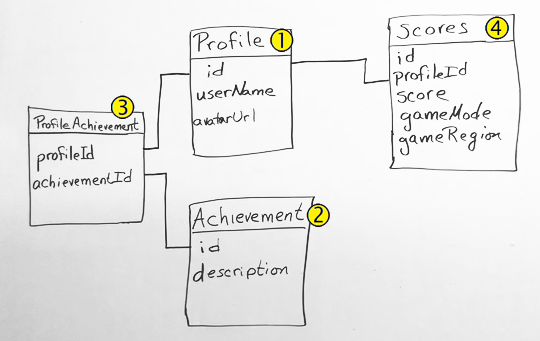

In this part, you bring up Azure SQL Database and populate your database with sample data. To verify the setup, you run queries against your database from the Azure portal.

Mara has created a whiteboard drawing of the database tables and the relationships between them.



The **Profiles** table  contains information about the player. Notice the *id* column. This field identifies the players and finds their related data. The **Achievements** table  holds all of the possible achievements for this game.

**Profiles** have a many-to-many relationship with achievements. That is, many profiles can have many achievements, and many achievements can be in many profiles.

We need a table to define the specific profile and achievement relationship. This relationship table is the **ProfileAchievements** table . Notice that the *profileId* relates to the *id* in the **Profiles** table. Similarly, the *achievementsId* relates to the *id* in the **Achievements** table.

The **Scores** table  holds score information for each player. This table relates to the **Profiles** table through the *profileId* column.

For learning purposes, here you bring up one instance of Azure SQL Database. The instance is connected to each App Service environment for the _Dev_, _Test_, and _Staging_ stages. In practice, you might associate a separate database instance with each environment. As you move toward _Staging_, instead of working with a small set of fictitious data, you might start working with a full copy of the real data that you run in production.

> [!IMPORTANT]
> You need your own Azure subscription to complete the exercises in this module.

Azure SQL Database can create a populated SQL database by using a file called a _bacpac_. This file can contain the database schema as well as data. The _bacpac_ file differs from the _dacpac_ file that we mentioned earlier. The _dacpac_ file contains only schema information.

Mara gives the team a *bacpac* file. They'll use the file to create the populated database. Then they'll test the changes to the application locally by using the SQL database that they created.

In the next section, follow along with Andy, Mara, and Tim as they create the database.

> [!NOTE]
> In this section, you bring up Azure SQL Database. You verify that it contains sample data through the Azure portal because the portal is a great way to explore Azure services. In a future learning path, you'll learn how to automate the process.

## Get the bacpac file and upload the file to Azure Storage

Mara creates the development database and populates it with test data. She exports this database for you. The export is in a file format called *bacpac*. The *bacpac* format includes the database schema and the data. After you get this file, put it in Azure Blob storage so that SQL Server can use it to create a database.

> [!NOTE]
> If you haven't worked with Azure Blob storage, just follow along. We'll point you to more resources at the end of this module.

1. Download the [bacpac file](https://sqldbtutorial.blob.core.windows.net/bacpacs/tailspindatabase.bacpac?azure-portal=true) to your computer.

    You'll upload this file to your storage account later.
1. Go to the [Azure portal](https://portal.azure.com?azure-portal=true). 1. On the top left, select **+ Create a resource**.
1. Type **Storage accounts** in the *Search the Marketplace* box.
1. You see this. Select **Create**.

    :::image type="content" source="../media/3-create-storage-account.png" alt-text="A screenshot of the storage account page highlighting the create button.":::

1. On the **Basics** tab, fill in these fields:

    | Property  | Value  |
    |---|---|
    | Subscription | Enter your subscription. |
    | Resource Group | Select **Create new** and name the group *tailspin-space-game-rg*. |
    | Storage account name | This name must be unique across Azure. We suggest using something like *spacegamedbstorageNNN*, where *NNN* is a random number. |
    | Location | Choose a location near you that supports this kind of resource. |

   You can leave the rest of the default values unchanged.

1. Select **Review + create** > **Create**.
1. Wait for the storage account to be created and then select **Go to resource**.
1. Select **containers**.

    :::image type="content" source="../media/3-select-containers.png" alt-text="A screenshot of the storage account page with containers highlighted.":::

1. On the **Containers** page, select **+ Container**.
1. In the **Name** field, enter *bacpac* and select **Create**.
1. Select the **bacpac** container.
1. On the **bacpac** page, select **Upload**.
1. Upload the *tailspindatabase.bacpac* file that you downloaded earlier.

## Create the SQL Server logical instance and the database

Here you create the SQL Server that holds your new database.

1. In the Azure portal, on the left, select **+ Create a Resource**.
1. In the search bar, enter *SQL server (logical server)*.
1. On the **SQL server (logical server)** page, select **Create**.
1. On the **Basics** tab, fill in these fields:

    | Property  | Value  |
    |---|---|
    | Subscription | Enter your subscription. |
    | Resource Group | Enter *tailspin-space-game-rg*. |
    | Server name | Enter *tailspin-space-game-sql-NNN*, where *NNN* is a random number. |
    | Server admin login | Enter *azuresql*. |
    | Password | Enter a password that meets the requirements. Don't use dollar signs ($) in the password.|
    | Confirm password | Enter the same password. |

1. Select **Review + create** > **Create**.
1. After the server is created, select **Go to resource**.
1. On the right side of the overview page, select **Show firewall and virtual networks**.
1. On the firewall settings page, make sure that **Allow Azure services and resources to access this server** is switched to **Yes**. Select **Save** > **OK**.

    Azure creates the tables and inserts the data that you need.

## Populate your database

Here you import the *bacpac* file that you uploaded to Blob storage. You import this file to SQL Server.

1. On the menu on the left, select **Overview** to go back to your **SQL server** overview page.
1. Select **Import database**.

   

1. On the **Import database** page, select your subscription and then select **Storage - Configure required settings**.

    

1. On your **Storage accounts** page, select **spacegamedbstorageNNN**, where *NNN* is your number.
1. On the **Containers** page, select **bacpac**.
1. Highlight the **tailspindatabase.bacpac** file and then choose **Select**.
1. On the **Import database** page, for the admin username, enter *azuresql*. Enter the password that you used to set up the SQL Server instance.
1. Select **OK** and wait for the operation to finish.

## Set a firewall rule

Before you explore your database, you need to set a firewall rule that permits database access from your local machine.

1. In the Azure portal, on the left, select **SQL databases**.
1. Choose **tailspindatabase**.
1. At the top of the **tailspindatabase** page, select **Set server firewall**.

    Select **+ Add Client IP**.
1. Save the new rule.

1. Ensure that **Allow Azure services and resources to access this server** is set to **Yes**.
1. At the top, select **Save** > **OK**.

## Explore the database

Now that you've set the firewall rule, you can run queries against your database from the Azure portal. Here you run a query to verify that your *bacpac* file was imported successfully.

The database contains four tables:

* **dbo.Profiles**
* **dbo.Scores**
* **dbo.Achievements**
* **dbo.ProfileAchievements**

The _Space Game_ web application reads from these tables to get the latest leaderboard data.

1. Navigate back to the **tailspindatabase** dashboard. You can use the breadcrumb bar at the top.
1. From the menu on the left, select **Query editor**.
1. For the admin username, enter *azuresql*. Also enter your password. Then select **OK**.

    > [!NOTE]
    > If you get an error message that contains an IP address:
    >
    > 1. Copy the IP address to your clipboard.
    > 1. Select the link in the error message to return to the firewall rules.
    > 1. In the **LocalIP** firewall rule, update the IP addresses with the contents of the clipboard.
    > 1. Select **Save**, and then select **OK**.
    >

1. Expand **Tables** and then expand each table. You see four tables: **dbo.Profiles**, **dbo.Scores**, **dbo.Achievements**, and **dbo.ProfileAchievements**. You also see the columns and keys for each table.

    

1. In the **Query 1** pane, enter the following SQL statement. Then select **Run**.

    ```sql
    SELECT * FROM [dbo].[Profiles]
    ```

    This statement retrieves data from the **Profiles** table. The **Results** window displays the first 20 rows.

    

1. Change the query as follows. Then select **Run**.

    ```SQL
    SELECT * FROM [dbo].[Scores]
    ```

    This time you see the scores in the **Results** window. There are 25 rows. Notice that the **Score** entry is related to the profile by the **profileID**. This ID is from the **Profiles** table.
1. Change the query as follows. Then select **Run**.

    ```SQL
    SELECT * FROM [dbo].[Achievements]
    ```

    This time you see the list of possible achievements in the **Results** window. There are 10 rows. Notice that the achievements aren't related to any profile. They're not related because profiles and achievements have a many-to-many relationship. A profile can have many achievements, and an achievement can show up on many profiles. To relate the right achievements with the right profiles, you need a **ProfileAchievements** table.
1. Change the query as follows. Then select **Run**.

    ```SQL
    SELECT * FROM [dbo].[ProfileAchievements]
    ```

    Each row correlates the **Profile** ID with the **Achievement** ID.
