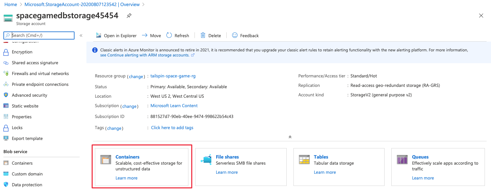

In this part, you bring up Azure SQL Database and populate your database with sample data. To verify the setup, you then run a few queries against your database from the Azure portal.

Mara has created a whiteboard drawing of the database tables and the relationships between them.


The Profiles table  contains information about the player. Notice the *id* column. This field is how we can identify the player and find their related data. The Achievements table  holds all of the possible achievements for this game. Since there is a many-to-many relationship between Profiles and Achievements, meaning many profiles can have many achievements and many achievements can be in many profiles, we need a table to define the specific profile and achievement relationship. This relationship table is the ProfileAchievements table . Notice the *profileId* relates to the *id* in the Profiles table and the *achievementsId* relates to the *id* in the Achievements table. Lastly, there is the Scores table . This table holds the score information for each player and is related to the Profiles table through the *profileId* column.

For learning purposes, here you bring up one instance of Azure SQL Database that is connected to the App Service environment for each of the _Dev_, _Test_, and _Staging_ stages. In practice, you might associate a separate database instance with each environment. As you move towards _Staging_, you might switch from working with a small set of fictitious data to working with a full copy of the real data you're running in production.

> [!IMPORTANT]
> Remember that you need your own Azure subscription to complete the exercises in this module.

Azure SQL Database can create a SQL Database including data using a file called a _bacpac_. This file can contain the database schema as well as data. This file differs from the _dacpac_ file that we mentioned earlier. The _dacpac_ file contains only schema information.

Mara has given the team a *bacpac* file so that they can create the database with data in it. After that, they want to test the changes to the application locally using the SQL Database they created.

Here, you follow along with Andy, Mara, and Tim as they create the database.

> [!NOTE]
> In this section, you bring up Azure SQL Database and verify that it contains sample data through the Azure portal because it's a great way to explore Azure services. In a future learning path, you'll learn how to automate the process.

## Get the bacpac file and upload the file to Azure storage

Mara has created the development database with test data in it. She exported this database for you to use. The export is in a file format called *.bacpac*. This format has the database schema and the data. You need to get this file and put it in blob storage on Azure so SQL Server can create a database from it.

> [!NOTE]
> If you haven't worked with blob storage on Azure, just follow along. We'll point you to more resources at the end of this module.

1. Download the [bacpac file](https://sqldbtutorial.blob.core.windows.net/bacpacs/tailspindatabase.bacpac?azure-portal=true) to your computer.

    You'll need to upload this file to your storage account later.
1. Go to the [Azure portal](https://portal.azure.com?azure-portal=true). Then select **Storage accounts** on the left.
1. On the **Storage accounts** page, select **+ Add**.
1. Under the **Basics** tab, fill in these fields:

    | Property  | Value  |
    |---|---|
    | Subscription | < your subscription > |
    | Resource Group | Select **Create new** and name it **tailspin-space-game-rg**. |
    | Storage account name | This must have a unique name across Azure. We suggest using something like **spacegamedbstorageNNN**, where *NNN* is a random number. |
    | Location | Choose a location near you that supports this kind of resource. |

   You can leave the rest as the default values.

1. Select **Review and create**. Then select **Create**.
1. Wait for the storage account to be created and select **Go to resource**.
1. Under **Services**, select **containers**.

1. On the **Containers** page, select **+ Container**.
1. In the **Name** field, enter **bacpac** and select **OK**.
1. Select the **bacpac** container.
1. On the **bacpac** page, select **Upload**.
1. Upload the *tailspindatabase.bacpac* file that you downloaded earlier.

## Create the SQL Server logical instance and the database

Here you create the SQL Server that holds your new database.

1. From the Azure portal, on the left, select **+ Create a Resource**.
1. In the search bar, enter **SQL server (logical server)**.
1. On the **SQL server (logical server)** page, select **Create**.
1. Under the **Basics** tab, fill in these fields:

    | Property  | Value  |
    |---|---|
    | Subscription | < your subscription > |
    | Resource Group | **tailspin-space-game-rg** |
    | Server name | **tailspin-space-game-sql-NNN**, where *NNN* is a random number. |
    | Server admin login | **azuresql** |
    | Password | Enter a password that meets the requirements. Do not use dollar signs in the password.|
    | Confirm password | Enter the same password. |

1. Select **Review + create**, then select **Create**.
1. After the server is created, select **Go to resource**.
1. On the right side of the overview page, select **Show firewall settings**.
1. On the firewall settings page, make sure the switch to **Allow Azure services and resources to access this server** is **on** and select **Save** and then select **OK**.

    This enables Azure to create the tables and insert the data that you need.

## Populate your database

Here, you import the *bacpac* file that you uploaded to blob storage to SQL Server.

1. Select **Overview** from the menu on the left to go back to your **SQL server** overview page.
1. Select **Import database**.

1. On the *Import database* page, select your subscription and then select **Storage - Configure required settings**.

    
1. On your **Storage accounts** page select **spacegamedbstorageNNN**, where **NNN** is your number.
1. On the **Containers** page, select **bacpac**.
1. Highlight the **tailspindatabase.bacpac** file and then choose **Select**.
1. Back on the **Import database** page, enter **azuresql** for the admin username and the password you used to set up the SQL Server instance.
1. Select **OK** and wait for the operation to finish.

## Set a firewall rule

Before you can explore your database, you need to set a firewall rule that permits access access to the database from your local machine.

1. From the Azure portal, on the left, select **SQL databases**.
1. Choose the **tailspindatabase**.
1. At the top of the **tailspindatabase** page, select **Set server firewall**.

    Your current IP address is printed next to **Client IP address**. For example, **123.12.123.123**.
1. Enter the following rule:

    | Property  | Value  |
    |---|---|
    | Rule name| LocalIP |
    | Start IP | Your IP address. Change the last octet to `0`. For example, 123.12.123.**0** |
    | End IP | Your IP address. Change the last octet to `255`. For example, 123.12.123.**255** |

1. Ensure that **Allow Azure services and resources to access this server** is set to **On**.
1. Select **Save** at the top and then select **OK**.

## Explore the database

Now that you've set the firewall rule, you can run queries against your database from the Azure portal. Here you do that to verify that your *bacpac* file was imported successfully.

The database contains four tables: **dbo.Profile**, **dbo.Scores**, **dbo.Achievements**, and **dbo.ProfileAchievements**. The _Space Game_ web application reads from these tables to get the latest leaderboard data.

1. Navigate back to the **tailspindatabase** dashboard. You can use the breadcrumb bar at the top to back up.
1. Select **Query editor** from the menu on the left.
1. Enter **azuresql** for the admin username and your password for the password. Then select **OK**.

    > [!NOTE]
    > If you get an error message that contains an IP address, copy that IP address to your clipboard. Then click the link in the error message to return to the firewall rules. Update the IP addresses in the **LocalIP** firewall rule with the contents of the clipboard.
    > Then click **Save** and then **OK**.
    > Then repeat this step.
1. Expand **Tables**, and then expand each table in turn. You see four tables, **dbo.Profiles**, **dbo.Scores**, **dbo.Achievements**, and **dbo.ProfileAchievements**, together with the columns and keys for each table.

    

1. In the **Query 1** pane, enter the following SQL statement, and then select **Run**.

    ```sql
    SELECT * FROM [dbo].[Profiles]
    ```

    This statement retrieves the data from the **Profiles** table. The results window displays the first 20 rows.

    

1. Change the query as follows, and then select **Run**.

    ```SQL
    SELECT * FROM [dbo].[Scores]
    ```

    This time you see the scores in the **Results** window. There are 25 rows. Notice that the Score entry is related to the Profile by the profileID. This profileId is the id from the Profile table.
1. Change the query as follows, and then select **Run**.

    ```SQL
    SELECT * FROM [dbo].[Achievements]
    ```

    This time you see the list of possible Achievements in the **Results** window. There are 10 rows. Notice that they are not related to any profile. This is because profiles and achievements have a many-to-many relationship. This means a profile can have many achievements, and an achievement can show up on many profiles. To get the right achievements with the right profiles, a ProfileAchievements table relates them.
1. Change the query as follows, and then select **Run**.

    ```SQL
    SELECT * FROM [dbo].[ProfileAchievements]
    ```

    Each row is a correlation of the Profile Id and the Achievement Id.
