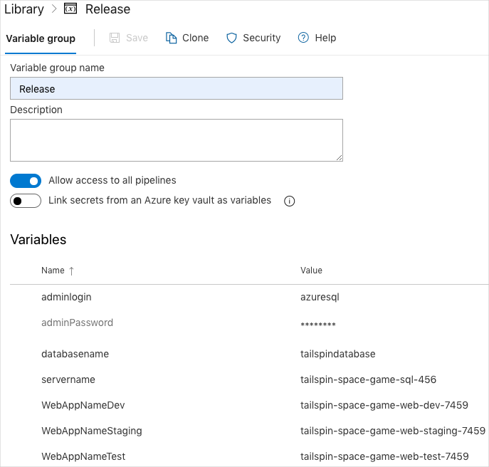
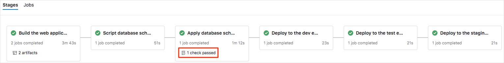

At this point, the team's pipeline has four stages. The first stage produces the build artifact and the second stage deploys the _Space Game_ web application to App Service in the _dev_ environment. The third and fourth stages deploy the _Space Game_ web application to the _test_ and _staging_ environments. We have taken out the triggers and approvals from the previous module to concentrate on just this section of the pipeline.

Here, you follow along with Andy, Mara, and Tim as they modify the pipeline to add stages that will script the database changes for the DBA, and apply those changes after they are approved.

## Create the Azure App Service environments

In [Create a release management workflow with Azure Pipelines](/learn/modules/create-a-release-management-workflow?azure-portal=true), you created one App Service instance that corresponds to each of the _dev_, _test_, and _staging_ environments. There you worked through it step by step. Here, you use the Azure command-line interface (CLI) through Azure Cloud Shell to create them all in one step.

### Bring up Cloud Shell through the Azure portal

1. Go to the [Azure portal](https://portal.azure.com?azure-portal=true) and sign in.
1. From the menu bar, select Cloud Shell. Make sure to select **Bash** from the drop-down menu at the upper left of the cloud shell.

    

    > [!NOTE]
    > Cloud Shell requires an Azure storage resource to persist any files you create while working in Cloud Shell. On first launch, Cloud Shell prompts to create a resource group, storage account, and Azure Files share on your behalf. This is a one-time step and will be automatically attached for all future Cloud Shell sessions.

### Select an Azure region

To make the commands easier to run, start by selecting a default region. After you specify the default region, later commands use that region unless you specify a different region.

1. Run `az configure` to set your default region. Replace **\<REGION>** with the name of the region you chose for your database.

    ```azurecli
    az configure --defaults location=<REGION>
    ```

    Here's an example that sets **westus2** as the default region.

    ```azurecli
    az configure --defaults location=westus2
    ```

### Create the App Service instances

Here, you create the App Service instances for the three stages you'll deploy to: _Dev_, _Test_, and _Staging_.

To do so, you:

> [!div class="checklist"]
> * Generate a random number that makes your web app's domain name unique.
> * Create an App Service plan.
> * Create the App Service instances, one for each of the _dev_, _test_, and _staging_ environments.
> * Set an Application Configuration key/value pair to store the connection string to the database.
> * Get the hostname for each of your environments.
> * Verify that each environment is running and that the home page is accessible.

1. From Cloud Shell, generate a random number that makes your web app's domain name unique

    ```bash
    webappsuffix=$RANDOM
    ```

1. Run the following `az appservice plan create` command to create an app service plan that's named **tailspin-space-game-asp**.

    ```azurecli
    az appservice plan create \
      --name tailspin-space-game-asp \
      --resource-group tailspin-space-game-rg \
      --sku B1
    ```

    The `--sku` argument specifies the **B1** plan, which runs on the **Basic** tier.

    > [!IMPORTANT]
    > If the **B1** SKU is not available as part of your Azure subscription, [choose a different plan](https://azure.microsoft.com/pricing/details/app-service/linux/), such as **S1** (**Standard**).

1. Run the following `az webapp create` commands to create the three App Service instances, one for each of the _dev_, _test_, and _staging_ environments.

    ```azurecli
    az webapp create \
      --name tailspin-space-game-web-dev-$webappsuffix \
      --resource-group tailspin-space-game-rg \
      --plan tailspin-space-game-asp

    az webapp create \
      --name tailspin-space-game-web-test-$webappsuffix \
      --resource-group tailspin-space-game-rg \
      --plan tailspin-space-game-asp

    az webapp create \
      --name tailspin-space-game-web-staging-$webappsuffix \
      --resource-group tailspin-space-game-rg \
      --plan tailspin-space-game-asp
    ```

1. Run the following `az webapp list` command to list the hostname and state of each App Service instance.

    ```azurecli
    az webapp list \
      --resource-group tailspin-space-game-rg \
      --query "[].{hostName: defaultHostName, state: state}" \
      --output table
    ```

    Note the hostname for each running service. You'll need these hostnames to set the connection string to the database later when you verify your work. Here's an example:

    ```output
    HostName                                                 State
    -------------------------------------------------------  -------
    tailspin-space-game-web-dev-21017.azurewebsites.net      Running
    tailspin-space-game-web-test-21017.azurewebsites.net     Running
    tailspin-space-game-web-staging-21017.azurewebsites.net  Running
    ```

### Configure the App Service to use the connection string

1. In Cloud Shell, create a Bash variable that specifies your connection string. Replace `{your_connection_string}` with your connection string.

    ```bash
    DB_CONNECTION_STRING="{your_connection_string}"
    ```

    This is similar to what you did in the previous part, where you ran the application locally.

    Here's a complete example:

    ```bash
    DB_CONNECTION_STRING="Server=tcp:tailspin-space-game-sql-333.database.windows.net,1433;Initial Catalog=tailspindatabase;Persist Security Info=False;User ID=azuresql;Password=MyPassword1234;MultipleActiveResultSets=False;Encrypt=True;TrustServerCertificate=False;Connection Timeout=30;"
    ```

1. Run the `az webapp config connection-string set` command three times to configure the connection string to the database in each App Service environment.

    ```azurecli
    az webapp config connection-string set \
      --name tailspin-space-game-web-dev-$webappsuffix \
      --resource-group tailspin-space-game-rg \
      --settings "DefaultConnection=$DB_CONNECTION_STRING" \
      --connection-string-type SQLAzure

    az webapp config connection-string set \
      --name tailspin-space-game-web-test-$webappsuffix \
      --resource-group tailspin-space-game-rg \
      --settings "DefaultConnection=$DB_CONNECTION_STRING" \
      --connection-string-type SQLAzure

    az webapp config connection-string set \
      --name tailspin-space-game-web-staging-$webappsuffix \
      --resource-group tailspin-space-game-rg \
      --settings "DefaultConnection=$DB_CONNECTION_STRING" \
      --connection-string-type SQLAzure
    ```

    This creates an application setting called **DefaultConnection** that the application uses to connect to the database. This enables you to use the connection string without having to set it in the *appsettings.json* file, which would reveal your credentials in plain text in source control. Anyone with read access to App Service can read this configuration file. You will normally set permissions on App Service to restrict who has read access.

> [!IMPORTANT]
> Remember, the [Clean up your Azure DevOps environment](/learn/modules/manage-database-changes-in-azure-pipelines/8-clean-up-environment?azure-portal=true) page in this module contains important cleanup steps. Cleaning up helps ensure that you're not charged for Azure resources after you complete this module. Be sure to perform the cleanup steps even if you don't complete this module.

## Create a service connection

Here, you create a service connection that enables Azure Pipelines to access your Azure subscription. Azure Pipelines uses this service connection to deploy the website to App Service. You created a similar service connection in the previous module.

> [!IMPORTANT]
> Make sure that you're signed in to both the Azure portal and Azure DevOps under the same Microsoft account.

1. In Azure DevOps, go to your **Space Game - web - Database** project.
1. Select **Project settings** from the bottom corner of the page.
1. Under **Pipelines**, select **Service connections**.
1. Select **New service connection**, then choose **Azure Resource Manager**, then select **Next**.
1. Select **Service principal (automatic)**, then select **Next**.
1. Fill in these fields:

    | Field               | Value                                        |
    |---------------------|----------------------------------------------|
    | Scope level     | **Subscription**                             |
    | Subscription    | Your Azure subscription                      |
    | Resource Group  | **tailspin-space-game-rg**                   |
    | Service connection name | *Resource Manager - Tailspin - Space Game* |

    During the process, you might be prompted to sign in to your Microsoft account.

1. Select **Save**.

    Azure DevOps performs a test connection to verify that it can connect to your Azure subscription. If Azure DevOps is unable to connect, you'll have the chance to sign in a second time.

## Create pipeline variables in Azure Pipelines

In [Create a release pipeline with Azure Pipelines](/learn/modules/create-release-pipeline?azure-portal=true), you added a variable to your pipeline that stores the name of your web app in App Service. Here, you do the same. However, this time, you add one variable for each of the App Service instances that corresponds to the _Dev_, _Test_, and _Staging_ stages in your pipeline.

You will also need to create variables for the username and password for your Azure SQL instance. The pipeline will need this to make schema changes on your behalf.

To add the variable:

1. In Azure DevOps, go to your **Space Game - web - Database** project.
1. Under **Pipelines**, select **Library**.

    
1. Select **+ Variable group**.
1. Under **Properties**, enter **Release** for the variable group name.
1. Under **Variables**, select **+ Add**.
1. Add the **WebAppNameDev**, **WebAppNameTest**, and **WebAppNameStaging** variables. Each value corresponds to the name of the App Service environment. This table shows some examples:

    | Variable name         | Example value                            |
    |-----------------------|------------------------------------------|
    | **WebAppNameDev**     | **tailspin-space-game-web-dev-1234**    |
    | **WebAppNameTest**    | **tailspin-space-game-web-test-1234**    |
    | **WebAppNameStaging** | **tailspin-space-game-web-staging-1234** |

    > [!IMPORTANT]
    > Make sure you set the name of the App Service instance, and not its hostname. In this example, you would enter **tailspin-space-game-web-dev-1234** and not **tailspin-space-game-web-dev-1234.azurewebsites.net**.

1. Add these pipeline pipeline variables.

    | Variable name         | Example value                            |
    |-----------------------|------------------------------------------|
    | **adminlogin**        | **azuresql** |
    | **adminPassword**     | The password you assigned when you created the SQL server instance |
    | **servername**        | **tailspin-space-game-sql-333** (Yours should specify your server name)  |
    | **databasename**      | **tailspindatabase**  |

1. Select the lock icon next to your value for **adminPassword**. This encrypts its value so that it is not shown when the pipeline runs.

1. Select **Save** near the top of the page to save your variables to the pipeline.

    Your variable group resembles this one:

    > 

## Add the database stage to the pipeline

Here you add the Azure Pipelines stage that checks for SQL Database schema changes so the DBA can approve or edit the proposed changes. In this exercise, there won't be any schema changes. You do that in the next exercise.

1. Open the *azure-pipelines.yml* file from the `database` branch.
1. Copy the new pipeline below and replace the code that is already in the *azure-pipelines.yml* file.

    [!code-yml[](code/azure-pipelines1.yml?highlight=65-161,165)]

    This pipeline adds a new build job for the *Tailspin.SpaceGame.Database* project. This will result in a *.dacpac* file being created that contains information about the database schema. That *.dacpac* file will be copied to a staging directory in the pipeline and then published as an artifact called **dropDacpac**.

    ```yml
    - task: VSBuild@1
      displayName: 'Build the database project'
      inputs:
        project: Tailspin.SpaceGame.Database/Tailspin.SpaceGame.Database.sqlproj

    - task: CopyFiles@2
      displayName: 'Copy dacpac file to staging directory'
      inputs:
        contents: |
          Tailspin.SpaceGame.Database/bin/**/*.dacpac
        targetFolder: '$(Build.StagingDirectory)'

    - task: PublishBuildArtifacts@1
      displayName: 'Publish Artifact'
      inputs:
        pathToPublish: '$(Build.ArtifactStagingDirectory)'
        artifactName: dropDacpac
      condition: succeededOrFailed()
    ```

    The new stages are `DBAVerificationScript` and `DBAVerificationApply`.

    The `DBAVerificationScript` stage will read the *.dacpac* file and create a change script for the database. Then you use a PowerShell script to write out that change script so the database administrator can approve the changes before the changes are applied to the database.

    ```yml
    - task: SqlAzureDacpacDeployment@1
      displayName: Generate schema change script
      inputs:
        azureSubscription: 'Resource Manager - Tailspin - Space Game'
        authenticationType: 'server'
        serverName: '$(servername).database.windows.net'
        databaseName: '$(databasename)'
        sqlUsername: '$(adminlogin)'
        sqlPassword: '$(adminPassword)'
        deployType: 'DacpacTask'
        deploymentAction: 'Script'
        dacpacFile: '$(Pipeline.Workspace)/dropDacpac/Tailspin.SpaceGame.Database/bin/$(buildConfiguration)/Tailspin.SpaceGame.Database.dacpac'
        ipDetectionMethod: 'AutoDetect'

    - task: PowerShell@2
      displayName: Show Auto Generated SQL Script
      inputs:
        targetType: 'inline'
        script: | 
        Write-Host "Auto Generated SQL Update Script:"
        Get-Content d:\a\1\s\GeneratedOutputFiles\$(databasename)_Script.sql | foreach {Write-Output $_}
    ```

    The `DBAVerificationApply` stage reads the auto-generated file and applies the change script to the database.

    ```yml
    steps:
    - download: current
        artifact: dropDacpac
        patterns: '**/*'
    - task: SqlAzureDacpacDeployment@1
        displayName: 'Deploy SQL schema'
        inputs:
        azureSubscription: 'Resource Manager - Tailspin - Space Game'
        authenticationType: 'server'
        serverName: '$(servername).database.windows.net'
        databaseName: '$(databasename)'
        sqlUsername: '$(adminlogin)'
        sqlPassword: '$(adminPassword)'
        deployType: 'DacpacTask'
        deploymentAction: 'Publish'
        dacpacFile: '$(Pipeline.Workspace)/dropDacpac/Tailspin.SpaceGame.Database/bin/$(buildConfiguration)/Tailspin.SpaceGame.Database.dacpac'
        ipDetectionMethod: 'AutoDetect'
    ```

1. Move to your project's root directory. Here's an example:

    ```bash
    cd ~/mslearn-tailspin-spacegame-web-deploy
    ```

1. Save the file and commit it, but do not push your branch to GitHub yet.

    ```bash
    git add azure-pipelines.yml
    git commit -m "Add database schema checks to the pipeline"
    ```

### Create an environment for manual approval

Here you create the manual approval for the `DBAVerificationApply` stage. You learned about manual approvals in the previous module. Recall that you need to set up an environment and add an approver.

1. From Azure Pipelines, select **Environments**
1. Select **Create environment**.
1. Under **Name**, enter **dbaverificationapply**.
1. Leave the remaining fields at their default values.
1. Select **Create**.
1. On the **dbaverificationapply** environment page, select the drop down menu, then select **Checks**.

    

1. On the **Use manual approvals** page, select **Create**.
1. Under **Approvers**, select **Add users and groups** and then select your account.
1. Under **Instructions to approvers**, enter **Approve this change to the database schema**.
1. Select **Create**.

## Run the pipeline

1. Push the changes to the pipeline up to your GitHub remote, `origin`. This triggers the pipeline to run.

    ```bash
    git push origin database
    ```

1. Go to your pipeline and wait for the manual approval of the database schema.

    When the pipeline stops for approval, click on the `DBAVerificationScript` stage and look at the change script that was created. It will be in the **Show automated SQL Script** section. The script won't have any changes since we didn't change anything in the database yet. You will know there are no changes because you do not see **CREATE**, **ALTER**, or **DROP** statements in the script.
1. Go back to the pipeline and select the **Waiting** button on the `DBAVerificationApply`. Select **Review** and then **Approve**.
1. Wait for the pipeline to finish deployments.

    

1. Check at least one of the web addresses to see that the application has been deployed and is working with the database.

**Tim:** Great! I feel good about going to the DBA with this so far. Let's try it with the schema change we have been working on.
