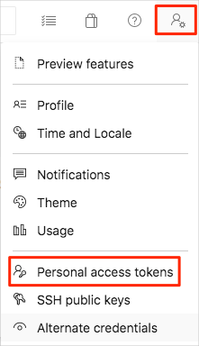
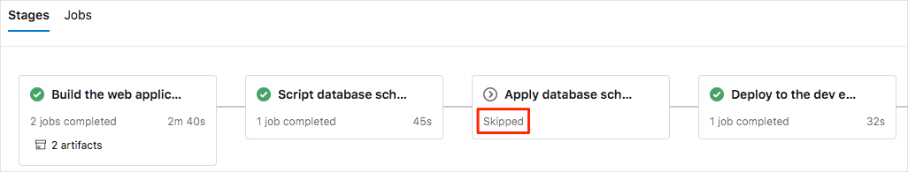

Tim and Andy are happy with the pipeline and the manual approval of schema changes. But every time the pipeline runs, it halts to wait for DBA approval even if the database schema hasn't changed. They want the pipeline to halt only when the database schema changes.

In this section, you modify the pipeline to halt only when the database schema changes. To do so, you write a variable to the pipeline that flags the schema change.

## Fetch the branch from GitHub

Here you fetch the `schema-changes` branch from GitHub. Then you *check out*, or switch to, that branch.

This branch contains the _Space Game_ web project. The project includes changes to the website code. The code expects the Profiles table to have a `favoriteMap` column. The **Profile** page will display this new column's data as **Favorite Galaxy**. The project also includes the Azure Pipelines configuration that you created earlier.

In the *Tailspin.SpaceGame.Database* project, the Profiles table has changed. The `favoriteMap` column has been added.

1. In Visual Studio Code, open the integrated terminal.
1. Run the following `git` commands. The commands fetch the `schema-changes` branch from the Microsoft repository and switch to that branch.

    ```bash
    git fetch upstream schema-changes
    git checkout -b schema-changes upstream/schema-changes
    ```

1. Open the `dbo` folder in the database project. This folder includes the scripts for each of the tables. Open *Profile.sql* to see the new column, `favoriteMap`.

## Run the pipeline

1. Use an empty commit to trigger the pipeline to run. Then push the change to GitHub.

    ```bash
    git commit --allow-empty -m "Trigger pipeline for DBA approval"
    git push origin schema-changes
    ```

1. Watch the pipeline and wait for the manual approval of the database schema.

    When the pipeline stops for approval, select the `DBAVerificationScript` stage. Look at the change script that was created. This time you see an `ALTER TABLE` SQL statement that adds the new column to the Profiles table.
1. Go back to the pipeline. Select the **Waiting** button. Select **Review** > **Approve**.
1. Wait for the pipeline to finish deploying to each App Service environment.
1. Before you can try the new website, you need to add data to the new column:
    1. Navigate back to your [Azure portal](https://portal.azure.com?azure-portal=true) and select **SQL Databases**.
    1. Select your database, **tailspindatabase**.
    1. Select **Query editor** and sign in.
    1. In your local `schema-changes` branch, you see *FavoriteMapData.sql*. This SQL script adds a favorite galaxy string to each profile by filling in the `favoriteMap` column. Copy the contents of this file.
    1. Paste the file contents into **Query 1**. Select **Run** to populate the new table.
    1. Verify that the queries ran successfully.
    1. Select **New Query**.
    1. In **Query 2**, add the following T-SQL code:

        ```sql
        SELECT * FROM dbo.Profiles
        ```

        Verify that the `favoriteMap` column is populated with data.
1. Navigate to one of your host names, for example, **tailspin-space-game-web-dev-1234.azurewebsites.net**. Select a player to see the new data on the profile.

    

**Tim:** I think the meeting went well. We managed to get the DBA involved, and they're a tough customer. Score one for DevOps. But I can see a problem here. Every application change triggers this pipeline to run. We won't have schema changes every time. But the pipeline will stop and wait for approval even if the change file contains no changes. How can we fix that problem?

**Mara:** Look at you getting into DevOps! I have an idea. We already have a change script in the pipeline. Maybe we can check that script for keywords that signal a change. 

**Andy:** That solution could work. We'll need a pipeline variable to check as a triggering condition.


### Check for keywords in the generated script

In this section, you add to the PowerShell script that created the change file. You check to see if a database change is pending. You'll know there's a change if the file contains the words **CREATE**, **ALTER**, or **DROP**. 

Don't copy this script yet. Soon you'll replace the entire contents of the *azure-pipelines.yml* file as you did in the previous exercise.

   ```powershell
   $containsWord = $file | %{$_ -match "CREATE" -or $_ -match "ALTER" -or $_ -match "DROP"}
   ```

### Pass a pipeline variable change between stages

If the keyword search returns a match, create a variable in the pipeline variable group. Set its value to `True`. If the variable is in the pipeline variable group, all stages can see it. Currently, when you set a new variable in a stage, the variable is scoped to only that stage. 

Here you use a PowerShell library that was created by Donovan Brown. The library, called [VSTeam](https://www.powershellgallery.com/packages/VSTeam/6.3.5?azure-portal=true), uses the [REST API for Azure DevOps Services](https://docs.microsoft.com/rest/api/azure/devops/search/?azure-portal=true) to access Azure DevOps programmatically.

This script copies all variables out of the variable group. It adds a new variable named `schemaChanged`. It also updates the variable group with the complete set of variables.

Again, don't copy this script yet. Soon you'll replace the contents of the entire *azure-pipelines.yml* file as you did in the previous exercise.

```powershell
if ($containsWord -contains $true) {
  Install-Module VSTeam -Scope CurrentUser -Force
  Set-VSTeamAccount –Account $(Acct) -PersonalAccessToken $(PAT)
  $methodParameters = @{
    ProjectName = "$(System.TeamProject)"
    Name = "Release"}
  $vg = Get-VSTeamVariableGroup @methodParameters
  $vars = @{}
  $vg.variables | Get-Member -MemberType *Property | %{$vars.($_.Name) = $vg.variables.($_.Name)}
  $varName = "schemaChanged"
  $vars.$varName= @{}
  $vars.$varName.value = "True"
  $vars.$varName.isSecret = $false
  $methodParameters = @{
    id = $vg.id
    ProjectName = "$(System.TeamProject)"
    Name = "Release"
    Description = ""
    Type = "Vsts"
    Variables = $vars}
  Update-VSTeamVariableGroup @methodParameters}
```


```powershell
Install-Module VSTeam -Scope CurrentUser -Force
Set-VSTeamAccount –Account $(Acct) -PersonalAccessToken $(PAT)
$methodParameters = @{
  ProjectName = "$(System.TeamProject)"
  Name = "Release"}
$vg = Get-VSTeamVariableGroup  @methodParameters 
$vars = @{}
$vg.variables | Get-Member -MemberType *Property | %{$vars.($_.Name) = $vg.variables.($_.Name)}
$vars.Remove("schemaChanged")
$methodParameters = @{
  id = $vg.id
  ProjectName = "$(System.TeamProject)"
  Name = "Release"
  Description = ""
  Type = "Vsts"
  Variables = $vars}
Update-VSTeamVariableGroup @methodParameters
```

## Change the pipeline

The VSTeam library needs to access your Azure DevOps organization, so it requires authentication. Here you create a personal access token. You add the token to your pipeline variables so that the VSTeam library can authenticate calls to Azure DevOps.

From Azure DevOps:

1. Select your profile from the upper-right corner, then select **Personal access tokens**.

    

1. Select **+ New Token**.
1. For the name, enter *Database Changes*.
1. Under **Scopes**, select **Full access**.
1. Select **Create**.
1. Copy the token to a safe place.

    > [!IMPORTANT]
    > Be sure to save the token copy now. It will never again be shown in plain text.
1. Add two variables to the **Release** variable group.
    1. Navigate to your **Space Game - web - Database** project. Select **Pipelines**.
    1. Under **Pipelines**, select **Library**.
    1. Select **Release**. Add the following variables:

        | Variable name         | Example value                            |
        |-----------------------|------------------------------------------|
        | **Acct**    | The name of your organization in Azure DevOps |
        | **PAT** | Your personal access token |

        Select the lock icon next to the value for **PAT** to ensure that this value is encrypted.
    1. Near the top of the page, select **Save** to save your variables to the pipeline.

1. Open the *azure-pipelines.yml* file that you got when you switched to the `schema-changes` branch.
1. Copy the following new pipeline. Use it to replace the code in the *azure-pipelines.yml* file.

    [!code-yml[](code/azure-pipelines2.yml?highlight=134-166,169-173,201-222,226-234)]

    This pipeline adds to the PowerShell script. It checks the generated SQL script for the keywords **CREATE**, **ALTER**, and **DROP**. If any of these words are found, the script creates a variable named `schemaChanged` in the pipeline variable group. If this variable is `True`, a change needs approval. If the variable isn't present, the script contains no changes and this stage is skipped because the condition fails.

1. Add and commit *azure-pipelines.yml* to your branch. Then push the changes to your GitHub remote, `origin`. This step causes the pipeline to run.

    ```bash
    git add azure-pipelines.yml
    git commit -m "Add condition for database approval stage"
    git push origin schema-changes
    ```

1. Navigate back to Azure DevOps and watch the pipeline run.

    

## Recommended practices

In this exercise, you created a variable to use as a condition for a stage. In practice, the variable must be unique for each pipeline run because you might be running this pipeline in parallel with other changes. If you're using the **Release Pipeline (classic)** editor for your project, you can use the [suggested PowerShell code from Donovan Brown](http://donovanbrown.com/post/Passing-variables-from-stage-to-stage-in-Azure-DevOps-release?azure-portal=true) to create a variable that's unique to that specific release.
