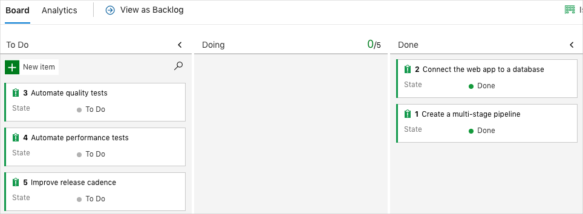

You've finished the tasks for this module. Here you'll move the work item to the **Done** state in Azure Boards. You'll also clean up your Azure DevOps environment.

> [!IMPORTANT]
> This page contains important cleanup steps. Cleaning up helps ensure that you don't run out of free build minutes. It also helps ensure that you're not charged for Azure resources after you complete this module.

## Clean up Azure resources

Here you delete your Azure App Service instances, the database server, and the database. The easiest way to delete these resources is to delete the parent resource group. Deleting a resource group deletes all resources in that group.

In the [Create a release pipeline with Azure Pipelines](/learn/modules/create-release-pipeline?azure-portal=true) module, you managed Azure resources through the Azure portal. Here you tear down your deployment by using the Azure CLI through Azure Cloud Shell. Your steps are similar the ones you followed to create these resources earlier in this module.

To clean up your resource group:

1. Go to the [Azure portal](https://portal.azure.com?azure-portal=true) and sign in.
1. From the menu, select Cloud Shell. When prompted, select the **Bash** experience.

    

1. Run the following `az group delete` command. This command deletes **tailspin-space-game-rg**, which is the resource group that you used in this module.

    ```azurecli
    az group delete --name tailspin-space-game-rg
    ```

    When prompted, enter **y** to confirm the operation.

1. As an optional step, run the following `az group list` command after the previous command finishes.

    ```azurecli
    az group list --output table
    ```

    You see that the resource group **tailspin-space-game-rg** no longer exists.

## Move the work item to Done

Here you complete the work item that you assigned to yourself earlier in this module. You move **Manage database schema changes** to the **Done** column.

In practice, "Done" often means you've put working software in the hands of your users. For learning purposes, here you'll mark this work as complete because the goal for the Tailspin team was to connect the web app to a database.

At the end of each sprint, or work iteration, your team might want to hold a retrospective meeting. In the meeting, you share the work you completed, what went well, and what could be improved.

To complete the work item:

1. In Azure DevOps, navigate to **Boards**. From the menu, select **Boards**.
1. Move the **Connect the app to a database** work item from the **Doing** column to the **Done** column.

    

## Disable the pipeline or delete your project

Each module in this learning path provides a template that you can run to create a clean environment for the duration of the module.

Running multiple templates gives you multiple Azure Pipelines projects. Each project points to the same GitHub repository. This setup can trigger multiple pipelines to run each time you push a change to your GitHub repository. The pipeline runs can consume free build minutes on our hosted agents. So it's important that you disable or delete your pipeline before you move to the next module.

Choose one of the following options.

### Option 1: Disable the pipeline

Disable the pipeline so that it doesn't process further build requests. You can re-enable the build pipeline later if you want to. Choose this option if you want to keep your DevOps project and your build pipeline for future reference.

To disable the pipeline:

1. In Azure Pipelines, navigate to your pipeline.
1. From the drop-down menu, select **Settings**:

    
1. Under **Processing of new run requests**, select **Disabled** and then select **Save**.

    Your pipeline will no longer process build requests.

### Option 2: Delete the Azure DevOps project

Delete your Azure DevOps project, including the contents of Azure Boards and your build pipeline. In future modules, you can run another template that brings up a new project in a state where this project leaves off. Choose this option if you don't need your DevOps project for future reference.

To delete the project:

1. In Azure DevOps, navigate to your project. Earlier, we recommended that you name this project **Space Game - web - Database**.
1. Select the gear icon next to the project name.

    The icon might not appear until you move your mouse over that area.

    
1. At the bottom of the **Project details** area, select **Delete**.

    
1. In the window that appears, enter the project name. Select **Delete** again.

    Your project is now deleted.
