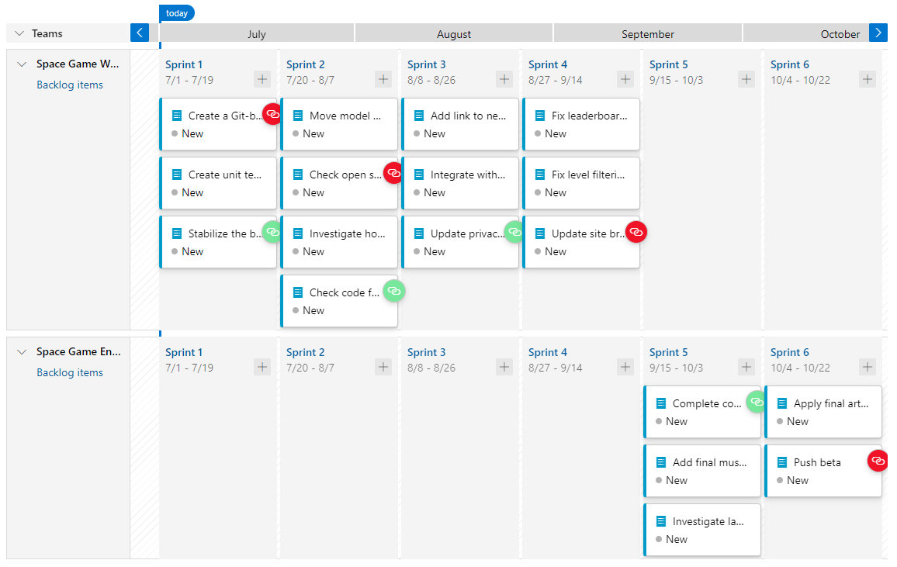

_Delivery Plans_ is an extension for Azure DevOps that helps organizations plan and review work schedules across multiple teams. The Tailspin team will use this extension to get a better idea of how their work relates to work to be produced by other teams.

Mara installed Delivery Plans in the team's Azure DevOps organization. She then created a delivery plan and added the sprints for her team and the game engine team. Excited to show off the potential, she invites Andy over for a quick demo.

**Mara:** After our last conversation I looked into our options for managing delivery plans. I found an Azure DevOps extension that seems to give us everything we need.

**Andy:** I'm very interested to see what you've come up with. There's a lot of stress throughout the organization about the beta slip, so anything we can do to improve schedule efficiency will be quite welcome.

**Mara:** Okay, here it is.

**Mara:** The Delivery Plans extensions allows us to create a "delivery plan". Once we create that, we can add in the backlogs of teams within the organization. They are shown in parallel so that we can see what each team is planning to deliver against a calendar backdrop.

**Andy:** This is great! Now we know when something we're dependent on won't be available in time. We can even gauge the likelihood of delay based on how much other work and dependencies those teams have taken on. This should help mitigate some of the "schedule chicken" behavior that sometimes go on around here.

> [!NOTE]
> [Schedule chicken](https://wikipedia.org/wiki/Schedule_chicken?azure-portal=true) is when two or more teams are at risk of not meeting deadlines, but none of them want to admit it. Instead, each wait for another to slip their schedule first and then use the other team's slip as a pretext for delaying their own delivery.

**Mara:** Yes, and we can also use this as an opportunity to let other teams know if we're going to slip something they're dependent on. It will help us build trust in our people and processes.

Andy nods in agreement. It would be nice for the teams to have more faith in each other.

**Andy:** Well now that we know about the beta slip we have to move our associated work out to a future sprint. On the bright side, it gives us an opportunity to pull some new work in to replace it. Let's swap the integration work with those two leaderboard bugs.
Mara drags the integration work item out to the following sprint. She then drags the two leaderboard bugs back in to fill the available capacity.
 

**Mara:** I also added the current beta date as a milestone. Now we will always have it in place as a reference point for the work we're planning.

**Andy:** We should also add events like Cliffchella and the annual company party.

**Mara:** Why the company party? Does that impact the schedule?

**Andy:** It might. Every year the DBAs enter the pie-eating contest and they all end up calling in sick the next day. I'm not saying we should expect it to happen again this year, but I do think we should be prepared. And now we have the tools for it.
