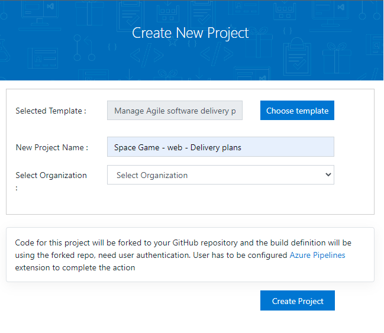

In this section, you make sure that your Azure DevOps organization is set up to complete the rest of this module.

To meet these objectives, you:

> [!div class="checklist"]
> * Set up an Azure DevOps project for this module.

## Get the Azure DevOps project

Here you make sure that your Azure DevOps organization is set up to complete the rest of this module. You set it up by running a template that creates a project in Azure DevOps.

The modules in this learning path are part of a progression. You follow the Tailspin web team through their DevOps journey. For learning purposes, each module has an associated Azure DevOps project.

### Run the template

Run a template that sets up your Azure DevOps organization.

> [!div class="nextstepaction"]
> [Run the template](https://azuredevopsdemogenerator.azurewebsites.net/?name=deliveryplans&azure-portal=true)

On the Azure DevOps Demo Generator site, follow these steps to run the template:

1. Select **Sign In** and accept the usage terms.
1. On the **Create New Project** page, select your Azure DevOps organization. Then enter a project name, such as *Space Game - web - Delivery plans*.

    

1. Select **Create Project**.

    The template takes a few moments to run.
1. Select **Navigate to project** to go to your project in Azure DevOps.

> [!IMPORTANT]
> The [Clean up your Azure DevOps environment](/learn/modules/manage-delivery-plans/6-clean-up-environment?azure-portal=true) page in this module contains important cleanup steps. Be sure to follow the cleanup steps even if you don't complete this module.

