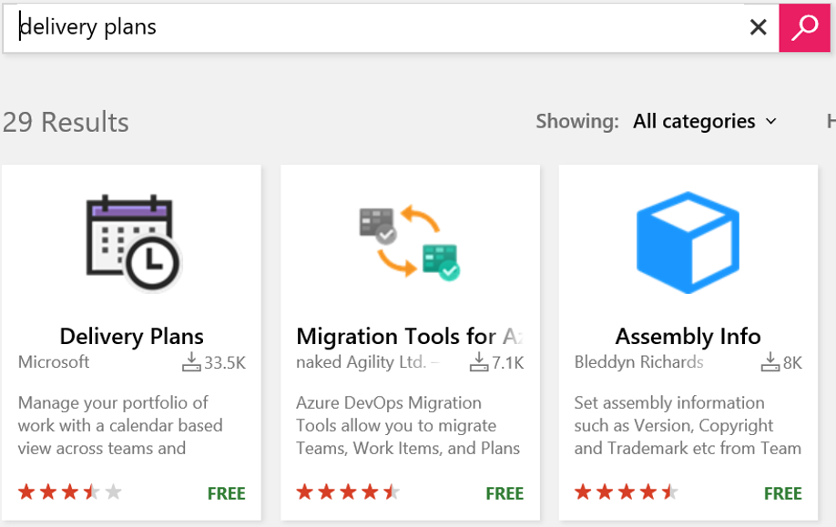
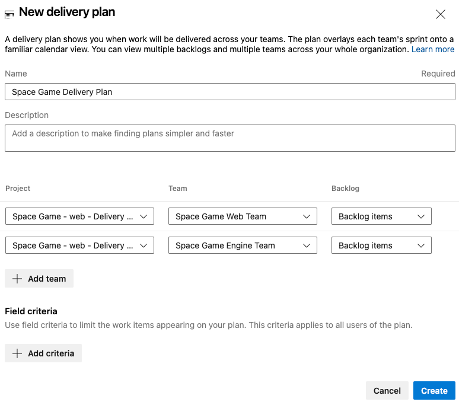
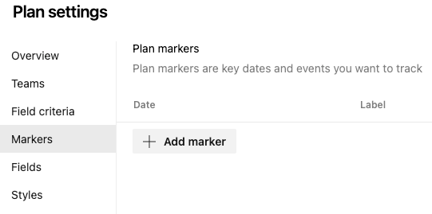
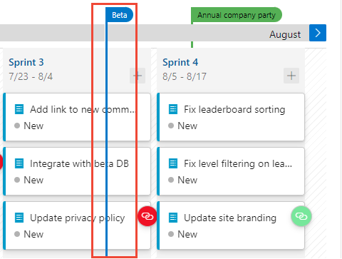
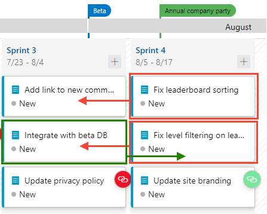
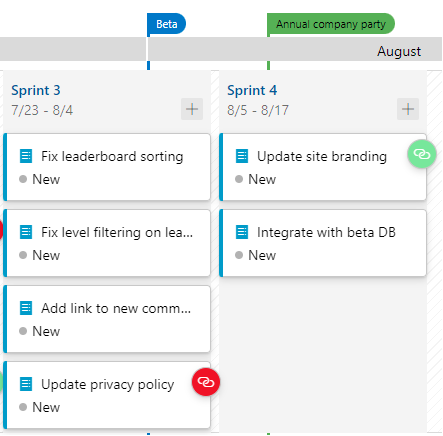

Here you create a delivery plan and use it to plan a sprint in Azure DevOps.

The Tailspin team is eager to see how the Delivery Plans extension is going to work. They already have two teams with sprints set up in Azure DevOps, so now they can review and optimize the work schedules.

To do this, you:

> [!div class="checklist"]
> * Install the Delivery Plans extension.
> * Create a delivery plan.
> * Add team sprints and milestones.
> * Rearrange work items to fit the overall schedule.

## Install the Marketplace extension

The Delivery Plans Marketplace extension provides the features needed to create and manage delivery plans. It integrates with Azure Boards to provide a seamless experience when planning work.

1. From a new browser tab, go to [marketplace.visualstudio.com](https://marketplace.visualstudio.com?azure-portal=true).
1. On the **Azure DevOps** tab, search for "Delivery Plans".
1. Select **Delivery Plans** from the results.

    

1. Select it and then **Get it Free**.
1. Select your Azure DevOps organization from the drop-down box.
1. Select **Install**.

## Create a delivery plan

Delivery Plans adds a new **Plans** tab to Azure Boards. You can create as many delivery plans as you need to manage different aspects of your organization.

1. From Azure DevOps, navigate to your project.
1. Under **Boards**, select **Plans**.
1. Select **New plan**.
1. In the form, enter these fields:
    * **Name**: _Space Game Delivery Plan_
    * Select the **Backlog items** backlog for the **Space Game Web Team**
    * Add the **Space Game Engine Team's Backlog items** backlog using the **Add team** option
1. Select **Create**.

    

    > [!NOTE]
    > The team project generated for this module uses the *Scrum* process and not the *Basic* process used in other modules in this learning path. While the Basic process uses *Issues*, the Scrum process uses *Backlog items*, which are functionally the same for the purposes of this module. You can use Delivery Plans with either process.

### Add schedule milestone markers

Milestone markers can be added to the delivery plan as reference points. These help you plan work within the context of significant or external dates.

1. Select the **Configure plan settings** cog.

	

1. From the **Markers** tab, select **Add marker**.
1. In the form, enter these fields:
	* Select a date one week from now
	* **Label**: **Cliffchella**
	* **Color**: **Red**

	

1. Repeat the process to add markers for:
	* **Beta**: five weeks from today (blue)
	* **Annual company party**: six weeks from today (green)
1. Select **Save**.

1. Select the blue marker at the top of the design plan. It will expand to show that it represents the beta milestone. 

	

### Optimize the work schedule

1. Notice that there is a work item for the Web team to **Integrate with beta DB** that is scheduled to be completed before the beta will be ready. This will be a problem because this work item is dependent on that beta.
1. Drag the integration work item from **Sprint 3** to **Sprint 4** to ensure that its dependency will be available.
1. This change opens a significant amount of bandwidth in **Sprint 3**. Since that time is now available for productive work, drag the two **Fix** work items from **Sprint 4** back into **Sprint 3**.

	

Your final sprint plan should look similar to this:

You've just completed some invaluable work that will impact the organization in a meaningful way. Management can feel confident that work will progress without foreseeable delays. And instead of waiting on dependencies to be delivered, teams will have always productive work to take on. Sure, things might change as circumstances develop, but at least now everyone knows where to go to stay up to date.
