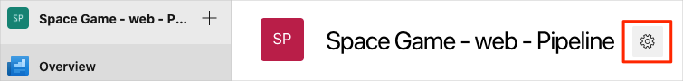
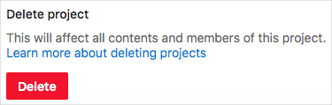

You're done with the tasks for this module. Here you clean up your Azure DevOps environment.

## Optional - Delete your project

This module provided a template that you ran to create a clean environment for the module.

Here you delete your Azure DevOps project, including what's in Azure Boards. In future modules, you can run another template that brings up a new project in a state where this module leaves off. Choose this option if you don't need your DevOps project for future reference.

To delete the project:

1. In Azure DevOps, go to your project. Earlier we recommended that you name this project **Space Game - web - Delivery plans**.
1. Select the gear icon next to the project name.

   The icon might not appear until you move your mouse pointer over that area.

   
1. At the bottom of the **Project details** area, select **Delete**.

    
1. In the window that appears, enter the project name, and then select **Delete** again.

Your project is now deleted.
