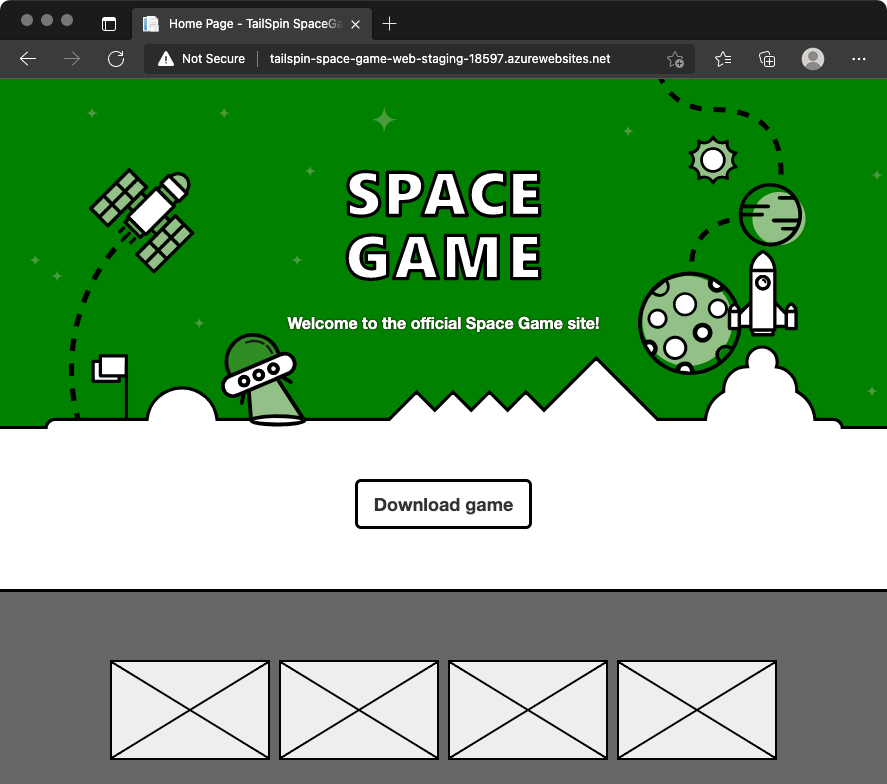

In this part, you see your deployment slots in action. Here, you make a few visual changes to the website. You do this by changing the background color and by changing the text on the hero banner at the top of the home page. You then push your change to GitHub, watch the pipeline run, and verify the change.

To further practice the process, you then revert the changes you made and watch the pipeline run as a way of *rolling forward*.

## Change the text on the hero banner

Here, you change the text on the hero banner. You'll see the change when you deploy to App Service.

1. In Visual Studio Code, open *Index.cshtml* in the *Tailspin.SpaceGame.Web/Views/Home* directory.
1. Look for this text near the top of the page:

    ```html
    <p>An example site for learning</p>
    ```

    > [!TIP]
    > Visual Studio Code also provides an easy way to search for text in files. To access the search pane, select the magnifying glass icon in the side pane.

1. Replace the text in the previous step with this new text and then save the file:

    ```html
    <p>Welcome to the official Space Game site!</p>
    ```

## Change the background color

Here, you change the background color of the hero banner from gray to green. 

1. In Visual Studio Code, open *site.scss* under the *Tailspin.SpaceGame.Web/wwwroot/css* directory.

    > [!IMPORTANT]
    > Make sure you open *site.scss* and not *site.css*. The _Build_ stage runs `node-sass` to convert *site.scss* (a Sass file) to *site.css* (a standard CSS file).

1. Locate this code near the top of the file.

    [!code-css[](code/5-site-1.scss?range=1-8&highlight=3)]

1. Replace the highlighted text in the previous step with the following, and then save the file:

    [!code-css[](code/5-site-2.scss?range=1-8&highlight=3)]

## Push the change through the pipeline

Normally, you would build and run the site locally to verify the change. You might also run any associated unit tests to verify that your change doesn't break existing functionality.

For brevity, here you commit the changes to your branch, push your branch to GitHub, and watch the pipeline run.

1. Add *Index.cshtml* and *site.scss* to the index, commit the changes, and push the changes up to GitHub.

    ```bash
    git add Tailspin.SpaceGame.Web/Views/Home/Index.cshtml Tailspin.SpaceGame.Web/wwwroot/css/site.scss
    git commit -m "Change text and colors on the home page"
    git push origin blue-green
    ```

1. From Azure Pipelines, trace the build through each of the steps.
1. Navigate to the URL that corresponds to the *production* slot for your _Staging_ environment. This is the default slot you configured when you set up the pipeline earlier.

    You see the website deployed with the color and text changes.

    

1. Navigate to the URL that corresponds to the *swap* slot for your _Staging_ environment. The URL includes "-swap.azurewebsites.net" in its name.

    You see the previous version of the website, without the color and text changes.

    

    That's because you swapped the *production* and *swap* slots. In other words, here you always deploy to the *swap* slot, and then swap the *production* and *swap* slots. The swap process ensures that *production* points to the more recent deployment.

## Revert the change

Let's say that you deployed a change that you want to revert. At this point, you could roll back the change by swapping the *production* and *swap* slots again (for example, you can swap slots manually through the Azure portal), or you could roll forward by pushing another change through the pipeline.

That's what you'll do here. You'll revert your latest code changes and push another change through the pipeline. To do so, you use the `git revert` command. With Git, you seldom remove commits from a file's history. Unlike the "undo" operation in a text editor, `git revert` creates a new commit that's essentially the opposite of the specified set of commits. To see this, you also run the `git log` command to trace your commit history during the revert process.

1. In your terminal, run the following `git log` command to view your commit history.

    ```bash
    git --no-pager log --oneline
    ```

    Your output resembles this. You see additional commits, and the commit IDs you see will differ.

    Trace the commit history. The latest commit is on top.

    ```output
    06a26bd (HEAD -> blue-green) Change text and colors on the home page
    e5e8fe5 Swap deployment slots
    664d946 Trigger the pipeline
    be86917 (upstream/blue-green) Initial
    ```

1. Run the following `git revert` command to revert by one commit.

    ```bash
    git revert --no-edit HEAD
    ```

    Think of HEAD as the current state of your branch. HEAD refers to the latest commit. This command specifies to revert only the HEAD, or latest, commit.

1. Run `git log` a second time to see your updated commit history.

    ```bash
    git --no-pager log --oneline
    ```

    You see an additional commit at the top that reverts the previous one. Here's an example.

    ```output
    95fa0ac (HEAD -> blue-green) Revert "Change text and colors on the home page"
    06a26bd Change text and colors on the home page
    e5e8fe5 Swap deployment slots
    664d946 Trigger the pipeline
    be86917 (upstream/blue-green) Initial
    ```

## Push the reverted change through the pipeline

Here, you push your reverted change through the pipeline and see the results.

1. Run the following `git push` command to upload the `blue-green` branch to your GitHub repository.

    ```bash
    git push origin blue-green
    ```

1. In Azure Pipelines, go to the build and trace the build as it runs.
1. Navigate to the URLs that corresponds to the *swap* and *production* slots for your _Staging_ environment.

    The *production* slot now points to your reverted change, which is the original website.

    

    The *swap* slot now points to the previous change.

    

Great work! The team now has a way to automate the releases and they can get new features to their users without incurring downtime.

## Team meeting

The team gathers to demo the pipeline. This time, Tim pushes a change through the pipeline while everyone else watches. But not everyone's convinced.

**Andy:** It's great seeing deployment slots at work, but I don't get it, since _Staging_ is only for our team and management. How do we benefit from zero-downtime deployments here?

**Tim:** Indeed, we won't see much benefit right now. But imagine when we apply blue-green deployments to a _Production_ stage. We'll still have the manual approval from management before we promote to _Production_. But when we do release new features, the swap process will make the rollout nearly instantaneous. It'll be seamless to our users.

**Andy:** OK, I think I understand now. I like this improvement. This was easy to set up, and it'll benefit our users. Everyone wins.

**Amita:** Speaking of improvements, why don't we revisit our value stream mapping exercise we performed a few weeks ago? I bet we'll see some real progress in terms of how quickly we can release new features.

**Mara:** Great, let's put that on the agenda for our next team meeting.