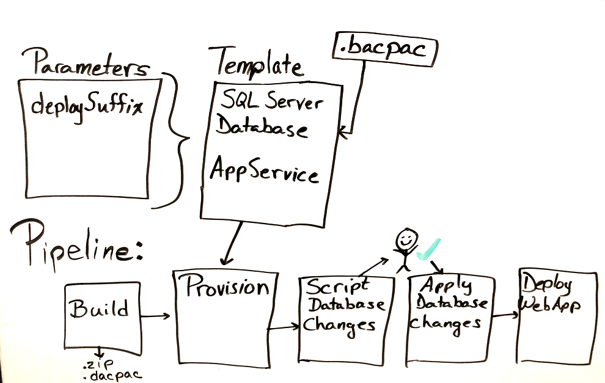
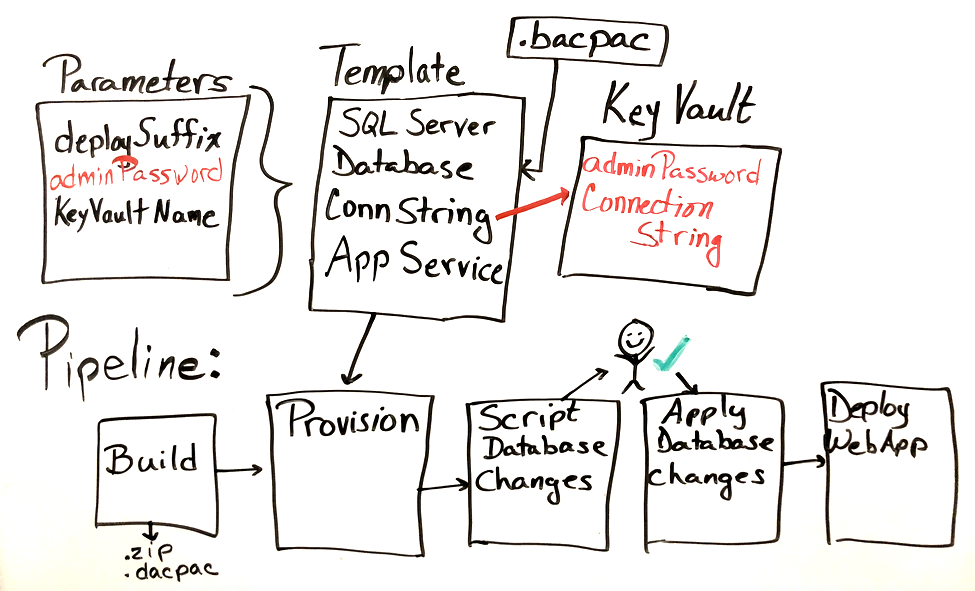
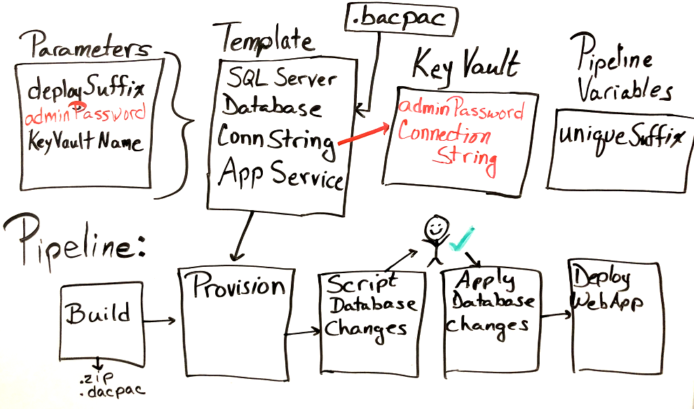
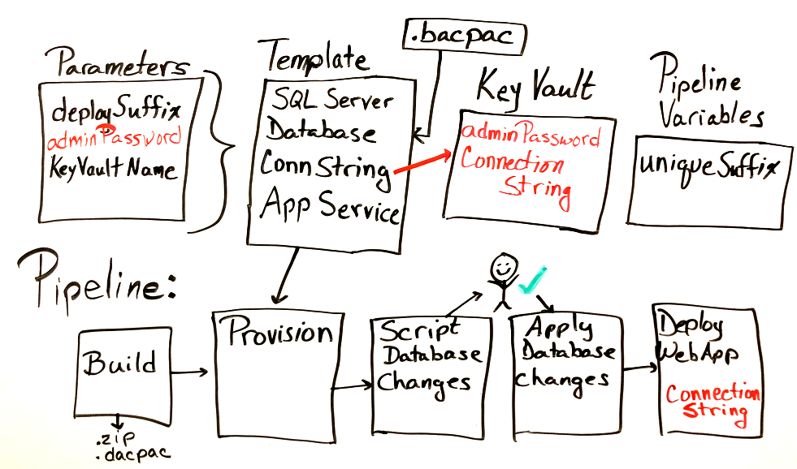

The team wants to try using an *Azure Resource Manager template* to automate the deployment of the _Space Game_ web application. This automation includes the SQL Server logical instance and the SQL database, as well as the Azure App Service plan and the App Service instance.

The web app is still in development, and database schema changes will happen. The database administrator (DBA) is responsible for the integrity of the database and needs to approve any changes made to the schema before they're applied.

In the [Manage database changes in Azure Pipelines](/learn/modules/manage-database-changes-in-azure-pipelines/?azure-portal=true) module, you created a pipeline with a stage that builds the .NET Core web app project and the SQL Server Data Tools database project. Then, you added a stage to discover changes to the database schema. The next stage that you added applied those schema changes if the DBA approved them. Then the web app was deployed.

As a reminder, here's the pipeline diagram from that previous module.

The _Build_ stage has a job to build the web app and a job to build the database project.  The database project produces a _.dacpac_ file that is a build artifact.

The next stage  scripts the database changes so that the  DBA can verify the changes before they're applied.

An  approval is added to the next stage that  applies the database changes. The last three stages  deploy to _Dev_, _Test_, and _Staging_ environments.

In that module, you created the infrastructure manually before you ran the pipeline. The _Dev_, _Test_, and _Staging_ stages all had identical infrastructure and shared a common database. As the web application project matures, the infrastructure needs for each of these stages also changes. The team is looking at Resource Manager templates to automate the deployment process in each stage.

In this section, you:

> [!div class="checklist"]
> * Learn about infrastructure as code using Resource Manager templates.
> * Design a Resource Manager template for Azure App Service and Azure SQL Database to use in Azure Pipelines.
> * Understand how to use Azure Key Vault to store and retrieve secrets by using Resource Manager templates and Azure Pipelines.
> * Learn what you need to add a Resource Manager template to Azure Pipelines.

Let's listen in on the morning meeting.

## The meeting

Andy has called the team together to discuss planning for the infrastructure changes that are the result of a maturing project.

**Andy:** Good morning everyone. We're getting closer to our release date, and Tim and Amita have some concerns they want to talk about. Amita?

**Amita:** Tim and I have been talking about the current flow for our release, and we believe it's time to push toward infrastructure that goes beyond development and is more like what the final product will need. For example, I need to test on machines with higher throughput and better redundancy. And staging needs to have data that's more real-world. Tim is concerned that this will slow down our release flow, since he'll have to provision all of these stages differently and maintain them. We're concerned how this will affect our pipeline.

**Mara:** I think I can help here. We've been trying out *infrastructure as code* with Terraform. Remember, infrastructure as code allows us to describe the infrastructure we need through code. This way, we can maintain the application code and everything we need to deploy the application in our central code repository. It has been working well for us, but I've been wanting to try Azure Resource Manager templates. This might be a good time to try one as proof of concept. We could create a template that provides parameters at each stage so that each stage can be provisioned with what it needs. The pipeline can run the template and use a specific parameter file for the stage it's provisioning.

**Tim:** I was hoping we could do that. It sounds like automation would enable us to more easily provision and maintain a separate database at each stage of the pipeline. But what are Resource Manager templates?

### Use Resource Manager templates for infrastructure as code

Recall that Resource Manager is the interface for managing and organizing cloud resources. A Resource Manager _template_ defines all the resources in a deployment, so you can deploy the template into a resource group as a single operation. We provide a link to a module on Resource Manager templates at the end of this module.

**Mara:** Resource Manager templates are JSON files that define all the resources we need so that Resource Manager can deploy the resources. We can get a *quickstart template* to start with from the [quickstart template gallery](https://azure.microsoft.com/resources/templates?azure-portal=true). These were created by the community with common infrastructure and would be a good place to start if we didn't already have infrastructure in place. Since we have infrastructure now, we can [export the entire resource group as a template from the Azure portal](https://docs.microsoft.com/azure/azure-resource-manager/export-template-portal?azure-portal=true). From there, we can modify the template to make it more reusable across the pipeline.

**Andy:** Let's start drawing out our plan.

*Andy moves to the whiteboard.*

### Design a Resource Manager template for App Service and SQL Database to use in Azure Pipelines

The template needs to have information passed in as parameters to have the reusability that the team needs. It will also need to output information from the created resources. For example, it might output the database connection string to use later in the pipeline. Let's listen in as the team decides what it will need in the template.

**Andy:** We need to create template and parameter files and change the pipeline to use them. The only parameter so far is the resource name suffix that represents the stage we're deploying to. For example, we're using _dev_ for the development stage.

What goes in the template?

*Mara pulls out her laptop and does a quick search.*

**Mara:** Everything we had to create manually the last time we worked with the database changes in the pipeline can now go in the template file. We can even deploy the database by using the *.bacpac* file. So that means we'll provision the SQL Server instance, the SQL database, the App Service plan, and the App Service instance. I propose we create just the infrastructure we need for one stage. Let's start with the _Dev_ stage. Then we can reuse this template for the other stages; we just need to change the parameters we give the template.

**Andy:** Great. I'll draw that in.

**Tim:** But what about the administrator password for the SQL Server instance? I don't want that information to be stored in our repository.

*Andy does some typing on his laptop.*

### Use Azure Key Vault to store and retrieve secrets by using Resource Manager templates and Azure Pipelines

*Azure Key Vault* enables you to securely store secrets. For example, you can store your API keys and passwords or anything that needs tight control over who has access to it.

**Andy:** It looks like we can store the administrator password in Azure Key Vault. The template parameter file can read from Key Vault.

*Andy draws on the whiteboard.*

So now we have Key Vault and another parameter.

**Tim:** Wait. The connection string to the database is sensitive data too, and we may need it again just like the administrator password. I suggest we add it to Key Vault as well.

**Mara:** Excellent idea! We can use the template to add the connection string to Key Vault. This means we need the name of the key vault in the parameter file too. The template will need it.

*Andy updates the whiteboard.*

**Tim:** Speaking of the pipeline, what changes do we need to make there?

### Add a Resource Manager template to Azure Pipelines

Adding a Resource Manager template to the pipeline is going to require a few changes to the current setup. The team needs to consider the new tasks that it needs and how to work with Azure Key Vault. There's also a connection string to configure. Let's continue to listen in as they talk about pipeline changes.

**Mara:** Since we're only prototyping this for now, we're going to need unique names for the SQL Server and App Service instances. Let's add a variable to Azure Pipelines that specifies a unique suffix for the SQL Server name and App Service name. That way we can be sure that if we run the template again, we have the same suffix. This ensures we don't break the idempotency of the template deployment. And we can use different variables for different deployments.

**Andy:** Right. I'll add pipeline variables to the diagram.

**Mara:** Now we need a task that runs the template. I found this one, [AzureResourceManagerTemplateDeployment@3](https://github.com/microsoft/azure-pipelines-tasks/blob/master/Tasks/AzureResourceManagerTemplateDeploymentV3/README.md?azure-portal=true). It has parameters for the template file and the template parameter file.

We also need to think about setting the connection string in the App Service instance. We could do that in the template, but then when we deploy the web app, it will get overwritten. So I think we need a task to set that after the web app is deployed.

**Andy:** I'm way ahead of you, Mara. I found the [AzureAppServiceSettings@1](https://docs.microsoft.com/azure/devops/pipelines/tasks/deploy/azure-app-service-settings?view=azure-devops&azure-portal=true) task. But it needs the connection string. How do I get that out of the key vault?

**Tim:** We can use the [AzureKeyVault@1](https://docs.microsoft.com/azure/devops/pipelines/tasks/deploy/azure-key-vault?view=azure-devops&azure-portal=true) task to fetch the connection string in the pipeline.

**Mara:** Excellent! This task will help us in a few stages.

*Andy updates the whiteboard.*

**Andy:** If there are no other concerns, then I think we have a plan.

**Tim:** Let's start with a basic template and run it from Cloud Shell in the Azure portal. We can pass in the parameters we need to create just the basic infrastructure. When we have that working, we can add the other pieces and deploy it from the pipeline. I'd like to lead on this part.

**Andy:** Great. Let me know how it turns out.
