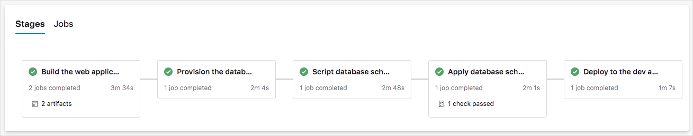

In this exercise, you put the team's vision into place and add the Azure Resource Manager template deployment to the pipeline. 

Here you:

> [!div class="checklist"]
> * Get the source code.
> * Create a key vault to store the SQL Server admin password.
> * Create the service connection and pipeline variables that the deployment will need.
> * Create the template parameter file, explore the template, and explore the pipeline.
> * Run the pipeline, approve the database changes, and see the successful deployment of the web app.

## Get the starter code from GitHub

In the previous exercise, you forked and cloned the repo you'll need for this module. Here, you check out the branch you'll use for this deployment. This branch contains the _Space Game_ project that you worked with in the previous modules, the SQL Server Data Tools project for the database schema, the Resource Manager template file, and an Azure Pipelines configuration to start with.

1. In Visual Studio Code, open the integrated terminal.
1. Run the following `git` commands to fetch a branch named `provision-db` from Microsoft's repository and switch to that branch.

    ```bash
    git fetch upstream provision-db
    git checkout -b provision-db upstream/provision-db
    ```

    The format of these commands enables you to get starter code from Microsoft's GitHub repository, known as `upstream`. Shortly, you'll push this branch up to your GitHub repository, known as `origin`.

## Create the key vault and store a secret

1. Go to Azure Cloud Shell in the Azure portal.
1. Generate a unique identifier for your key vault name.

    ```bash
    UNIQUE_ID=$RANDOM
    ```

1. Run the following command to create a key vault to store `adminPassword`. Notice the `enabled-for-template-deployment` parameter. It enables your template to query the key vault after permissions are established.

    ```azurecli
    az keyvault create \
      --name tailspin-vault-$UNIQUE_ID \
      --resource-group tailspin-spacegame-web-rg \
      --enabled-for-template-deployment true
    ```

1. Run this command to get your key vault ID.

    ```azurecli
    az keyvault show --name tailspin-vault-$UNIQUE_ID --query id --output tsv
    ```

    Store this name somewhere safe for later.

1. Run the **openssl** tool to generate a random password.

    ```bash
    SQL_PASSWORD=$(openssl rand -base64 32)
    ```

1. Run the following command to set the secret in the key vault.

    ```azurecli
    az keyvault secret set \
      --vault-name tailspin-vault-$UNIQUE_ID \
      --name "adminPassword" \
      --value "$SQL_PASSWORD"
    ```

1. To make sure the template is idempotent, you add a variable to Azure Key Vault to specify if this run of the pipeline is the first run. You set it to `true` here, and the template will set it to `false` after the first run. You check this variable when provisioning the database by using a *.bacpac* file. You don't want to run that *.bacpac* file more than one time.

    ```azurecli
    az keyvault secret set \
      --vault-name tailspin-vault-$UNIQUE_ID \
      --name "firstRun" \
      --value "true"
    ```

1. In Visual Studio Code, add a file named *deploymentParameters.json* in the root directory of the _Space Game_ solution. Then add these contents to the file.

    ```json
    {
        "$schema": "https://schema.management.azure.com/schemas/2015-01-01/deploymentParameters.json#",
        "contentVersion": "1.0.0.0",
        "parameters": {
            "deployPrefix": {
                "value": "-dev-"
            },
            "keyVaultName": {
              "value": ""
            },
            "uniqueSuffix": {
                "value": ""
            },
            "adminPassword": {
                "reference": {
                  "keyVault": {
                    "id": ""
                  },
                  "secretName": "adminPassword"
                }
            },
            "firstRun": {
                "reference": {
                    "keyVault": {
                        "id": ""
                    },
                    "secretName": "firstRun"
                }
            }
        }
    }
    ```

    The Resource Manager template reads this file to discover:

    * The `deploymentPrefix` and `uniqueSuffix` variables that we want to use for this specific deployment.
    * The `adminPassword` value for the SQL Server instance.
    * The `keyVaultName` value.
    * The `firstRun` value.

    The template needs the name of the key vault so it can add the database connection string to the key vault for us.

1. In *deploymentParameters.json*, set these values:

    * **keyVaultName.value**: The name of your key vault. An example is *tailspin-vault-11272*.
    * **uniqueSuffix.value**: Any combination of four or five digits. This suffix helps keep your resource names unique.
    * **keyVault.id**: The key vault ID that you obtained earlier. There are two occurrences of this value. Be sure to set both.

    If you need help with setting these values, run the following commands in Cloud Shell:

    **keyVaultName.value**:

    ```azurecli
    az keyvault list --query [].name --output tsv
    ```

    Sample output:

    ```output
    tailspin-vault-11272
    ```

    **uniqueSuffix.value**:

    ```bash
    echo $RANDOM
    ```

    Sample output:

    ```output
    9881
    ```

    **keyVault.id**:

    ```azurecli
    az keyvault list \
      --resource-group tailspin-spacegame-web-rg \
      --query [].id \
      --output tsv
    ```

    Sample output:

    ```output
    /subscriptions/3e5385df-4a60-4a88-0000-000000000000/resourceGroups/tailspin-spacegame-web-rg/providers/Microsoft.KeyVault/vaults/tailspin-vault-11272
    ```

1. Save *deploymentParameters.json*.

## Create a service connection

Create a service connection that enables Azure Pipelines to access your Azure subscription. Azure Pipelines uses this service connection to deploy the website to Azure App Service. You created a similar service connection in previous modules.

> [!IMPORTANT]
> Make sure that you're signed in to both the Azure portal and Azure DevOps under the same Microsoft account.

1. In Azure DevOps, go to your _Space Game_ web project.
1. From the bottom corner of the page, select **Project settings**.
1. Under **Pipelines**, select **Service connections**.
1. Select **New service connection**, then choose **Azure Resource Manager**, then select **Next**.
1. Near the top of the page, **Service principal (automatic)**. Then select **Next**.
1. Fill in these fields:

    | Field                   | Value                                      |
    |-------------------------|--------------------------------------------|
    | Scope level             | **Subscription**                           |
    | Subscription            | Your Azure subscription                    |
    | Resource Group          | **tailspin-space-game-rg**                 |
    | Service connection name | *Resource Manager - Tailspin - Space Game* |

    During the process, you might be prompted to sign in to your Microsoft account.

1. Ensure that **Grant access permission to all pipelines** is selected.

1. Select **Save**.

    Azure DevOps performs a test connection to verify that it can connect to your Azure subscription. If Azure DevOps can't connect, you have the chance to sign in a second time.

## Create a personal access token

Create a personal access token to enable the Azure Pipelines REST API to access the pipeline variables. You need this token to set the template outputs to pipeline variables. The token enables the variables to be accessed across stages.

From Azure DevOps:

1. Select your profile from the upper-right corner, then select **Personal access tokens**.

    

1. Select **+ New Token**.
1. For the name, enter *Microsoft Learn - ProvisionDB*.
1. Under **Scopes**, select **Full access**.
1. Select **Create**.
1. Copy the token to a safe place.

    > [!IMPORTANT]
    > Be sure to save the token copy now. It will never again be shown in plain text.

1. Select **Close**.

## Add pipeline variables in Azure Pipelines

Add a variable group and variables to the pipeline.

1. Go to your _Space Game_ project and select **Pipelines**.
1. Under **Pipelines**, select **Library**.
1. Create a new variable group called **Release**.
1. Select **Release** and add the following variables:

    | Variable name         | Example value                            |
    |-----------------------|------------------------------------------|
    | **Acct**    | The name of your organization in Azure DevOps. |
    | **PAT** | Your personal access token. Select the lock icon next to this value to encrypt it. |
    | **location** | A location near you. An example is **eastus**. |
    | **subscription** | Your subscription GUID. |
    | **keyVaultName** | Your key vault name. |
    | **uniqueSuffix** | Your unique suffix. This is the **uniqueSuffix.value** value that you set in *deploymentParameters.json*. |

    If you need help with setting these values, run the following commands in Cloud Shell:

    **location**:

    ```azurecli
    az account list-locations \
      --query "[].{Name: name, DisplayName: displayName}" \
      --output table
    ```

    Select a location near you. For example, select **eastus**.

    **subscription**:

    ```azurecli
    az account list \
      --query "[?isDefault][id]" \
      --all \
      --output tsv
    ```

    Sample output:

    ```output
    3e5385df-4a60-4a88-0000-000000000000
    ```

    **keyVaultName**:

    ```azurecli
    az keyvault list --query [].name --output tsv
    ```

    Sample output:

    ```output
    tailspin-vault-11272
    ```

1. Select **Save** near the top of the page to save your variables to the pipeline.

    Your variable group looks similar to this:

    

## Allow the service connection to access the key vault

1. Go to the Azure portal, select **Resource groups**, and then select the **tailspin-spacegame-web-rg** resource group.
1. Select your key vault.
1. Select **Access policies**, and then select **+ Add Access Policy**.
1. On the **Add access policy** pane, choose **Select principal** and search for the service principal for your client account. It will be in the *[organization name]-[project name]-[subscription ID]* format.

    If you see many choices, enter your Azure DevOps organization into the search bar to narrow your choices.
1. On the **Add access policy** pane, select **Secret permissions** and ensure that **Get** and **List** are selected.
1. Select **Add**.
1. Select **Save**.

## Explore the Azure Resource Manager template and Azure Pipelines pipeline files

1. Open the *template.json* file that comes with the project. This is the same file that you used in the last exercise. Replace the code in that file with the following:

    [!code-json[](code/5-template.json?highlight=31-39,91-125,127-148,184-281,296)]

    Remember that you can create a template from scratch, download a starter template, or generate one from resources you already have. The [Manage database changes in Azure Pipelines](/learn/modules/manage-database-changes-in-azure-pipelines/?azure-portal=true) module had you create the necessary infrastructure manually in the Azure portal. This template file is the result of exporting the resource group that was created in that module. It has been modified to add the parts that the team discussed for pipeline deployment, and to remove the _Test_ and _Staging_ App Service deployments. For learning purposes, the default policies have also been removed.

    Notice the creation of the database. As in the [Manage database changes in Azure Pipelines](/learn/modules/manage-database-changes-in-azure-pipelines/?azure-portal=true) module, the database is created and the data is inserted by using a *.bacpac* file and an import extension in the resources section in a resource called `Import`. You don't want to import the database twice, so you use the `firstRun` parameter as a condition here.

    ```json
    {
        "type": "Microsoft.Sql/servers/databases",
        "apiVersion": "2017-03-01-preview",
        "name": "[concat(concat(parameters('servers_tailspin_space_game_sql_name'), variables('uniqueName')), '/tailspindatabase')]",
        "location": "[parameters('location')]",
        "dependsOn": [
            "[resourceId('Microsoft.Sql/servers', concat(parameters('servers_tailspin_space_game_sql_name'), variables('uniqueName')))]"
        ],
        "sku": {
            "name": "S1",
            "tier": "Standard"
        },
        "kind": "v12.0,user,vcore",
        "properties": {
            "collation": "SQL_Latin1_General_CP1_CI_AS",
            "catalogCollation": "SQL_Latin1_General_CP1_CI_AS",
            "zoneRedundant": false
        },
        "resources": [{
            "name": "Import",
            "type": "extensions",
            "apiVersion": "2014-04-01",
            "condition": "[equals(parameters('firstRun'), 'true')]",
            "dependsOn": [
                "[resourceId('Microsoft.Sql/servers/databases', concat(parameters('servers_tailspin_space_game_sql_name'), variables('uniqueName')), 'tailspindatabase')]"
            ],
            "properties": {
                "storageKeyType": "SharedAccessKey",
                "storageKey": "?",
                "storageUri": "https://sqldbtutorial.blob.core.windows.net/bacpacs/tailspindatabase.bacpac",
                "administratorLogin": "azuresql",
                "administratorLoginPassword": "[parameters('adminPassword')]",
                "operationMode": "Import"
            }
        }]
    },
    ```

    The `condition` part is important. Recall that Azure Resource Manager templates are idempotent. This means that Resource Manager applies infrastructure changes only when the configuration defined in your template differs from the running environment. However, you can import a *.bacpac* file only when the database is empty. If you try to import a *.bacpac* file a second time, the operation fails.

    To make the `Import` resource idempotent, we use a condition. Resource Manager applies a resource only when its condition is `true`. Recall that we set the `firstRun` variable to `true` in the key vault. The *deploymentParameters.json* file will read this variable.

    The next part is the creation of key vault secrets. Here, you add the database connection string to the key vault. You'll use this secret to add the connection string to the App Service configuration in the pipeline after the web app is deployed. You also set the `firstRun` variable to `false` because we have provisioned the database by now. This is the reason you need the `keyVaultName` parameter.

    ```json
    {
        "type": "Microsoft.KeyVault/vaults/secrets",
        "name": "[concat(parameters('keyVaultName'),'/connectionString')]",
        "apiVersion": "2015-06-01",
        "properties": {
            "contentType": "text/plain",
            "value": "[concat('Server=tcp:',reference(concat(parameters('servers_tailspin_space_game_sql_name'), variables('uniqueName'))).fullyQualifiedDomainName,',1433;Initial Catalog=tailspindatabase;Persist Security Info=False;User ID=',reference(concat(parameters('servers_tailspin_space_game_sql_name'), variables('uniqueName'))).administratorLogin,';Password=',parameters('adminPassword'),';MultipleActiveResultSets=False;Encrypt=True;TrustServerCertificate=False;Connection Timeout=30;')]"
        },
        "dependsOn": [
            "[resourceId('Microsoft.Sql/servers/databases', concat(parameters('servers_tailspin_space_game_sql_name'), variables('uniqueName')), 'tailspindatabase')]"
        ]
    },
    {
        "type": "Microsoft.KeyVault/vaults/secrets",
        "name": "[concat(parameters('keyVaultName'),'/firstRun')]",
        "apiVersion": "2015-06-01",
        "properties": {
            "value": "false"
        },
        "dependsOn": [
            "[resourceId('Microsoft.Sql/servers/databases', concat(parameters('servers_tailspin_space_game_sql_name'), variables('uniqueName')), 'tailspindatabase')]"
        ]
    },
    ```

1. Save *template.json* and commit it, along with *deploymentParameters.json*. But don't push your branch to GitHub yet.

    ```bash
    git add template.json deploymentParameters.json
    git commit -m "Add provisioning template"
    ```

1. In the code editor, open *azure-pipelines.yml*. This is the same file that you used in the [Manage database changes in Azure Pipelines](https://docs.microsoft.com/learn/modules/manage-database-changes-in-azure-pipelines/?azure-portal=true) module. Replace the code in that file with this:

    [!code-yml[](code/5-azure-pipelines.yml?highlight=97-119,135-139,214-218,280-284,293-299)]

    Notice the addition of the *Provision* stage. Here you have the task `AzureResourceManagerTemplateDeployment@3` to deploy the *template.json* file by using the *deploymentParameters.json* file.

    ```yml
    - task: AzureResourceManagerTemplateDeployment@3
        inputs:
        deploymentScope: 'Resource Group'
        ConnectedServiceName: 'Resource Manager - Tailspin - Space Game'
        subscriptionName: '$(subscription)'
        action: 'Create Or Update Resource Group'
        resourceGroupName: 'tailspin-spacegame-web-rg'
        location: '$(location)'
        templateLocation: 'Linked artifact'
        csmFile: 'template.json'
        csmParametersFile: 'deploymentParameters.json'
        deploymentMode: 'Incremental'
        deploymentOutputs: ResourceGroupDeploymentOutputs
    ```

    Several stages need the information stored in the key vault. They use the `AzureKeyVault@1` task to get the secrets. The `secretsFilter` parameter can specify just one secret, or get them all. This task adds the secret to the job variables for easy access within that job.

    ```yml
    - task: AzureKeyVault@1
        inputs:
        azureSubscription: 'Resource Manager - Tailspin - Space Game'
        keyVaultName: '$(keyVaultName)'
        secretsFilter: '*'
    ```

    The `AzureAppServiceSettings@0` task sets the connection string that it gets from the key vault as a `connectionStrings` setting in the App Service configuration.

    ```yml
    - task: AzureAppServiceSettings@1
        displayName: Azure App Service Settings
        inputs:
        azureSubscription: 'Resource Manager - Tailspin - Space Game'
        appName: $(webAppName)
        connectionStrings: |
        [{ "name": "DefaultConnection","value": "$(connectionString)","type": "SQLAzure","slotSetting": false }]
    ```

1. Save *azure-pipelines.yml* and commit it, but don't push your branch to GitHub yet.

    ```bash
    git add azure-pipelines.yml
    git commit -m "Add provisioning to the pipeline"
    ```

### Create an environment for manual approval

Create the manual approval for the `DBAVerificationApply` stage. You learned about manual approvals in [Create a multistage pipeline with Azure Pipelines](https://docs.microsoft.com/learn/modules/create-multi-stage-pipeline/index?azure-portal=true). Recall that you need to set up an environment and add an approver.

1. From Azure Pipelines, select **Environments**.
1. Select **Create environment**.
1. Under **Name**, enter **dbaverificationapply**.
1. Leave the remaining fields at their default values.
1. Select **Create**.
1. On the **dbaverificationapply** environment page, in the drop-down menu, select **Approvals and checks**.

    

1. Select **Approvals**.
1. Under **Approvers**, select **Add users and groups** and then select your account.
1. Under **Instructions to approvers**, enter **Approve this change to the database schema**.
1. Select **Create**.

## Run the pipeline

1. Push the changes to the pipeline up to your GitHub remote, `origin`. This step triggers the pipeline to run.

    ```bash
    git push origin provision-db
    ```

1. Go to your pipeline and wait for the manual approval of the database schema.

    When the pipeline stops for approval, select the `DBAVerificationScript` stage and look at the change script that was created. It will be in the **Show automated SQL Script** section. The script will contain an `ALTER` query that changes the `Profiles` table by adding a `favoriteMap` column.
1. Go back to the pipeline and select the **Waiting** button on the `DBAVerificationApply` stage. Select **Review** and then select **Approve**.
1. Wait for the pipeline to finish the deployment.
1. After the build finishes, select the back button to return to the summary page.

    You see that the deployment finished successfully.

    

## Verify the result

View your website to verify the deployment.

1. From the Azure portal, select **Resource groups**.
1. Select **tailspin-spacegame-web-rg**.
1. From the list of resources, select your App Service instance.

    The name of your App Service instance begins with **tailspin-space-game-web-dev-**, followed by a number. This is the instance that your Azure Resource Manager template provisioned for you in the pipeline.
1. From the top of the page, select the URL to go to your website.

    You see the _Space Game_ website deployed to App Service.

    

> [!NOTE]
> For learning purposes, you use the default network settings here. The default settings make your site accessible from the internet.
>
> In practice, you can configure an Azure virtual network that places your website in a non-internet routable network that only you and your team can access. Later, when you're ready, you can reconfigure your network to make the website available to your users.