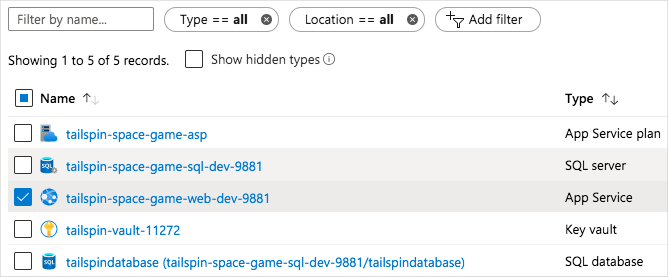
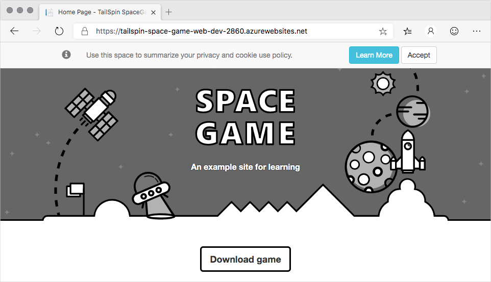

In this exercise, you destroy resources in your deployment and watch Azure Resource Manager repair your infrastructure.

Recall that Azure Resource Manager templates are idempotent. This means that Resource Manager applies infrastructure changes only when the configuration defined in your template differs from the running environment. This behavior enables you to repair your infrastructure if another process removes or changes a piece.

To see this repair process in action, here you delete your Azure App Service instance from the Azure portal. You then manually trigger the pipeline to run.

## Delete your App Service instance

Manually delete your App Service instance from the Azure portal to simulate a process that accidentally deleted a resource.

1. From the Azure portal, select **Resource groups**.
1. Select **tailspin-spacegame-web-rg**.
1. From the list of resources, select your App Service instance.

    

    > [!NOTE]
    > You can also select other resources if you want. Just be sure not to select your key vault or the database. Your Resource Manager template requires data from the key vault to provision your infrastructure, and your database has data in it that you don't want to lose.

1. From the top of the page, select **Delete**. Then enter **Yes** in the text box, and select **Delete**.

    > [!NOTE]
    > Be sure to select **Delete** and not **Delete resource group**.

1. Wait for the App Service instance to be removed from the list.

    You can periodically select the **Refresh** button to update the status.
1. As an optional step, refresh the web browser tab that shows the _Space Game_ website.

    You see that the website is no longer available.

## Manually trigger the pipeline

Manually trigger the pipeline to run so that Resource Manager can repair your infrastructure. In practice, you can push a change to GitHub to trigger the same process.

1. From Azure Pipelines, go to your pipeline.
1. Select the **Run pipeline** button.
1. Select the **provision-db** branch, and then select **Run**.
1. Go to the build and trace the build as it runs.
1. After the build finishes, select the back button to return to the summary page.

    

    You see that the deployment finished successfully. Notice that the *Apply database schema changes* stage was skipped. This is because the changes were applied in the last pipeline run, and there are no database schema changes to be approved for this pipeline run.
1. Refresh the web browser tab that shows the _Space Game_ website.

    You see that the _Space Game_ website is redeployed to App Service.

    