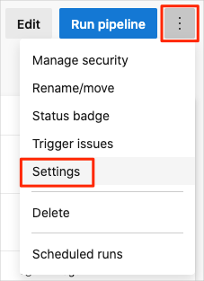

You're all done with the tasks for this module. Here, you'll move the work item to the **Done** state on Azure Boards and clean up your Azure DevOps environment.

> [!IMPORTANT]
> This page contains important cleanup steps. Cleaning up helps ensure that you don't run out of free build minutes. It also helps ensure that you're not charged for Azure resources after you complete this module.

## Clean up Azure resources

Delete your key vault, your Azure App Service instances, and the database server and database. The easiest way is to delete their parent resource group. Deleting a resource group deletes all resources in that group. You do so by using the Azure CLI through Azure Cloud Shell.

To clean up your resource group:

1. Go to the [Azure portal](https://portal.azure.com?azure-portal=true) and sign in.
1. From the menu bar, select **Cloud Shell**. When you're prompted, select the **Bash** experience.

    

1. Run the following `az group delete` command to delete the resource group that you used in this module, **tailspin-spacegame-web-rg**.

    ```azurecli
    az group delete --name tailspin-spacegame-web-rg
    ```

    When you're prompted, enter **y** to confirm the operation.

1. As an optional step, run the following `az group list` command after the previous command finishes.

    ```azurecli
    az group list --output table
    ```

    You see that the resource group **tailspin-spacegame-web-rg** no longer exists.

## Move the work item to Done

Move the work item that you assigned to yourself earlier in this module, **Provision a database in each environment**, to the **Done** column.

In practice, the definition of "done" often means functioning software for your users. For learning purposes, here you'll mark this work as complete because the goal for the Tailspin team is to provision the database through automation.

At the end of each sprint or work iteration, you and your team might hold a retrospective meeting. There, you share the work that you completed, what went well in the sprint, and what can be improved.

To complete the work item:

1. From Azure DevOps, go to **Boards**, and then select **Boards** from the menu.
1. Move the **Provision a database in each environment** work item from the **Doing** column to the **Done** column.

    

## Disable the pipeline or delete your project

Each module in this learning path provides a template that you can run to create a clean environment for the duration of the module.

Running multiple templates gives you multiple Azure Pipelines projects. Each project points to the same GitHub repository. If multiple pipelines run each time you push a change to your GitHub repository, you might run out of free build minutes on our hosted agents. So it's important that you disable or delete your pipeline before moving on to the next module.

Choose one of the following options.

### Option 1: Disable the pipeline

This option disables the pipeline so that it doesn't process further build requests. You can re-enable the build pipeline later if you want to. Choose this option if you want to keep your Azure DevOps project and your build pipeline for future reference.

To disable the pipeline:

1. In Azure Pipelines, navigate to your pipeline.
1. From the drop-down menu, select **Settings**:

    
1. Under **Processing of new run requests**, select **Disabled** and then select **Save**.

    Your pipeline will no longer process build requests.

### Option 2: Delete the Azure DevOps project

This option deletes your Azure DevOps project, including what's on Azure Boards and in your build pipeline. In future modules, you can run another template that opens a new project in a state where this one leaves off. Choose this option if you don't need your Azure DevOps project for future reference.

To delete the project:

1. From Azure DevOps, go to your project. Earlier, we recommended that you name this project **Space Game - web - ProvisionDB**.
1. Select the gear icon next to the project name.

    The icon might not appear until you move your mouse over that area.

    
1. From the **Project details** area, scroll to the bottom and select **Delete**.

    
1. From the window that appears, enter the project name and select **Delete** a second time.

Your project is now deleted.
