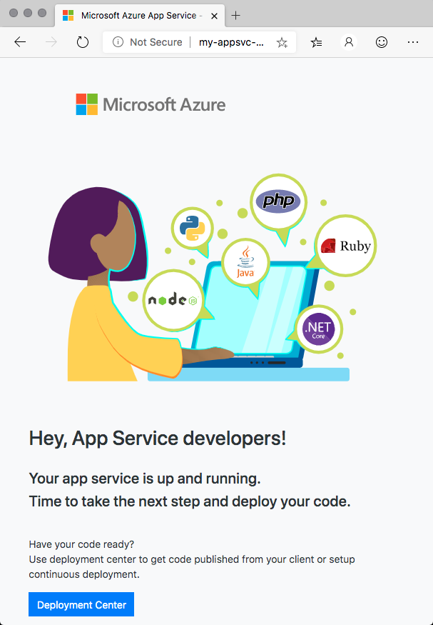

In this exercise, you run a Terraform plan that provisions Azure App Service.

During the process, you:

> [!div class="checklist"]
> * Walk through a basic Terraform plan so that you understand what each piece does.
> * Create the variables file to hold the Azure region that you choose.
> * Provision your infrastructure and verify the result.
> * Run the plan a second time to see idempotency in action.
> * Tear everything down.

> [!IMPORTANT]
> To complete this module, you need your own [Azure subscription](https://azure.microsoft.com/free/?azure-portal=true). Get started for free.

## Open Cloud Shell through the Azure portal

Open Azure Cloud Shell through the Azure portal so that you can work with Terraform code and run your configuration. We use Cloud Shell here because it comes with Terraform already set up for you.

You can also install and run Terraform locally from a terminal or a PowerShell window. Later, you'll run Terraform from Azure Pipelines.

1. Go to the [Azure portal](https://portal.azure.com?azure-portal=true) and sign in.
1. From the menu bar, select **Cloud Shell**. When you're prompted, select the **Bash** experience.

    

    > [!NOTE]
    > Cloud Shell requires an Azure Storage resource to persist any files that you create while working in Cloud Shell. When you first open Cloud Shell, it offers to create a resource group, storage account, and Azure Files share on your behalf. This is a one-time step and will be automatically attached for all future Cloud Shell sessions.

## Create a working directory

Create a directory to hold your Terraform plan. Doing so helps keep your Terraform code separate from your other work.

1. In Cloud Shell, create a directory named *mslearn-terraform-local-state*.

    ```bash
    mkdir ~/mslearn-terraform-local-state
    ```

1. Move to the *mslearn-terraform-local-state* directory.

    ```bash
    cd ~/mslearn-terraform-local-state
    ```

## Add the Terraform plan

Create a basic Terraform plan in a file named *main.tf*.

1. From the *mslearn-terraform-local-state* directory, open the editor.

    ```bash
    code main.tf
    ```

1. Add the following code to *main.tf*, and then save the file.

    [!code-terraform[](code/4-main.tf)]

## Understand the Terraform plan

Here, you briefly walk through each section of the Terraform plan to better understand how it works.

### Terraform settings

The plan starts with a `terraform` block that specifies the version of Terraform that your plan needs.

[!code-terraform[](code/main.tf?range=1-3)]

The `required_version` attribute specifies version 0.12.0 or later. In practice, you might use the `=` syntax to pin a specific version.

### Terraform variables

The plan includes these four variables:

* The resource group's name
* The resource group's location or region
* The name of the App Service plan
* A prefix that's later added to the name of the App Service instance

[!code-terraform[](code/main.tf?range=5-23)]

Each variable provides a default value. Shortly, you'll create a *.tfvars* file that specifies the value for the resource group's location.

### The random_integer resource

We haven't yet introduced the `random_integer` resource. It's a resource that generates a random whole number that's between the specified minimum and maximum values.

[!code-terraform[](code/main.tf?range=25-28)]

The plan uses this value to add a unique number to the name of your App Service instance. Azure uses the name of your App Service instance to form its host name. The name must be unique. In practice, you would specify a name for your App Service instance that describes your application.

When Terraform first runs this plan, it writes the generated value to the state file. So you get the same number each time Terraform runs.

### The resource group

The `azurerm_resource_group` resource creates the resource group that holds your App Service plan and App Service instance.

[!code-terraform[](code/main.tf?range=30-33)]

To specify the resource group's name and location, the plan uses the `${var.variable}` syntax to read the variables defined earlier in the plan.

The name "my" enables you to refer to this resource in other parts of your plan. This name does not appear in your Azure resource. Think of it as you would a variable in any other programming language.

### The App Service plan

The `azurerm_app_service_plan` resource defines the App Service plan. The App Service plan is set to run on Linux and uses the **Basic** pricing tier, which is intended for apps that have lower traffic requirements.

[!code-terraform[](code/main.tf?range=35-46)]

As with the resource group, this resource uses the `${var.variable}` syntax to specify the name of the App Service plan.

To specify the App Service plan's location and parent resource group name, this resource reads attributes from the `azurerm_resource_group` resource named "my." Doing so enables this resource to remain synchronized with its parent resource group if the parent resource group changes.

### The App Service instance

The `azurerm_app_service` resource defines the App Service instance.

[!code-terraform[](code/main.tf?range=48-53)]

Like the `azurerm_app_service_plan` resource, this resource reads the location and parent resource group name from the `azurerm_resource_group` resource named "my." It reads the App Service plan ID from the `azurerm_app_service_plan` resource.

Azure uses the App Service name to form the host name. To specify the App Service name, the plan combines (or _interpolates_) the prefix variable and the variable that holds the name of the App Service instance.

### The host name output value

In this example, you don't know the name or host name of the App Service instance until the plan runs. That's because the plan uses a random integer as part of the name.

The `output` block prints the host name of the App Service instance after the plan runs. Doing so gives you a URL that you can test to verify that App Service is running.

[!code-terraform[](code/main.tf?range=55-58)]

> [!TIP]
> In Cloud Shell, you can close the editor now if you want. But leave the command window open for the next part.

## Select an Azure region

A _region_ is one or more Azure datacenters within a specific geographic location. East US, West US, and North Europe are examples of regions. Every Azure resource, including an App Service instance, is assigned a region.

To make the commands easier to run, start by selecting a default region. After you specify the default region, later commands use that region unless you specify a different region.

1. From Cloud Shell, run the following `az account list-locations` command to list the regions that are available from your Azure subscription.

    ```azurecli
    az account list-locations \
      --query "[].{Name: name, DisplayName: displayName}" \
      --output table
    ```

1. From the **Name** column in the output, choose a region that's close to you. For example, use **eastasia** or **westus2**.

1. Run the following `read` command to set a Bash variable that's named `AZ_LOCATION`.

    ```bash
    read AZ_LOCATION
    ```

    At the prompt, enter the region that you chose in the previous step.

    This Bash variable makes it easier to run the command that comes next. In practice, this Bash variable isn't required.

1. Print the Bash variable to verify that it was set correctly.

    ```bash
    echo $AZ_LOCATION
    ```

    You see your region in the results.

## Create the variables file

Create the Terraform variables file, *terraform.tfvars*. In the file, you add the Azure region that you just chose.

This file can also contain values for your other variables. But for learning purposes, here you only need to specify the region.

1. Run the following command. It creates a file named *terraform.tfvars* and sets the contents with the value for the `resource_group_location` Terraform variable.

    ```bash
    echo 'resource_group_location = "'$AZ_LOCATION'"' | tee terraform.tfvars
    ```

1. Print *terraform.tfvars* to confirm the location.

    ```bash
    cat terraform.tfvars
    ```

    The output resembles this:

    ```output
    resource_group_location = "northeurope"
    ```

## Provision your infrastructure

Initialize Terraform, examine the proposed execution plan, and then apply the plan.

1. Run `terraform init` to initialize your Terraform environment.

    ```bash
    terraform init
    ```

    This command downloads the latest versions of the "azurerm" and "random" provider plug-ins. If you need a specific version of either of these plug-ins, you include a `provider` block in your Terraform plan.

1. Run `terraform plan` to view Terraform's proposed execution plan.

    ```bash
    terraform plan
    ```

    The command reads the `resource_group_location` variable from *terraform.tfvars*.

1. Examine the plan.

    You see that the plan includes the resource group, the random number, the App Service plan, and the App Service instance. Many attributes, including the value of the random number, can't be known until Terraform runs the plan.

    Because you haven't yet run this plan, each resource is marked with a plus (**+**) symbol to indicate that it would be created.

    In practice, you would verify that this plan meets your infrastructure requirements.

1. Run `terraform apply` to run the plan.

    ```bash
    terraform apply
    ```

    When you're prompted, enter **yes**.

    Later, you'll see how to automatically apply the configuration when you run the plan in Azure Pipelines.

    > [!IMPORTANT]
    > If you don't finish this exercise, be sure to run the `terraform destroy` command shown here to ensure that you're not charged for Azure resources you no longer need.

## Verify the result

After the plan finishes, Terraform writes the output value that contains the host name for your site. But let's see how to get this value a second time when you need it later.

1. Run `terraform output` to print the host name.

    ```bash
    terraform output
    ```

    The output resembles this:

    ```output
    website_hostname = my-appsvc-8499.azurewebsites.net
    ```

1. Run the following command to print only the host name.

    ```bash
    terraform output website_hostname
    ```

    The output resembles this:

    ```output
    my-appsvc-8499.azurewebsites.net
    ```

    This form is useful when you have many output values, but you're interested in only one of them. It's also a useful way to pass values to other commands because this form prints only the value. You'll see an example that uses this form later.

1. On a new browser tab, go to your site.

    You see the default App Service home page:

    

    Later, you'll deploy the _Space Game_ website to App Service from Azure Pipelines.

1. Run the following `az webapp list` command. This command verifies that App Service is running and that the correct parent resource group contains it.

    ```azurecli
    az webapp list --resource-group my-rg --output table
    ```

    The output resembles this:

    ```output
    Name            Location      State    ResourceGroup    DefaultHostName                  AppServicePlan
    --------------  ------------  -------  ---------------  -------------------------------- ----------------
    my-appsvc-8499  North Europe  Running  my-rg            my-appsvc-8499.azurewebsites.net my-asp
    ```

## Examine the state file

You don't typically work with the Terraform state file directly, but here you examine it to get a sense of what it contains.

Run the following command to print the contents of your Terraform state file, *terraform.tfstate*:

```bash
cat terraform.tfstate
```

Take a moment to examine the output. Although Terraform always checks with Azure to get the current state of your resources before it applies changes, the state file can help Terraform map your plan to your running resources. In this example, the state file holds the value of your random number. This value is not stored in Azure.

## Run the plan a second time

Terraform is idempotent. That means you can run it as many times as you want. Terraform applies infrastructure changes only when your plan changes or the state of your Azure resources doesn't match what's in your plan.

1. Run `terraform plan` a second time.

    ```bash
    terraform plan
    ```

    This time, you see that Terraform proposes no changes. That's because your Terraform plan did not change and you haven't modified any of your Azure resources.

1. Run `terraform apply` a second time.

    ```bash
    terraform apply
    ```

    As you would expect, Terraform does not apply any changes. Later, you'll see the benefit of this behavior when you provision your infrastructure in Azure Pipelines.

## Destroy your infrastructure

You're finished with the infrastructure that you provisioned. Here, you destroy the infrastructure that Terraform is managing for you.

1. Run `terraform destroy` to destroy your resources.

    ```bash
    terraform destroy
    ```

    When you're prompted, enter **yes**.

    Much like `terraform plan`, the `terraform destroy` command gives you a proposed plan of action. Terraform marks each resource with a minus (**-**) symbol to indicate that it would be destroyed.

1. Run the following `az group list` command to verify that your Azure subscription no longer contains a resource group named "my-rg."

    ```azurecli
    az group list \
      --query "[?contains(@.name, 'my-rg')].{name: name}" \
      --output tsv
    ```

    This command produces no output, which verifies that the resource group no longer exists.

## What's next?

Let's see what Tim and Andy plan to do next.

**Tim:** That was easy. So we can just put this in our pipeline and have it create the resources?

**Andy:** This is a great start, but we have a few things to consider. Let's do that next.
