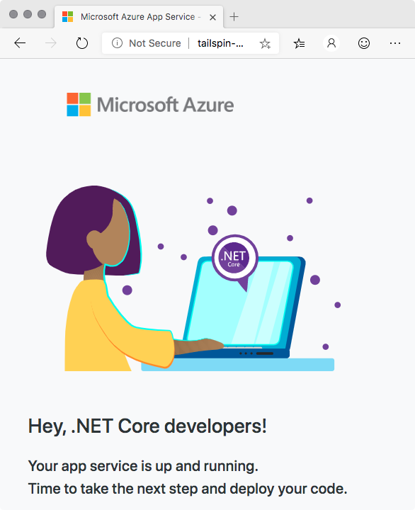

In this exercise, you run a second Terraform plan that provisions Azure App Service. The Terraform plan that you run here more closely resembles what the Tailspin team needs to deploy the _Space Game_ website.

The process that you follow is similar to what you did earlier. This time, you:

> [!div class="checklist"]
> * Maintain the state file remotely by using Azure Blob storage.
> * Use a service principal to authenticate access to Azure.

You'll again work from Azure Cloud Shell. Doing so helps you verify that you're able to authenticate with Azure and maintain the state file remotely. Later in this module, you'll apply the same configuration from Azure Pipelines.

## Open Cloud Shell through the Azure portal

As you did earlier, open Cloud Shell through the Azure portal:

1. Go to the [Azure portal](https://portal.azure.com?azure-portal=true) and sign in.
1. From the menu bar, select **Cloud Shell**. When you're prompted, select the **Bash** experience.

## Create a working directory

Similar to what you did earlier, here you create a directory to hold your Terraform plan.

1. In Cloud Shell, move to the home directory.

    ```bash
    cd ~
    ```
1. From the home directory, create a directory named *mslearn-terraform-remote-state*.

    ```bash
    mkdir ~/mslearn-terraform-remote-state
    ```

1. Move to the *mslearn-terraform-remote-state* directory.

    ```bash
    cd ~/mslearn-terraform-remote-state
    ```

## Download the Terraform plan

Download a more complete Terraform plan to a file named *main.tf*.

1. Run this `curl` command to download the Terraform plan from GitHub.

    ```bash
    curl https://raw.githubusercontent.com/MicrosoftDocs/mslearn-provision-infrastructure-azure-pipelines/master/main.tf > main.tf
    ```

    Later, you'll include this file along with the source code for the _Space Game_ website.

1. Take a moment to familiarize yourself with the contents of *main.tf*.

    This configuration resembles the one you used earlier, with these changes:

    * The variables named "my" are replaced with more realistic names that relate to the _Space Game_ website.
    * The App Service instance name corresponds to the **dev** environment in Azure Pipelines. You learned about this environment in the [Create a multi-stage pipeline with Azure Pipelines](/learn/modules/create-multi-stage-pipeline?azure-portal=true) module.
    * The App Service instance includes a `site_config` block that defines how to run the web service. It specifies the .NET Core 3.1 runtime and the startup command `dotnet Tailspin.SpaceGame.Web.dll`.

        > [!NOTE]
        > In this part, you won't deploy the _Space Game_ website to App Service. You'll do that later, when you provision your infrastructure from Azure Pipelines.

    * This configuration provides two output values: the name of the App Service instance and its host name. Later in this module, you'll write the name of the App Service instance as a pipeline variable that the deployment task can read.

## Create the variables file

The Terraform plan that you use here requires the same variables file, *terraform.tfvars*, that you used earlier. The easiest way to reuse this file is to copy it.

1. Run the following command to copy this file from the *~/mslearn-terraform-local-state* directory to the current directory.

    ```bash
    cp ~/mslearn-terraform-local-state/terraform.tfvars .
    ```

1. Print *terraform.tfvars* to confirm that it was copied over correctly.

    ```bash
    cat terraform.tfvars
    ```

    The output resembles this:

    ```output
    resource_group_location = "northeurope"
    ```

## Make your resource names unique

The names of both your storage account and your service principal need to be unique.

For learning purposes, here you generate a random number that you'll include in each name.

1. From Cloud Shell, generate a random number and assign it to the `UNIQUE_ID` Bash variable.

    ```bash
    UNIQUE_ID=$RANDOM
    ```

1. Print your identifier to the console. Write it down for later.

    ```bash
    echo $UNIQUE_ID
    ```

    The output resembles this:

    ```output
    13904
    ```

## Create a Blob storage account

Create a Blob storage account to hold your state file. To do so, you:

1. Create a resource group to hold your storage account.
1. Create a storage account.
1. Create a Blob storage container, which Terraform uses to hold your state file.

To create the Blob storage account:

1. Run the following `az group create` command to create a resource group named "tf-storage-rg."

    You can use the region that's shown here or replace it with the one you chose earlier.

    ```azurecli
    az group create \
      --location westus \
      --name tf-storage-rg
    ```

    > [!NOTE] 
    > You create a resource group that's separate from the one you use to manage your Terraform configuration. This separation ensures that the resource group is not destroyed when you run `terraform destroy`.

1. Run the following `az storage account create` command to create a storage account whose name includes your unique ID.

    ```azurecli
    az storage account create \
      --name tfsa$UNIQUE_ID \
      --resource-group tf-storage-rg \
      --sku Standard_LRS
    ```

1. Run the following `az storage account list` command to print the name of the storage account that you just created.

    ```azurecli
    az storage account list \
      --resource-group tf-storage-rg \
      --query '[].name' \
      --output tsv
    ```

    The name includes your unique ID. Here's an example:

    ```output
    tfsa4962
    ```

    Note this name for later.

1. Run the following `az storage container create` command to create a storage container named "tfstate" in your storage account.

    ```azurecli
    az storage container create \
      --account-name tfsa$UNIQUE_ID \
      --name tfstate
    ```

1. Run the following `az storage container list` command to verify that your storage container exists.

    ```azurecli
    az storage container list \
      --account-name tfsa$UNIQUE_ID \
      --query [].name \
      --output tsv
    ```

    You see this:

    ```output
    tfstate
    ```

## Add the back-end configuration to your plan

Your Terraform plan file, *main.tf*, contains a `terraform` block that contains a `backend` block that's associated with Azure.

```terraform
terraform {
  required_version = "> 0.12.0"

  backend "azurerm" {
  }
}
```

To specify your Blob storage account in this `backend` block, you can modify your plan like this (don't make this change just yet):

```terraform
terraform {
  required_version = "> 0.12.0"

  backend "azurerm" {
    resource_group_name  = "tf-storage-rg"
    storage_account_name = "tfsa4962"
    container_name       = "tfstate"
    key                  = "terraform.tfstate"
  }
}
```

You replace `storage_account_name` with the name of your storage account.

To make the configuration easier to reuse, here you write a file named *backend.tfvars* that contains this information. When you initialize Terraform, you provide this file as an argument. Terraform can then initialize its state to use a remote state file.

To create the *backend.tfvars* file:

1. Write the resource group name "tf-storage-rg" to *backend.tfvars*.

    ```bash
    echo 'resource_group_name = "tf-storage-rg"' | tee backend.tfvars
    ```
1. Run this command to fetch the name of your storage account from Azure and append the name to *backend.tfvars*.

    ```bash
    echo 'storage_account_name = "'$(az storage account list \
      --resource-group tf-storage-rg \
      --query [].name \
      --output tsv)'"' | tee -a backend.tfvars
    ```
1. Append the container name "tfstate" to *backend.tfvars*.

    ```bash
    echo 'container_name = "tfstate"' | tee -a backend.tfvars
    ```
1. Append the state file name "terraform.tfstate" to *backend.tfvars*.

    ```bash
    echo 'key = "terraform.tfstate"' | tee -a backend.tfvars
    ```

    The file *terraform.tfstate* does not yet exist in your Blob storage account. Terraform creates this file the first time it executes your plan.

1. Print *backend.tfvars* to verify its contents.

    ```bash
    cat backend.tfvars
    ```

    The output resembles this:

    ```output
    resource_group_name = "tf-storage-rg"
    storage_account_name = "tfsa4962"
    container_name = "tfstate"
    key = "terraform.tfstate"
    ```

## Run Terraform to use the remote state file

Run Terraform to apply your configuration. This time, you use a remote state file that's maintained in Blob storage.

1. Run the following `terraform init` command to initialize Terraform.

    ```bash
    terraform init -backend-config="backend.tfvars"
    ```

    This command includes the `-backend-config` argument to specify your *backend.tfvars* file.

    You see from the output that Terraform initializes the back end and then downloads the necessary plug-ins.

    > [!IMPORTANT]
    > If you don't finish this exercise, be sure to run the `terraform destroy` command shown here to ensure that you're not charged for Azure resources you no longer need.

1. Run `terraform plan` to see the proposed plan.

    ```bash
    terraform plan
    ```

    You again see that the plan includes the resource group, the random number, the App Service plan, and the App Service instance.

    In practice, you would verify that this plan meets your infrastructure requirements.

1. Run the following `terraform apply` command to apply the configuration.

    ```bash
    terraform apply -auto-approve
    ```

    This time, you specify the `-auto-approve` argument to skip the prompt that confirms the operation. Later, you use this argument to automatically apply the configuration in Azure Pipelines.

1. Verify that the configuration succeeded. To do so, run `terraform output` to print your output values. Then, from a separate browser tab, go to the host name that's shown.

    ```bash
    terraform output
    ```

    You see the default App Service home page.

    

1. As an optional step, download the state file from Blob storage to */tmp/terraform.tfstate* and view its contents.

    ```azurecli
    az storage blob download \
      --account-name tfsa$UNIQUE_ID \
      --container-name tfstate \
      --name terraform.tfstate \
      --file /tmp/terraform.tfstate
    ```

    ```bash
    cat /tmp/terraform.tfstate
    ```

    The state file describes the current state of your Azure resources. This time, the state file is maintained in Blob storage.

1. Run the following `terraform destroy` command to destroy your resources.

    ```bash
    terraform destroy -auto-approve
    ```

    The `-auto-approve` argument skips the prompt that confirms the operation.

## Create a service principal

You've configured Terraform to access the state file remotely. Next, you create the service principal that can authenticate with Azure on your behalf.

During the process, you collect information about your service principal that you'll later need when you run your configuration in Azure Pipelines.

1. Run the following `az account list` command to get your Azure subscription ID.

    ```azurecli
    ARM_SUBSCRIPTION_ID=$(az account list \
      --query "[?isDefault][id]" \
      --all \
      --output tsv)
    ```

1. Run the following `az ad sp create-for-rbac` command to create a service principal.

    ```azurecli
    ARM_CLIENT_SECRET=$(az ad sp create-for-rbac \
      --name http://tf-sp-$UNIQUE_ID \
      --role Contributor \
      --scopes "/subscriptions/$ARM_SUBSCRIPTION_ID" \
      --query password \
      --output tsv)
    ```

    The service principal's name begins with `http://tf-sp-` and ends with your unique ID.

    *Contributor* is the default role for a service principal. This role has full permissions to read and write to an Azure subscription.

    The output from this command is your only opportunity to retrieve the generated password for the service principal. The `--query` argument reads the password field from the output. The output is assigned to the Bash variable named `ARM_CLIENT_SECRET`.

1. Run the following `az ad sp show` command. It gets your service principal's client ID and assigns the result to a Bash variable named `ARM_CLIENT_ID`.

    ```azurecli
    ARM_CLIENT_ID=$(az ad sp show \
      --id http://tf-sp-$UNIQUE_ID \
      --query appId \
      --output tsv)
    ```

1. Run the following `az ad sp show` command. It gets your service principal's tenant ID and assigns the result to a Bash variable named `ARM_TENANT_ID`.

    ```azurecli
    ARM_TENANT_ID=$(az ad sp show \
      --id http://tf-sp-$UNIQUE_ID \
      --query appOwnerTenantId \
      --output tsv)
    ```

1. Print each of the Bash variables that you collected in this part to verify their contents.

    ```bash
    echo $ARM_SUBSCRIPTION_ID
    echo $ARM_CLIENT_SECRET
    echo $ARM_CLIENT_ID
    echo $ARM_TENANT_ID
    ```

    Each value is a GUID or a long series of letters and numbers.

1. Export the variables so that Terraform can access them.

    ```bash
    export ARM_SUBSCRIPTION_ID
    export ARM_CLIENT_SECRET
    export ARM_CLIENT_ID
    export ARM_TENANT_ID
    ```

    Terraform understands these environment variables and looks for them when it runs.

1. Run the following `terraform init` command to initialize Terraform.

    ```bash
    terraform init -backend-config="backend.tfvars"
    ```

    You initialize Terraform a second time here to ensure that Terraform can access Blob storage under your service principal account.

1. Run `terraform apply` to apply the configuration.

    ```bash
    terraform apply -auto-approve
    ```

    For brevity, here you skip the `terraform plan` phase.

    You see Terraform apply the configuration. As an optional step, you can confirm that the default website appears on a new browser tab.

1. Run the following `terraform destroy` command to destroy your resources.

    ```bash
    terraform destroy -auto-approve
    ```

1. Print out the details for your service principal one more time. Note their values somewhere safe, because you'll need them again later.

    ```bash
    env | grep ARM
    ```

    Also note the name of your storage account. Here's a refresher:

    ```azurecli
    az storage account list \
      --resource-group tf-storage-rg \
      --query [].name \
      --output tsv
    ```

    Finally, note the name of the Azure region that you want to use for your deployment when you run Terraform from Azure Pipelines. Here's a refresher on how to list your available regions:

    ```azurecli
    az account list-locations \
      --query "[].{Name: name, DisplayName: displayName}" \
      --output table
    ```

## Delete the state file from Blob storage

The version of Terraform that you run in Cloud Shell might be different from the version that you run in Azure Pipelines. Here, you delete your state file from Blob storage. This procedure ensures that there are no incompatibilities in the state file format between the Terraform versions. Terraform re-creates this state file when you provision your Azure resources from the pipeline.

1. From Cloud Shell, run the following `az storage account list` command to list your storage account name.

    ```azurecli
    SA_NAME=$(az storage account list \
      --resource-group tf-storage-rg \
      --query [].name \
      --output tsv)
    ```
1. Print the result to verify that you have the correct storage account name.

    ```bash
    echo $SA_NAME
    ```

    You see your storage account name.

    ```output
    tfsa13534
    ```

1. Run the following `az storage blob delete` command to delete the state file *terraform.tfstate* from Blob storage.

    ```azurecli
    az storage blob delete \
      --account-name $SA_NAME \
      --container-name tfstate \
      --name terraform.tfstate
    ```

## The result

**Tim:** I'm glad that we set up Terraform to use Blob storage and a service principal before we added anything to Azure Pipelines.

**Andy:** I agree. By understanding what the pipeline needs, we're better prepared to provision our infrastructure automatically. By first practicing the process manually, we can help ensure that things will run smoothly from the pipeline.
