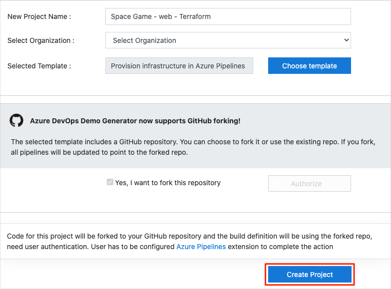
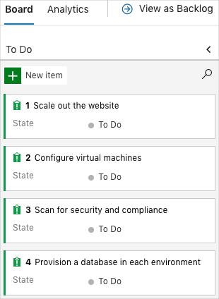
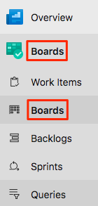
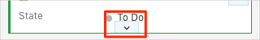
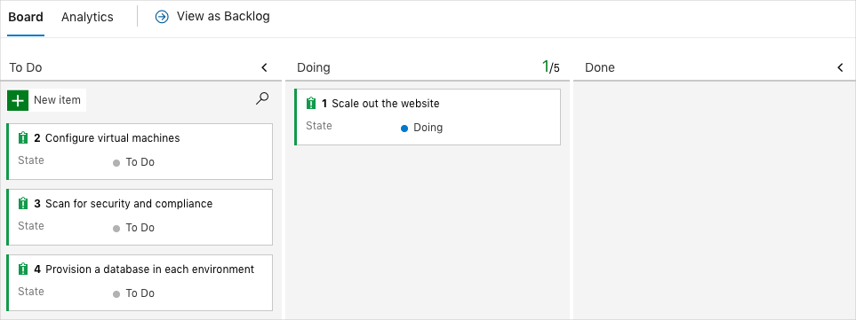
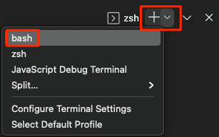
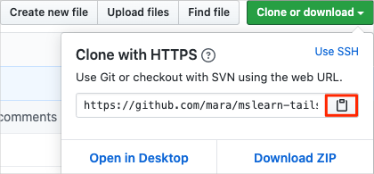

The team has been slowly integrating a DevOps strategy into its existing processes. In this section, you make sure that your environment reflects the team's efforts so far.

To do this, you:

> [!div class="checklist"]
> * Add a user to ensure that Azure DevOps can connect to your Azure subscription.
> * Set up an Azure DevOps project for this module.
> * Move the work item for this module on Azure Boards to the **Doing** column.
> * Make sure your project is set up locally so that you can push changes to the pipeline.
> * Create a service connection that enables Azure Pipelines to securely access your Azure subscription.

## Add a user to Azure DevOps

To complete this module, you need your own [Azure subscription](https://azure.microsoft.com/free/?azure-portal=true). You can get started with Azure for free.

Although you don't need an Azure subscription to work with Azure DevOps, here you'll use Azure DevOps to deploy to Azure resources that exist in your Azure subscription. To simplify the process, you need to sign in to both your Azure subscription and your Azure DevOps organization under the same Microsoft account.

If you use different Microsoft accounts to sign in to Azure and Azure DevOps, add a user to your DevOps organization under the Microsoft account that you use to sign in to Azure. For more information, see [Add users to your organization or project](https://docs.microsoft.com/azure/devops/organizations/accounts/add-organization-users?tabs=browser&azure-portal=true). When you add the user, choose the **Basic** access level.

Then sign out of Azure DevOps and sign in again under the Microsoft account that you use to sign in to your Azure subscription.

## Get the Azure DevOps project

Make sure that your Azure DevOps organization is set up to complete the rest of this module. You do this by running a template that creates a project for you in Azure DevOps.

The modules in this learning path form a progression, where you follow the Tailspin web team through its DevOps journey. For learning purposes, each module has an associated Azure DevOps project.

### Run the template

Run a template that sets up everything for you in your Azure DevOps organization.

> [!div class="nextstepaction"]
> [Run the template](https://azuredevopsdemogenerator.azurewebsites.net/?name=provision-infrastructure-azure-pipelines&azure-portal=true)

From the Azure DevOps Demo Generator site, perform these steps to run the template:

1. Select **Sign In** and accept the usage terms.
1. From the **Create New Project** page, select your Azure DevOps organization. Then enter a project name, such as *Space Game - web - Terraform*.
1. Select **Yes, I want to fork this repository**, and then select **Authorize**.
1. Select **Create Project**.

    

    It takes a few moments for the template to run.
1. Select **Fork repository on GitHub**, and then select **Authorize**. If a window appears, authorize access to your GitHub account.

    > [!IMPORTANT]
    > You need to select this option for the template to connect to your GitHub repository. Select it even if you've already forked the _Space Game_ website project. The template uses your existing fork.

1. Select **Navigate to project** to go to your project in Azure DevOps.

> [!IMPORTANT]
> The [Clean up your Azure DevOps environment](/learn/modules/provision-infrastructure-azure-pipelines/9-clean-up-environment?azure-portal=true) page in this module contains important cleanup steps. Cleaning up helps ensure that you don't run out of free build minutes. Be sure to perform the cleanup steps even if you don't complete this module.

[!include[](../../shared/includes/project-visibility.md)]

## Move the work item to Doing

In this part, you assign a work item to yourself on Azure Boards. The work item relates to this module. You also move the work item to the **Doing** state. In practice, you and your team would create work items at the start of each sprint or work iteration.

Assigning work in this way gives you a checklist. It gives others on your team visibility into what you're working on and how much work is left. It also helps the team enforce work-in-progress (WIP) limits so that the team doesn't take on too much work at one time.

Recall that the team settled on these three top issues for the current sprint:



> [!NOTE]
> Within an Azure DevOps organization, work items are numbered sequentially. In your project, the number that's assigned to each work item might not match what you see here.

Here you move the first item, **Scale out the website**, to the **Doing** column and assign yourself to the work item. **Scale out the website** relates to using automation to provision the infrastructure needed to run the _Space Game_ website.

To set up the work item:

1. From Azure DevOps, go to **Boards** and then select **Boards** from the menu.

    

1. From the **Scale out the website** work item, select the arrow at the bottom of the card. Then assign the work item to yourself.

    
1. Move the work item from the **To Do** column to the **Doing** column.

    

At the end of this module, you move the card to the **Done** column after you've completed the task.

## Prepare Visual Studio Code

Set up Visual Studio Code so you can build the website locally and work with source files.

Visual Studio Code comes with an integrated terminal, so you can edit files and work from the command line all from one place.

1. Start Visual Studio Code.
1. On the **View** menu, select **Terminal**.
1. In the drop-down list, select **bash**:

    

    The terminal window lets you choose any shell that's installed on your system, like Bash, Zsh, and PowerShell.

    Here you'll use Bash. Git for Windows provides Git Bash, which makes running Git commands easy.

    [!include[](../../shared/includes/troubleshoot-code-terminal.md)]

1. Run the `cd` command to go to the directory that you want to work from. You can choose your home directory (`~`) or a different one.

    ```bash
    cd ~
    ```

### Configure Git

If you're new to Git and GitHub, you need to run a few commands to associate your identity with Git and authenticate with GitHub. [Set up Git](https://help.github.com/articles/set-up-git?azure-portal=true) explains the process in greater detail.

At a minimum, complete the following steps. Run these commands from the Visual Studio Code integrated terminal.

1. [Set your username](https://help.github.com/articles/setting-your-username-in-git?azure-portal=true).
1. [Set your commit email address](https://help.github.com/articles/setting-your-commit-email-address-in-git?azure-portal=true).
1. [Cache your GitHub password](https://help.github.com/articles/caching-your-github-password-in-git?azure-portal=true).

> [!NOTE]
> If you're already using two-factor authentication with GitHub, [create a personal access token](https://help.github.com/articles/creating-a-personal-access-token-for-the-command-line?azure-portal=true). Use your token in place of your password when prompted later.
>
> Treat your access token like you would a password. Keep it in a safe place.

## Set up your project in Visual Studio Code

In the [Deploy applications with Azure DevOps](https://docs.microsoft.com/learn/paths/deploy-applications-with-azure-devops?azure-portal=true) learning path, you forked and then cloned a Git repository that contains the source code for the _Space Game_ website. Your fork was connected to your projects in Azure DevOps so that the build runs when you push changes to GitHub.

> [!IMPORTANT]
> In this learning path, we switch to a different Git repository, [mslearn-tailspin-spacegame-web-automate](https://github.com/MicrosoftDocs/mslearn-tailspin-spacegame-web-automate?azure-portal=true). When you ran the template to set up your Azure DevOps project, the process forked the repository automatically for you.

In this part, you clone your fork locally so that you can make changes and build out your pipeline configuration.

### Clone your fork locally

You now have a copy of the *Space Game* web project in your GitHub account. Now you'll download, or *clone*, a copy to your computer so you can work with it.

A clone, just like a fork, is a copy of a repository. When you clone a repository, you can make changes, verify that your changes work as you expect, and then upload the changes back to GitHub. You can also synchronize your local copy with changes that other authenticated users have made to GitHub's copy of your repository.

To clone the *Space Game* web project to your computer:

1. Go to your fork of the *Space Game* web project (**mslearn-tailspin-spacegame-web-automate**) on [GitHub](https://github.com?azure-portal=true).
1. Select **Clone or download**. Then select the button that copies the URL to your clipboard.

    
1. In Visual Studio Code, go to the terminal window.
1. In the terminal, move to the directory that you want to work from. You can choose your home directory (`~`) or a different one.

    ```bash
    cd ~
    ```

1. Run the `git clone` command. Replace the URL that's shown here with the contents of your clipboard.

    ```bash
    git clone https://github.com/your-name/mslearn-tailspin-spacegame-web-automate.git
    ```

1. Move to the `mslearn-tailspin-spacegame-web-automate` directory. This is the root directory of your repository.

    ```bash
    cd mslearn-tailspin-spacegame-web-automate
    ```

### Set the upstream remote

A *remote* is a Git repository where team members collaborate (like a repository on GitHub).

Run this `git remote` command to list your remotes:

```bash
git remote -v
```

You see that you have both fetch (download) and push (upload) access to your repository:

```output
origin  https://github.com/username/mslearn-tailspin-spacegame-web-automate.git (fetch)
origin  https://github.com/username/mslearn-tailspin-spacegame-web-automate.git (push)
```

*Origin* specifies your repository on GitHub. When you fork code from another repository, it's common to name the original remote (the one you forked from) as *upstream*.

Run this `git remote add` command to create a remote named *upstream* that points to the Microsoft repository:

```bash
git remote add upstream https://github.com/MicrosoftDocs/mslearn-tailspin-spacegame-web-automate.git
```

Run `git remote` a second time to see the changes:

```bash
git remote -v
```

You see that you still have both fetch (download) and push (upload) access to your repository. You also now have fetch access from the Microsoft repository:

```output
origin  https://github.com/username/mslearn-tailspin-spacegame-web-automate.git (fetch)
origin  https://github.com/username/mslearn-tailspin-spacegame-web-automate.git (push)
upstream        https://github.com/MicrosoftDocs/mslearn-tailspin-spacegame-web-automate.git (fetch)
```

### Open the project in the file explorer

In Visual Studio Code, your terminal window points to the root directory of the *Space Game* web project. You'll now open the project from the file explorer so you can view its structure and work with files.

1. On the **File** menu, select **Open**.
1. Go to the root directory of the *Space Game* web project.

    (You can run the `pwd` command in the terminal window to see the full path if you need a reminder.)

You see the directory and file tree in the file explorer.

> [!NOTE]
> You might need to open the integrated terminal a second time after you open the folder.

## Fetch starter code from GitHub

Fetch and check out a Git branch that contains starter code for this module.

1. From Visual Studio Code, open the integrated terminal.
1. Run the following `git fetch` and `git checkout` commands. These commands download a branch named `terraform` from Microsoft's repository and switch to that branch.

    ```bash
    git fetch upstream terraform
    git checkout -b terraform upstream/terraform
    ```

    Recall that `upstream` refers to Microsoft's GitHub repository. Your project's Git configuration understands the `upstream` remote because you set up that relationship when you forked the project from Microsoft's repository and cloned it locally.

    Shortly, you'll push this branch up to your GitHub repository, known as `origin`.

1. As an optional step, open *azure-pipelines.yml* from Visual Studio Code and familiarize yourself with the initial configuration.

    The configuration resembles the basic one that you created in the [Create a build pipeline with Azure Pipelines](/learn/modules/create-a-build-pipeline/6-create-the-pipeline?azure-portal=true) module. It builds only the application's Release configuration. For learning purposes, this configuration does not run the quality or security checks that you set up in previous modules.

    [!include[](../../shared/includes/pipeline-branches-note.md)]

## Create a service connection

Create a service connection that enables Azure Pipelines to access your Azure subscription. Azure Pipelines uses this service connection to deploy the website to App Service. You created a similar service connection in the [Deploy applications with Azure DevOps](https://docs.microsoft.com/learn/paths/deploy-applications-with-azure-devops?azure-portal=true) learning path.

> [!IMPORTANT]
> Make sure that you're signed in to both the Azure portal and Azure DevOps under the same Microsoft account.

1. In Azure DevOps, go to your **Space Game - web - Terraform** project.
1. From the bottom corner of the page, select **Project settings**.
1. Under **Pipelines**, select **Service connections**.
1. Select **New service connection**, then choose **Azure Resource Manager**, then select **Next**.
1. Near the top of the page, **Service principal (automatic)**. Then select **Next**.
1. Fill in these fields:

    | Field                   | Value                                      |
    |-------------------------|--------------------------------------------|
    | Scope level             | **Subscription**                           |
    | Subscription            | Your Azure subscription                    |
    | Resource Group          | **(leave blank)**                          |
    | Service connection name | *Resource Manager - Tailspin - Space Game* |

    During the process, you might be prompted to sign in to your Microsoft account.

1. Ensure that **Grant access permission to all pipelines** is selected.

1. Select **Save**.

    Azure DevOps performs a test connection to verify that it can connect to your Azure subscription. If Azure DevOps can't connect, you have the chance to sign in a second time.
