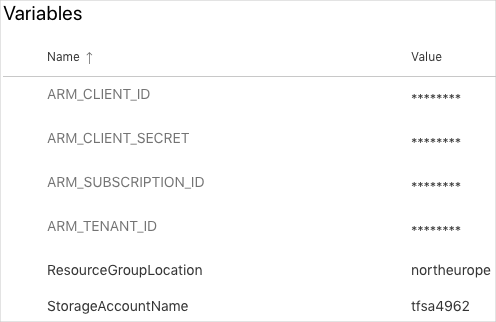
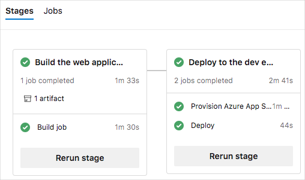

You now have everything you need to run your Terraform plan in Azure Pipelines. Automated provisioning helps you to run each phase of your deployment &mdash; build, test, provision, and deploy &mdash; all from the pipeline.

In this section, you run your Terraform plan in Azure Pipelines. During the process, you:

> [!div class="checklist"]
> * Add your service principal details and information about your Azure Blob storage account to pipeline variables.
> * Add a job to your Azure Pipelines configuration that provisions your infrastructure.
> * Visit your website to verify the deployment.
> * Remove a piece of your infrastructure and watch Terraform repair your environment.

## Create pipeline variables in Azure Pipelines

In the [Deploy applications with Azure DevOps](https://docs.microsoft.com/learn/paths/deploy-applications-with-azure-devops?azure-portal=true) learning path, you added variables to your pipeline to store the names of your web apps in Azure App Service. Here, instead of adding the names of your web apps, you add your service principal details and information about your Blob storage account.

To add the variables:

1. In Azure DevOps, go to your **Space Game - web - Terraform** project.
1. Under **Pipelines**, select **Library**.

    
1. Select **+ Variable group**.
1. Under **Properties**, enter **Release** for the variable group name.
1. Under **Variables**, select **+ Add**.
1. Add the following variables:

    > [!div class="mx-tableFixed"]
    > | Variable name             | Example value                            |
    > |---------------------------|------------------------------------------|
    > | **ARM_CLIENT_ID**         | **00000000-1111-0000-0000-000000000000** |
    > | **ARM_CLIENT_SECRET**     | **00000000-2222-0000-0000-000000000000** |
    > | **ARM_TENANT_ID**         | **00000000-3333-0000-0000-000000000000** |
    > | **ARM_SUBSCRIPTION_ID**   | **00000000-4444-0000-0000-000000000000** |
    > | **StorageAccountName**    | **tfsa4962** |
    > | **ResourceGroupLocation** | **westus** |

    Select the  lock icon next to  **ARM_CLIENT_SECRET** to encrypt this value.

1. Select **Save**.

    Your variable group looks like this:

    

## Provision infrastructure in Azure Pipelines

Modify your pipeline configuration by adding a job that runs Terraform to provision infrastructure to run the _Space Game_ website.

1. In Visual Studio Code, modify *azure-pipelines.yml* by adding a job during the _Dev_ stage.
    > [!Tip]
    > You can replace the entire file or just update the part that's highlighted.

    [!code-yml[](code/8-azure-pipelines.yml?highlight=72-107,109-111)]

    This configuration resembles the one you built in the [Deploy applications with Azure DevOps](https://docs.microsoft.com/learn/paths/deploy-applications-with-azure-devops?azure-portal=true) learning path. Here's a brief summary of what's new:

    * The _Dev_ stage includes a new job, **Provision**, that runs before the deployment job.
    * The **Provision** job:
        * Writes *terraform.tfvars* and *backend.tfvars*, just as you did from Cloud Shell.
        * Uses the `-input=false` argument to close Terraform with an error status if the values for any variables could not be set.
        * Initializes Terraform and provisions your Azure infrastructure.
        * Uses the `##vso[]` syntax to write the `WebAppNameDev` variable to the pipeline.
        * Adds the service principal credentials to the script's environment so that Terraform can access them securely.
    * The **Deploy** deployment job reads the ``WebAppNameDev`` variable from the **RunTerraform** task in the provisioning job.

1. From the integrated terminal, add *azure-pipelines.yml* to the index, commit the change, and push the change to GitHub.

    > [!TIP]
    > Remember to save *azure-pipelines.yml* before running these Git commands.

    ```bash
    git add azure-pipelines.yml
    git commit -m "Add provisioning job to the Dev stage"
    git push origin terraform
    ```

1. In Azure Pipelines, go to the build and trace the build as it runs.
1. After the build finishes, select the back button to return to the summary page.

    

    You see that the deployment finished successfully.

## Verify the result

Here, you see your website to verify the deployment.

1. From the Azure portal, select **Resource groups**.
1. Select **tailspin-space-game-rg**.
1. From the list of resources, select your App Service instance.

    The name of your App Service instance begins with **tailspin-space-game-web-dev-**, followed by a number. This is the instance that Terraform provisioned for you in the pipeline.
1. From the top of the page, select the URL to go to your website.

    You see the _Space Game_ website deployed to App Service.

    

> [!NOTE]
> For learning purposes, you use the default network settings here. The default settings make your site accessible from the internet. 
>
> In practice, you can configure an Azure virtual network that places your website in a non-internet routable network that's accessible only to you and your team. Later, when you're ready, you can reconfigure your network to make the website available to your users.

## Repair your infrastructure

Recall that Terraform operations are idempotent. This means that Terraform applies configuration changes only when the configuration defined in your plan differs from the running environment. This behavior enables you to repair your infrastructure if a piece is removed or changed by another process.

To see this repair process in action, here you delete your App Service instance from the Azure portal. You then manually trigger the pipeline to run.

1. Return to the Azure portal. You should still be on the page that details your App Service instance.

    If you're not, repeat the steps from the previous section to get there.
1. From the top of the page, select **Delete**.
1. Enter the name of your App Service instance, such as **tailspin-space-game-web-dev-2860**, in the input box. Then select **Delete**.
1. From the top of the page, select your resource group, **tailspin-space-game-rg**.
1. Wait for the App Service instance to be removed from the list.

    You can periodically select the **Refresh** button to update the status. Note that your App Service plan is not deleted. Only your web app is deleted.
1. As an optional step, refresh the web browser tab that shows the _Space Game_ website.

    You see that the website is no longer available.
1. From Azure Pipelines, go to your pipeline.
1. Select the **Run pipeline** button.
1. Select the **terraform** branch, and then select **Run**.
1. Go to the build and trace the build as it runs.
1. After the build finishes, select the back button to return to the summary page.

    

    You see that the deployment finished successfully.
1. Refresh the web browser tab that shows the _Space Game_ website.

    You see that the _Space Game_ website is redeployed to App Service.

    

    Because the state file holds your random number, Terraform can bring up a new App Service instance that has the same name.

## The result

**Tim:** I think we've got this! Let's show the team.

## Provision and configure different target environments

Now that you've learned how to set up a specific set of target environments, let's consider some of the options that are available to you.

The release pipeline deploys software to a target environment. However, it's not only the software that's deployed with the release pipeline. If you're truly focusing on CD, then infrastructure as code and spinning up infrastructure as part of your release pipeline are very important.

When you focus on the deployment of the infrastructure, first consider the differences between the target environments that you can deploy to.

### On-premises servers

In most cases, when you deploy to an on-premises server, the hardware and the operating system is already in place. The server is already there and ready. In this case, the release pipeline can simply deploy the application.

In some cases, you might want to start or stop a virtual machine (for example, on Hyper-V or VMware). The scripts that you use to start or stop the on-premises servers should be part of your source control and be delivered to your release pipeline as a build artifact. You can use a task in the release pipeline to run the script that starts or stops the servers.

If you want to configure the server as well, take a look at technologies like PowerShell Desired State Configuration (DSC), or third-party tools like Puppet or Chef. All these products will maintain your server and keep it in a particular state.

### Infrastructure as a Service

When you use the cloud as your target environment, things change a bit. Some organizations can do what's called a "lift and shift" from their on-premises server to cloud servers. In this case, your deployment works the same as it did on the on-premises server. But when you use the cloud to provide you with Infrastructure as a Service (IaaS), you can access the power of the cloud to create servers when you need them.

This is where infrastructure as code plays a significant role. By using a script or template, you can create a server or other infrastructure components, such as a SQL server, a network, or an IP address, in the cloud. That script or template can be a part of your CD pipeline, which creates your infrastructure programmatically. After that, you can execute the steps to deploy the software.

Technologies like Azure Resource Manager or Terraform are great tools for creating infrastructure on demand.

### Platform as a Service

With Platform as a Service (PaaS), the cloud provides the infrastructure for you as a service, instead of you setting it yourself as you do with IaaS.

For example, in Azure, you can choose to create a web application. The server, the hardware, the network, the public IP address, the storage account, and even the web server, is set up for you by the cloud.

The only thing that you need to do is to provide the templates which instruct the cloud to create a WebApp. The same goes for Functions as a Service (FaaS or Serverless technologies).

You only need to deploy your application and the cloud takes care of the rest. However, you need to instruct the platform (the cloud) to create a placeholder where your application can be hosted. You can define this template in Azure Resource Manager or in Terraform. The infrastructure is defined in a script file that lives alongside the application code in source control.

### Clusters

You can also deploy your software to a cluster. A cluster is a group of servers that work together to host high-scale applications.

If you run a cluster as IaaS, you need to create and maintain the cluster. This means that you need to provide the templates to create the cluster. You also need to make sure that you roll out updates, bug fixes and patches to your cluster.

On the other hand, a hosted cluster is similar to PaaS. You instruct the cloud to create the cluster and you deploy your software to the cluster. When you run a container cluster, you can use container cluster technologies like Kubernetes or Docker Swarm.

### Summary

Regardless of the technology you choose to host your application, the creation, or at least configuration of your infrastructure, should be part of your release pipeline and part of your source control repository. Infrastructure as code is a fundamental part of CD and gives you the freedom to create servers and environments on demand.