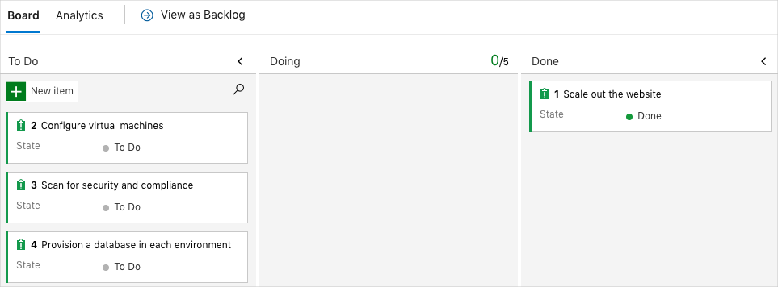

You're all done with the tasks for this module. Here, you'll clean up your Azure resources, move the work item to the **Done** state on Azure Boards, and clean up your Azure DevOps environment.

> [!IMPORTANT]
> This page contains important cleanup steps. Cleaning up helps ensure that you don't run out of free build minutes. It also helps ensure that you're not charged for Azure resources after you complete this module.

## Clean up Azure resources

Delete your Azure App Service deployment, your storage account, and your service principal. Earlier, you worked with Azure resources through Azure Cloud Shell in the Azure portal. Here, you do the same.

The easiest way to delete your App Service deployment and your storage account is to delete their parent resource groups. Deleting a resource group deletes all resources in that group.

To clean up your resource groups:

1. Go to the [Azure portal](https://portal.azure.com?azure-portal=true) and sign in.
1. From the menu bar, select **Cloud Shell**. When you're prompted, select the **Bash** experience.

    

1. Run the following `az group delete` command to delete the resource group for your App Service deployment, **tailspin-space-game-rg**.

    ```bash
    az group delete --name tailspin-space-game-rg --yes
    ```

1. Run the following `az group delete` command to delete the resource group for your storage account, **tf-storage-rg**.

    ```bash
    az group delete --name tf-storage-rg --yes
    ```

1. As an optional step, run the following `az group list` command after the previous command finishes.

    ```bash
    az group list --output table
    ```

    You see that the resource groups **tailspin-space-game-rg** and **tf-storage-rg** no longer exist.

To delete your service principal:

1. Run the following `az ad sp list` command to list the service principals in your Azure subscription.

    ```azurecli
    az ad sp list --show-mine --query [].servicePrincipalNames
    ```

1. Locate the service principal that you created in this module. The name begins with **http://tf-sp-** and ends with your unique ID. Here's an example:

    ```json
    [
      [
        "http://tf-sp-4962",
        "198244ba-dc73-4561-acea-356c513b0c37"
      ]
    ]
    ```
1. Run the following `az ad sp delete` command to delete your service principal. Replace the name shown here with yours.

    ```azurecli
    az ad sp delete --id http://tf-sp-4962
    ```

## Move the work item to Done

Move the work item that you assigned to yourself earlier in this module, **Scale out the website**, to the **Done** column.

In practice, the definition of "done" often means functioning software for your users. For learning purposes, here you'll mark this work as complete because the goal for the Tailspin team is to define a way to automatically provision infrastructure in their pipeline.

At the end of each sprint, or work iteration, you and your team might hold a retrospective meeting. There, you share the work that you completed, what went well in the sprint, and what can be improved.

To complete the work item:

1. From Azure DevOps, go to **Boards** and then select **Boards** from the menu.
1. Move the **Scale out the website** work item from the **Doing** column to the **Done** column.

    

## Disable the pipeline or delete your project

Each module in this learning path provides a template that you can run to create a clean environment for the duration of the module.

Running multiple templates gives you multiple Azure Pipelines projects. Each project points to the same GitHub repository. If multiple pipelines run each time you push a change to your GitHub repository, you might run out of free build minutes on our hosted agents. So it's important that you disable or delete your pipeline before moving on to the next module.

Choose one of the following options.

### Option 1: Disable the pipeline

This option disables the pipeline so that it doesn't process further build requests. You can re-enable the build pipeline later if you want to. Choose this option if you want to keep your Azure DevOps project and your build pipeline for future reference.

To disable the pipeline:

1. From Azure Pipelines, go to your pipeline.
1. Select the **Edit** button.

    
1. From the menu in the upper-right corner, select **Settings**.

    
1. Under **Processing of new run requests**, select **Disabled** and then select **Save**.

    Your pipeline will no longer process build requests.

### Option 2: Delete the Azure DevOps project

This option deletes your Azure DevOps project, including what's on Azure Boards and in your build pipeline. In future modules, you can run another template that opens a new project in a state where this one leaves off. Choose this option if you don't need your DevOps project for future reference.

To delete the project:

1. From Azure DevOps, go to your project. Earlier, we recommended that you name this project **Space Game - web - Terraform**.
1. Select the gear icon next to the project name.

    The icon might not appear until you move your mouse over that area.

    
1. From the **Project details** area, scroll to the bottom and select **Delete**.

    
1. From the window that appears, enter the project name and select **Delete** a second time.

    Your project is now deleted.