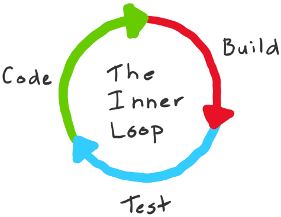
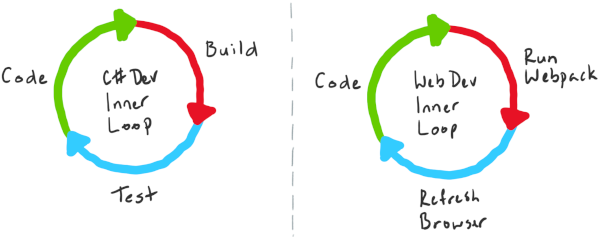
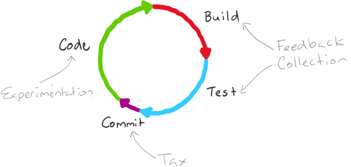
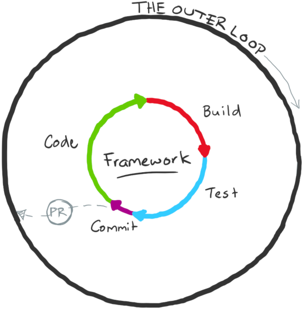
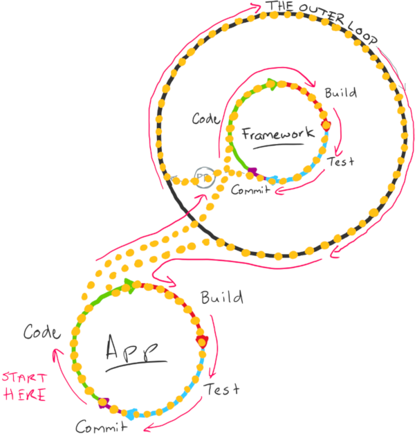

The _inner loop_ is the iterative process that a developer performs when they write, build, and debug code. There are of course other things that a developer does, but the inner loop is the core set of steps that developers perform over and over before they share their work with their team or the rest of the world.

Here's a diagram that illustrates this idea:

Exactly what goes into each developer's inner loop depends on the technologies that they are working with, the tools being used, and their own preferences.

For example, if you're writing a C# library, your inner loop might include coding, building, and testing. If you're doing web development, your inner loop might include coding, bundling, and refreshing your web browser to verify the result.

Both loops might include a fourth step, where you commit and integrate your changes with the team's central repository.

In reality, most codebases consist of multiple moving parts. The definition of a developer's inner loop on any single codebase might vary depending on what they're working on.

## What steps in the inner loop add value?

You can group the steps within the inner loop into three broad categories: *experimentation*, *feedback collection*, and *tax*.

For the example of building a C# library, here's how you might categorize each step:

| Step       | Category            |
|------------|---------------------|
| Coding     | Experimentation     |
| Building   | Feedback collection |
| Testing    | Feedback collection |
| Committing | Tax                 |

Here's a diagram that shows this mapping:

Of all the steps in the inner loop, coding is the only one that adds customer value. Building and testing code are important, but ultimately you use these as tools to gain feedback about whether the changes provide sufficient value. For example, does the code compile? Does the feature satisfy the requirements? Does the feature work correctly with other features?

A tax defines work that neither adds value nor provides feedback, but is still necessary. You can categorize unnecessary work as waste and then eliminate that work.

## How can I optimize the inner loop?

Having categorized the steps within the inner loop, there are some general statements we can make:

- The activities within the inner loop should happen as quickly as possible.
- The total loop execution time should be proportional to the changes you're making.
- Minimize the time it takes collect feedback, but maximize the quality of the feedback that you get.
- Minimize the tax you pay by eliminating it where it isn't necessary. For example, commit your changes only after all tests pass.
- As the size of your codebase grows, so does the size of the inner loop. For example, having more code means you need to run more tests, which in turn slows down the inner loop.

If you've ever worked on a large, monolithic codebase it's possible to get into a situation where even small changes require a disproportionate amount of time to execute the feedback collection steps of the inner loop.

There is no single solution that ensures that your inner loop doesn't slow you down. But it's important to notice slowdown when it happens, and then address what's causing it.

Here are a few things you can your team can do to optimize the inner loop:

1. Only build and test what changed.
1. Cache intermediate build results to speed up full builds.
1. Break up the codebase into smaller units and share binaries.

You can gain immediate benefits by implementing the first two recommendations. However, use caution when breaking your codebase into smaller units. When done incorrectly, breaking your codebase into too many small units can have the opposite effect: a tangled loop.

## What are tangled loops?

A _tangled loop_ happens when multiple processes, each with their own inner loop, become dependent on one another.

Say that your monolithic codebase has some set of core functionality that does a lot of the difficult work your application needs to perform. You might separate that code into a helper library in the form of a package.

To do this, you would typically move your library code to a separate repository and then set up a CI/CD pipeline that builds, tests, and packages the library. The pipeline might then publish the result to a package server. You would then configure your application to pull the library from the package server.

Development of the library code forms its own inner loop. When you make changes to the library and, for example, submit a pull request to merge your changes, you transition the workflow from the inner loop to the _outer loop_. The outer loop includes anything that depends on your library, for example, your monolithic application.

Initially, you might see some benefits. For example, you might see decreased build times in your application because the library code is already built for you. Eventually, you'll likely need to develop an application feature that requires new capabilities in the library. This is where teams who have incorrectly separated their codebases start to feel pain.

When you evolve code in two separate repositories where a dependency is present, then you'll likely experience some friction. In terms of the inner and outer loops, the inner loop of the original codebase now includes the outer loop of the library code that was previously separated out.

Outer loops can include taxes such as code reviews, security scanning, package signing, and release approvals. You don't want to pay that tax every time you add a function to the library that you want to use in your application.

In practice, this situation can force developers to work around processes or code in order to move forward. Such workarounds can build up tax that you'll have to pay at some point.

This doesn't mean that breaking code up into separate packages is a bad thing. You just need to carefully consider the impact your decisions have on the outer loop.