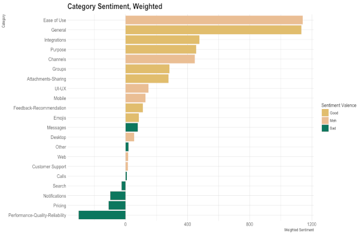

People are talking about you and your competitors constantly. They could be asking for help, complaining about a bug, or raving about how much they love you. And you want to stay on top of all those conversations. Your customers' opinions matter, not just to PR and marketing, but to every team – from customer support to product development to sales.

But sifting through irrelevant posts on multiple channels is overwhelming and can be a huge time drain. Sometimes it's not even possible when they don't tag or link to you.

That's where scanning tools comes in. Scanning tools make it easy for you to find people who are talking about you, but not necessarily to you, and reach out or take notes when necessary. There are so many business opportunities to uncover if you know where to look.

Although there isn't a specific survey question you can ask, it's important to get a general sense of what your customers are saying about your company over time.

Here are some pros and cons you might consider when deciding whether to use a scanning tool to gauge customer sentiment:

| Pros                                                                                     | Cons                                                                                               |
|------------------------------------------------------------------------------------------|----------------------------------------------------------------------------------------------------|
| There's no pressure or burden on the customer to complete a survey. Feedback happens naturally.            | It can be difficult to measure and quantify, which makes it nearly impossible to track performance over time. |
| It provides a true measure of what customers think about you, as this method is entirely organic. | It can be challenging to tie social media comments back to a customer relationship management (CRM) system at scale.                            |

Startups thrive on feedback as their "north star", and are constantly evolving based on what their customers request and complain about. This also applies to enterprises, who can't overlook the fact that customers are what make any company thrive, and often must work harder than startups to stay relevant and innovate.

If you're just collecting feedback when it comes in, you're missing out on data that's just as important as page views or engagement. It's like deciding not to bother setting up Google Analytics on your homepage, or not properly configuring your CRM. In the end, you're deciding to not benefit from data that will have a transformative effect on your product strategy.

With a dataset of feedback – whether that's from customer reviews, support tickets, or social media – you can dig into the words your customers are using to describe certain parts of your product and get insights into what they like, and perhaps more importantly, what they don't like.

Here's a diagram that shows automated analysis category sentiment for Slack, the instant messaging platform developed by Slack Technologies.

The categories on the left refer to different parts of Slack's product, and the bars represent how positively or negatively customers feel about each.

From there, you can build a summary that helps you focus on the most positive and the most negative parts of your product. You might summarize the bar chart shown earlier like this:

As the saying goes, "For every customer who bothers to complain, 20 other customers remain silent."

Unless the experience is really bad, customers usually don't bother to share feedback about an experience that didn't meet their expectations. Instead, they decide never to do business with the service provider again. That's a high price to pay for lost feedback.

An excellent source of feedback is on other websites, such as online communities, blogs, local listings, and so on. If your customers are not happy with the resolution to a negative experience, they are likely to vent their frustrations on these forums. A frustrated customer is not only a potentially lost customer. Studies have shown that each dissatisfied customer typically shares the unsatisfactory experience with eight to 10 (sometimes 20 or more) others. With the growing use of social media, it's not uncommon for negative feedback to go viral and hurt the credibility of a brand.

## Use release gates to validate your deployments

Any good DevOps practice uses techniques to limit the damage done by bugs that get deployed into production.

One common technique is to break up a production environment into a set of separate instances of an app and then configure deployments to only update one instance at a time, with a waiting period between them. During that waiting period, you watch for any signs (telemetry, customer complaints, and so on) that there is a problem. If a problem arises, you halt the deployment, fix the issue, and then continue the deployment. This way, any bug you deploy only affects a small portion of your customer base. Often, the first environment in your release pipeline is available only to people within your organization. This enables you to validate changes before they reach your customers.

_Release gates_ automate the waiting period between environments in release pipelines. They enable you to configure the conditions that cause the release to wait. For example, you can use Azure monitoring alerts to pause your release if monitoring alerts indicate that the environments you've deployed to are unhealthy. Or, you can use a work item query to automatically pause a release if anyone files a critical bug against the release.

However, one thing you'll quickly learn is that no amount of monitoring will catch every single problem and, particularly, if you have a popular application, your users will know within seconds and turn very quickly to Twitter to start asking about the problem. Twitter can be a wonderful "alert" to let you know something is wrong with your app.

You can use the [Twitter Sentiment Analysis](https://marketplace.visualstudio.com/items?itemName=ms-devlabs.vss-services-twittersentimentanalysis?azure-portal=true) extension to create a release gate that calculates the average sentiment of tweets made for a hashtag. It combines Azure DevOps, Azure functions, and Microsoft AI to analyze sentiment on your Twitter handle and gate your release progress based on sentiment. The analysis is relatively simple, but shows how easy it is to extend Azure DevOps release gates to measure any signal you choose and use that signal to manage your release process.