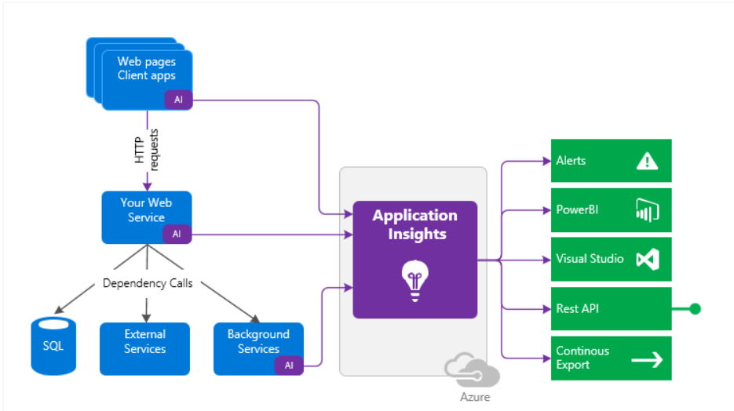

Copied from ILT

## Introduction

Continuous monitoring refers to the process and technology required to incorporate monitoring across each phase of your DevOps and IT operations lifecycles. It helps to continuously ensure the health, performance, and reliability of your application and infrastructure as it moves from development to production. Continuous monitoring builds on the concepts of Continuous Integration and Continuous Deployment (CI/CD) which help you develop and deliver software faster and more reliably to provide continuous value to your users.

Azure Monitor is the unified monitoring solution in Azure that provides full-stack observability across applications and infrastructure in the cloud and on-premises. It works seamlessly with Visual Studio and Visual Studio Code during development and test and integrates with Azure DevOps for release management and work item management during deployment and operations. It even integrates across the ITSM and SIEM tools of your choice to help track issues and incidents within your existing IT processes.

This article describes specific steps for using Azure Monitor to enable continuous monitoring throughout your workflows. It includes links to other documentation that provides details on implementing different features.

Enable monitoring for all your applications

In order to gain observability across your entire environment, you need to enable monitoring on all your web applications and services. This will allow you to easily visualize end-to-end transactions and connections across all the components.

Azure DevOps Projects give you a simplified experience with your existing code and Git repository, or choose from one of the sample applications to create a Continuous Integration (CI) and Continuous Delivery (CD) pipeline to Azure.
Continuous monitoring in your DevOps release pipeline allows you to gate or rollback your deployment based on monitoring data.
Status Monitor allows you to instrument a live .NET app on Windows with Azure Application Insights, without having to modify or redeploy your code.
If you have access to the code for your application, then enable full monitoring with Application Insights by installing the Azure Monitor Application Insights SDK for .NET, Java, Node.js, or any other programming languages. This allows you to specify custom events, metrics, or page views that are relevant to your application and your business.
Enable monitoring for your entire infrastructure

Applications are only as reliable as their underlying infrastructure. Having monitoring enabled across your entire infrastructure will help you achieve full observability and make it easier to discover a potential root cause when something fails. Azure Monitor helps you track the health and performance of your entire hybrid infrastructure including resources such as VMs, containers, storage, and network.

You automatically get platform metrics, activity logs and diagnostics logs from most of your Azure resources with no configuration.
Enable deeper monitoring for VMs with Azure Monitor for VMs.
Enable deeper monitoring for AKS clusters with Azure Monitor for containers.
Add monitoring solutions for different applications and services in your environment.
Infrastructure as code is the management of infrastructure in a descriptive model, using the same versioning as DevOps teams use for source code. It adds reliability and scalability to your environment and allows you to leverage similar processes that used to manage your applications.

Use Resource Manager templates to enable monitoring and configure alerts over a large set of resources.
Use Azure Policy to enforce different rules over your resources. This ensures that those resources stay compliant with your corporate standards and service level agreements.
Combine resources in Azure Resource Groups

A typical application on Azure today includes multiple resources such as VMs and App Services or microservices hosted on Cloud Services, AKS clusters, or Service Fabric. These applications frequently utilize dependencies like Event Hubs, Storage, SQL, and Service Bus.

Combine resources inAzure Resource Groups to get full visibility across all your resources that make up your different applications. Azure Monitor for Resource Groups provides a simple way to keep track of the health and performance of your entire full-stack application and enables drilling down into respective components for any investigations or debugging.
Ensure quality through Continuous Deployment

Continuous Integration / Continuous Deployment allows you to automatically integrate and deploy code changes to your application based on the results of automated testing. It streamlines the deployment process and ensures the quality of any changes before they move into production.

Use Azure Pipelines to implement Continuous Deployment and automate your entire process from code commit to production based on your CI/CD tests.
Use Quality Gates to integrate monitoring into your pre-deployment or post-deployment. This ensures that you are meeting the key health/performance metrics (KPIs) as your applications move from dev to production and any differences in the infrastructure environment or scale is not negatively impacting your KPIs.
Maintain separate monitoring instances between your different deployment environments such as Dev, Test, Canary, and Prod. This ensures that collected data is relevant across the associated applications and infrastructure. If you need to correlate data across environments, you can use multi-resource charts in Metrics Explorer or create cross-resource queries in Log Analytics.
Create actionable alerts with actions

A critical aspect of monitoring is proactively notifying administrators of any current and predicted issues.

Create alerts in Azure Monitor based on logs and metrics to identify predictable failure states. You should have a goal of making all alerts actionable meaning that they represent actual critical conditions and seek to reduce false positives. Use dynamic thresholds to automatically calculate baselines on metric data rather than defining your own static thresholds.
Define actions for alerts to use the most effective means of notifying your administrators. Available actions for notification are SMS, e-mails, push notifications, or voice calls.
Use more advanced actions to connect to your ITSM tool or other alert management systems through webhooks.
Remediate situations identified in alerts as well with Azure Automation runbooks or Logic Apps that can be launched from an alert using webhooks.
Use autoscaling to dynamically increase and decrease your compute resources based on collected metrics.
Prepare dashboards and workbooks

Ensuring that your development and operations have access to the same telemetry and tools allows them to view patterns across your entire environment and minimize your Mean Time To Detect (MTTD) and Mean Time To Restore (MTTR).

Prepare custom dashboards based on common metrics and logs for the different roles in your organization. Dashboards can combine data from all Azure resources.
Prepare Workbooks to ensure knowledge sharing between development and operations. These could be prepared as dynamic reports with metric charts and log queries, or even as troubleshooting guides prepared by developers helping customer support or operations to handle basic problems.
Continuously optimize

Monitoring is one of the fundamental aspects of the popular Build-Measure-Learn philosophy, which recommends continuously tracking your KPIs and user behavior metrics and then striving to optimize them through planning iterations. Azure Monitor helps you collect metrics and logs relevant to your business and to add new data points in the next deployment as required.

Use tools in Application Insights to track end-user behavior and engagement.
Use Impact Analysis to help you prioritize which areas to focus on to drive to important KPIs.

## Video introduction to Application Insights

Application Insights is an extensible Application Performance Management (APM) service for web developers on multiple platforms. Use it to monitor your live web application. It will automatically detect performance anomalies. It includes powerful analytics tools to help you diagnose issues and to understand what users actually do with your app. It's designed to help you continuously improve performance and usability. It works for apps on a wide variety of platforms including .NET, Node.js and J2EE, hosted on-premises or in the cloud. It integrates with your DevOps process, and has connection points to a variety of development tools. It can monitor and analyze telemetry from mobile apps by integrating with Visual Studio App Center.

(Video)

## How does Application Insights Work?

You install a small instrumentation package in your application, and set up an Application Insights resource in the Microsoft Azure portal. The instrumentation monitors your app and sends telemetry data to the portal. (The application can run anywhere - it doesn't have to be hosted in Azure.)

You can instrument not only the web service application, but also any background components, and the JavaScript in the web pages themselves.

In addition, you can pull in telemetry from the host environments such as performance counters, Azure diagnostics, or Docker logs. You can also set up web tests that periodically send synthetic requests to your web service.

All these telemetry streams are integrated in the Azure portal, where you can apply powerful analytic and search tools to the raw data.

What's the overhead?

The impact on your app's performance is very small. Tracking calls are non-blocking, and are batched and sent in a separate thread.

What does Application Insights monitor?

Application Insights is aimed at the development team, to help you understand how your app is performing and how it's being used. It monitors:

Request rates, response times, and failure rates - Find out which pages are most popular, at what times of day, and where your users are. See which pages perform best. If your response times and failure rates go high when there are more requests, then perhaps you have a resourcing problem.
Dependency rates, response times, and failure rates - Find out whether external services are slowing you down.
Exceptions - Analyse the aggregated statistics, or pick specific instances and drill into the stack trace and related requests. Both server and browser exceptions are reported.
Page views and load performance - reported by your users' browsers.
AJAX calls from web pages - rates, response times, and failure rates.
User and session counts.
Performance counters from your Windows or Linux server machines, such as CPU, memory, and network usage.
Host diagnostics from Docker or Azure.
Diagnostic trace logs from your app - so that you can correlate trace events with requests.
Custom events and metrics that you write yourself in the client or server code, to track business events such as items sold or games won.
Where do I see my telemetry?

There are plenty of ways to explore your data. Check out these articles:

Smart detection and manual alerts
Automatic alerts adapt to your app's normal patterns of telemetry and trigger when there's something outside the usual pattern. You can also set alerts on particular levels of custom or standard metrics.

Application map
The components of your app, with key metrics and alerts.

Profiler
Inspect the execution profiles of sampled requests.

Usage analysis
Analyze user segmentation and retention.

Diagnostic search for instance data
Search and filter events such as requests, exceptions, dependency calls, log traces, and page views.

Metrics Explorer for aggregated data Explore, filter, and segment aggregated data such as rates of requests, failures, and exceptions; response times, page load times.

Dashboards Mash up data from multiple resources and share with others. Great for multi-component applications, and for continuous display in the team room.

Live Metrics Stream When you deploy a new build, watch these near-real-time performance indicators to make sure everything works as expected.

Analytics Answer tough questions about your app's performance and usage by using this powerful query language.

Visual Studio See performance data in the code. Go to code from stack traces.

Snapshot debugger Debug snapshots sampled from live operations, with parameter values.

Power BI Integrate usage metrics with other business intelligence.

REST API Write code to run queries over your metrics and raw data.

Continuous export Bulk export of raw data to storage as soon as it arrives.

## How do I use Application Insights

Monitor

Install Application Insights in your app, set up availability web tests, and:

Set up a dashboard for your team room to keep an eye on load, responsiveness, and the performance of your dependencies, page loads, and AJAX calls.
Discover which are the slowest and most failing requests.
Watch Live Stream when you deploy a new release, to know immediately about any degradation.
Detect, Diagnose

When you receive an alert or discover a problem:

Assess how many users are affected.
Correlate failures with exceptions, dependency calls and traces.
Examine profiler, snapshots, stack dumps, and trace logs.
Build, Measure, Learn

Measure the effectiveness of each new feature that you deploy.

Plan to measure how customers use new UX or business features.
Write custom telemetry into your code.
Base the next development cycle on hard evidence from your telemetry.
Get started

Application Insights is one of the many services hosted within Microsoft Azure, and telemetry is sent there for analysis and presentation. So before you do anything else, you'll need a subscription to Microsoft Azure. It's free to sign up, and if you choose the basic pricing plan of Application Insights, there's no charge until your application has grown to have substantial usage. If your organization already has a subscription, they could add your Microsoft account to it.

There are several ways to get started. Begin with whichever works best for you. You can add the others later.

At run time: instrument your web app on the server. Avoids any update to the code. You need admin access to your server.

IIS on-premises or on a VM
Azure web app or VM
J2EE
At development time: add Application Insights to your code. Allows you to write custom telemetry and to instrument back-end and desktop apps.

Visual Studio 2013 update 2 or later.
Java
Node.js
Other platforms
Instrument your web pages for page view, AJAX and other client-side telemetry.

Analyze mobile app usage by integrating with Visual Studio App Center.

Availability tests - ping your website regularly from our servers.

(Video)