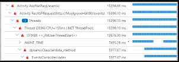
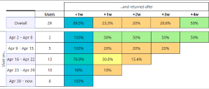
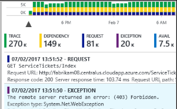
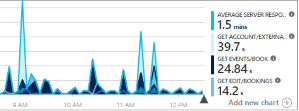
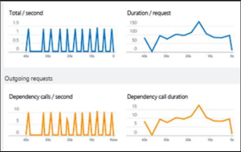

TODO: In this part, you ... This article describes specific steps for using Azure Monitor to enable continuous monitoring throughout your workflows. It includes links to other documentation that provides details on implementing different features.

TODO: It's also about Application Insights

## The meeting

TODO: Frame up a team discussion around feedback. Remember, the Beta is coming up. Irwin wants the team to consider ...

## What is continuous monitoring?

_Continuous monitoring_ refers to the processes and technologies that you can use to monitor each phase of your application's lifecycle. Continuous monitoring helps you validate the health, performance, and reliability of your application and infrastructure as changes move from development to production.

Continuous monitoring builds on CI/CD concepts, which help you develop and deliver software faster and more reliably to provide continuous value to your users.

## What is Azure Monitor?

TODO: Define observability

[Azure Monitor](https://docs.microsoft.com/azure/azure-monitor/overview?azure-portal=true) is a service on Azure that provides full-stack observability across applications and infrastructure in the cloud and on-premises. It works with development tools such as Visual Studio and Visual Studio Code during your development and test phases. It integrates with Azure DevOps to provide release management and work item management during your deployment phases. It also integrates with your favorite IT service management (ITSM) and Security information and event management (SIEM) tools to help you track issues and incidents within your existing IT processes.

TODO: The following...

### Enable monitoring on your applications

In order to gain observability across your entire environment, you need to enable monitoring on all of your web applications and services. This enables you to more easily visualize the end-to-end transactions and connections across all components.

You might start with [Azure DevOps Projects](https://docs.microsoft.com/azure/devops-project/overview?azure-portal=true), which makes it easy to create a starter CI/CD pipeline, using your existing code and Git repository.

Then, you can [add continuous monitoring to your release pipeline](https://docs.microsoft.com/azure/application-insights/app-insights-vsts-continuous-monitoring?azure-portal=true) by combining Azure Pipelines with Azure Application Insights. Application Insights is a feature of Azure Monitor that you can use to monitor your live applications. We'll take a closer look at Application Insights shortly.

### Enable monitoring on your infrastructure

Applications are only as reliable as their underlying infrastructure. Having monitoring enabled across your entire infrastructure helps you achieve full observability and makes it easier to discover potential root causes when something fails. Azure Monitor helps you track the health and performance of your entire hybrid infrastructure including virtual machines, containers, storage, and networks.

With Azure Monitor, you can collect:

* Platform metrics, activity logs and diagnostics logs from most of your Azure resources with no additional configuration needed.
* Monitoring data for VMs. ([Azure Monitor for VMs](https://docs.microsoft.com/azure/azure-monitor/insights/vminsights-overview?azure-portal=true))
* Monitoring data for AKS clusters. ([Azure Monitor for containers](https://docs.microsoft.com/azure/azure-monitor/insights/container-insights-overview?azure-portal=true))

As you learned in the [Automate your deployments with Azure DevOps](/learn/paths/automate-deployments-azure-devops/?azure-portal=true) learning path, _infrastructure as code_ enables you to describe, through code, the infrastructure that you need for your application. Because you describe your infrastructure by using code, you can follow the same development, testing, and versioning schemes that DevOps teams use for applications.

To enable monitoring by using an infrastructure as code approach, you can use:

* [Resource Manager templates](https://docs.microsoft.com/azure/azure-monitor/platform/template-workspace-configuration?azure-portal=true) to enable monitoring and configure alerts over a large set of resources.
* [Azure Policy](https://docs.microsoft.com/azure/governance/policy/overview?azure-portal=true) to enforce different rules over your resources. Azure Policy helps ensure that those resources stay compliant with your corporate standards and service-level agreements (SLAs).

### Use Azure resource groups to combine resources

A typical application on Azure includes compute resources such as virtual machines, Azure App Service, microservices, Azure Kubernetes Service (AKS) clusters, and Service Fabric. These applications frequently depend on data and networking services such as Azure Event Hubs, Azure Storage, Microsoft SQL Database, and Azure Service Bus.

In Azure, a _resource group_ holds related Azure resources. Combine resources in a resource group to get full visibility across all your resources that make up your different applications. [Azure Monitor for resource groups](https://docs.microsoft.com/azure/azure-monitor/insights/resource-group-insights) provides a basic way to keep track of the health and performance of your entire application and enables you to drill down into individual components so that you can troubleshoot failures.

### Ensure quality through continuous deployment

CI/CD enables you to integrate and deploy code changes to your application automatically, based on the results of automated testing. CI/CD streamlines the deployment process and verifies the quality of your code before changes move to production.

Here are some recommended ways to ensure quality during your deployment process:

* Use [Azure Pipelines](https://docs.microsoft.com/azure/devops/pipelines?azure-portal=true) to implement a CI/CD pipeline that automates your entire process, including running automated tests, from the time you commit code all the way to production.
* Use [quality gates](https://docs.microsoft.com/azure/devops/pipelines/release/approvals/gates?view=azure-devops?azure-portal=true) to add monitoring into your pre-deployment and post-deployment environments. Doing so helps ensure that you meet the key health and performance metrics (KPIs) as your applications move from development to production. Quality gates also help ensure that any differences in the infrastructure environment or the way that you scale do not negatively impact your KPIs.

* [Maintain separate monitoring instances](https://docs.microsoft.com/azure/application-insights/app-insights-separate-resources?azure-portal=true) between your different deployment environments such as development, test, staging, and production. Doing so helps ensure that any data that's collected is relevant across applications and infrastructure. If you need to correlate data across environments, you can use [multi-resource charts in Metrics Explorer](https://docs.microsoft.com/azure/azure-monitor/platform/metrics-charts?azure-portal=true) or create [cross-resource queries in Log Analytics](https://docs.microsoft.com/azure/azure-monitor/log-query/cross-workspace-query).

### Create alerts that you can act on

To ensure that your monitoring efforts are effective, you need to notify administrators of any active issues as well as issues you predict might happen. Some ways to accomplish this are:

* Create [alerts in Azure Monitor](https://docs.microsoft.com/azure/azure-monitor/platform/alerts-overview) based on logs and metrics to identify predictable failure states.

    The goal is to ensure that each alert represents a critical condition that you can act on. A _false positive_ happens when monitoring reports an issue that does not actually exist. Use dynamic thresholds to automatically calculate baselines on metric data rather than defining your own static thresholds.
* Define actions for alerts to that most effectively notify your administrators.

    Available [actions for notification](https://docs.microsoft.com/azure/azure-monitor/platform/action-groups#create-an-action-group-by-using-the-azure-portal?azure-portal=true) are short message service (SMS), email, push notifications, or voice calls.
* Use more advanced actions to [connect to your ITSM tool](https://docs.microsoft.com/azure/azure-monitor/platform/itsmc-overview?azure-portal=true) or other alert management systems through webhooks.
* Use [Azure Automation runbooks](https://docs.microsoft.com/azure/automation/manage-runbooks) or [webhooks](https://docs.microsoft.com/azure/azure-monitor/platform/activity-log-alerts-webhook) to remediate alert conditions.
* Use [autoscaling](https://docs.microsoft.com/azure/azure-monitor/learn/tutorial-autoscale-performance-schedule) to dynamically adjust your compute resources based on the metrics you collect.

### Create dashboards and workbooks

Ensuring that your development and operations teams have access to the same telemetry and tools enables them to view patterns across your entire environment and minimize your _Mean Time To Detect_ (MTTD) and _Mean Time To Restore_ (MTTR). Here are some ways to do that:

* Create [custom dashboards](https://docs.microsoft.com/azure/application-insights/app-insights-tutorial-dashboards) that are based on common metrics and logs for the different roles in your organization. Dashboards can combine data from multiple Azure resources.
* Create [Azure Monitor workbooks](https://docs.microsoft.com/azure/application-insights/app-insights-usage-workbooks) to share knowledge between development and operations teams. You can prepare a workbook as a dynamic report that contains charts and log summaries. Developers can create troubleshooting guides to help customer support or operations troubleshoot problems.

### Continuously optimize

Monitoring is one of the fundamental aspects of the popular Build-Measure-Learn philosophy, which recommends that you continuously track your KPIs and user behavior metrics and then optimize them through iterative planning exercises. Azure Monitor helps you collect metrics and logs that are relevant to your business and to add new data points in the next deployment as required.

* Use tools in Application Insights to [track end-user behavior and engagement](https://docs.microsoft.com/azure/application-insights/app-insights-tutorial-users).
* Use [Impact Analysis](https://docs.microsoft.com/azure/application-insights/app-insights-usage-impact) to help you prioritize which areas to focus on to improve on your most important KPIs.

## What is Azure Application Insights?

---
* If you have access to the code for your application, then enable full monitoring with [Application Insights](https://docs.microsoft.com/azure/application-insights/app-insights-overview?azure-portal=true) by installing the Azure Monitor Application Insights SDK for [.NET](https://docs.microsoft.com/azure/application-insights/quick-monitor-portal?azure-portal=true), [Java](https://docs.microsoft.com/azure/application-insights/app-insights-java-quick-start?azure-portal=true), [Node.js](https://docs.microsoft.com/azure/application-insights/app-insights-nodejs-quick-start?azure-portal=true), or . Doing so enables you to specify custom events, metrics, or page views that are relevant to your application and your business.
---

Application Insights is an Application Performance Management (APM) service for web developers. With it, you can:

* Monitor your live web application.
* Automatically detect performance anomalies.
* Diagnose failures and understand what users actually do with your application.

Application Insights works with .NET, Node.js, Java, and [many other programming languages and frameworks](https://docs.microsoft.com/azure/application-insights/app-insights-platforms?azure-portal=true). It works with applications hosted in the cloud or on-premises.

Application Insights provides connection points that you can use to integrate with your existing DevOps processes and tools. Application Insights also integrates with Visual Studio App Center, which enables you to monitor and analyze telemetry from your mobile applications.

### How does Application Insights work?

You start by adding a small instrumentation package to your application. Then you create an Application Insights resource in the Azure portal. The instrumentation monitors your app and sends telemetry data back to Azure, which you can access from the portal. Remember that your application can run anywhere; it doesn't need to be hosted in Azure.

In addition to web applications, you can instrument almost any kind of background component. You can even instrument JavaScript code.

TODO: Here's a ...

You can also pull in telemetry data from your host environments. This data includes performance counters, Azure diagnostics, and Docker logs. You can also set up _synthetic monitoring_ tests. Synthetic monitoring uses a set of transactions to assess performance and availability. Synthetic transactions are predictable tests that enable you to compare results from release to release.

#### What's the overhead?

The impact on your app's performance is typically very small. Tracking calls are non-blocking, and are batched and sent in a separate thread.

### What does Application Insights monitor?

Application Insights helps development teams understand how their app is performing and how it's being used.

Application Insights monitors:

* Request rates, response times, and failure rates.

    Find out which pages are most popular, at what times of day, and where your users are. See which pages perform best. See how your response times and failure rates compare to your traffic levels.
* Whether external services are slowing you down.
* Application exceptions.

    Analyze the aggregated statistics, or pick specific instances and investigate the stack trace for related requests. Application Insights reports exceptions that occur both on the server and on the client.
* Web page load performance, as reported from the user's web browser.
* AJAX calls from web pages, including response times and failure rates.
* User and session counts.
* Performance counters from your Windows or Linux server machines, such as CPU, memory, and network usage.
* Host diagnostics from Docker or Azure.
* Diagnostic trace logs from your app. This enables you to correlate trace events with requests.
* Custom events and metrics that you write yourself in the client or server code. For example, you might track events such as items sold or games won.

### Where do I see my telemetry?

Here are ways you can view and track your telemetry data:

* [Smart detection and manual alerts](https://docs.microsoft.com/en-us/azure/application-insights/app-insights-proactive-diagnostics)

    Automatic alerts adapt to your app's normal patterns of telemetry and trigger when there's something outside the usual pattern. You can also set alerts on particular levels of custom or standard metrics.

    

* [Application Map](https://docs.microsoft.com/en-us/azure/azure-monitor/app/app-map)
    Application Map helps you spot performance bottlenecks or failure hotspots across all components of your distributed application.

    

* [Profiler](https://docs.microsoft.com/en-us/azure/azure-monitor/app/profiler)

    You can run Profiler on ASP.NET and ASP.NET Core apps that are running on Azure App Service using Basic service tier or higher.

    

* [Usage analysis](https://docs.microsoft.com/en-us/azure/azure-monitor/app/usage-overview)

    Analyze user segmentation and retention.

    

* [Search](https://docs.microsoft.com/en-us/azure/azure-monitor/app/diagnostic-search)

    Search helps you find and explore individual telemetry items, such as page views, exceptions, or web requests.

    

* [Metrics Explorer](https://docs.microsoft.com/en-us/azure/azure-monitor/platform/metrics-getting-started)

    Enables you to plot charts, visually correlate trends, and investigate spikes and dips in metrics' values.

    

* [Live Metrics Stream](https://docs.microsoft.com/en-us/azure/azure-monitor/app/live-stream)

    When you deploy a new build, watch performance indicators in close to real time to make sure everything works as expected.

    

* [Log Analytics](https://docs.microsoft.com/en-us/azure/azure-monitor/log-query/get-started-portal)

    Answer tough questions about your app's performance and usage by using a powerful query language.

    

[Snapshot Debugger](https://docs.microsoft.com/en-us/azure/azure-monitor/app/snapshot-debugger)

    Collect a debug snapshot from your live web application.

    

* Power BI

    Integrate usage metrics with other business intelligence.

    

* [Continuous Export](https://docs.microsoft.com/azure/azure-monitor/app/export-telemetry)

    Export raw data to storage as soon as it arrives.

    

TODO: Summarize any interesting observations here.
TODO: Any observations from the TS team?