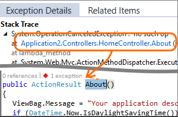

_Continuous monitoring_ refers to the processes and technologies that are required to monitor each phase of the DevOps and operations lifecycle. Continuous monitoring helps validate the health, performance, and reliability of your application and infrastructure as changes move from development to production. Continuous monitoring builds on CI/CD concepts, which help you develop and deliver software faster and more reliably to provide continuous value to your users.

TODO: In this part, you ... This article describes specific steps for using Azure Monitor to enable continuous monitoring throughout your workflows. It includes links to other documentation that provides details on implementing different features.

TODO: It's also about Application Insights

## What is Azure Monitor?

[Azure Monitor](https://docs.microsoft.com/azure/azure-monitor/overview?azure-portal=true) is the monitoring solution in Azure that provides full-stack observability across applications and infrastructure in the cloud and on-premises. It works with development tools such as Visual Studio and Visual Studio Code during your development and test phases. It integrates with Azure DevOps to provide release management and work item management during your deployment phases. It even integrates with your favorite ITSM and SIEM tools to help track issues and incidents within your existing IT processes.

TODO: The following...

### Enable monitoring on your applications

In order to gain observability across your entire environment, you need to enable monitoring on all your web applications and services. This enables you to easily visualize end-to-end transactions and connections across all  components.

* [Azure DevOps Projects](https://docs.microsoft.comazure/devops-project/overview?azure-portal=true) helps get you started with your existing code and Git repository. Or you can choose a sample applications to create CI/CD pipeline.

* [Continuous monitoring in your DevOps release pipeline](https://docs.microsoft.com/en-us/azure/application-insights/app-insights-vsts-continuous-monitoring?azure-portal=true) enables you to gate or rollback your deployment based on monitoring data.

* [Status Monitor](https://docs.microsoft.com/en-us/azure/application-insights/app-insights-monitor-performance-live-website-now?azure-portal=true) enables you to instrument a running .NET app on Windows with Azure Application Insights, without having to modify or redeploy your code.

* If you have access to the code for your application, then enable full monitoring with [Application Insights](https://docs.microsoft.com/en-us/azure/application-insights/app-insights-overview?azure-portal=true) by installing the Azure Monitor Application Insights SDK for [.NET](https://docs.microsoft.com/en-us/azure/application-insights/quick-monitor-portal?azure-portal=true), [Java](https://docs.microsoft.com/en-us/azure/application-insights/app-insights-java-quick-start?azure-portal=true), [Node.js](https://docs.microsoft.com/en-us/azure/application-insights/app-insights-nodejs-quick-start?azure-portal=true), or [many other programming languages](https://docs.microsoft.com/en-us/azure/application-insights/app-insights-platforms?azure-portal=true). Doing so enables you to specify custom events, metrics, or page views that are relevant to your application and your business.

### Enable monitoring on your infrastructure

Applications are only as reliable as their underlying infrastructure. Having monitoring enabled across your entire infrastructure helps you achieve full observability and makes it easier to discover potential root causes when something fails. Azure Monitor helps you track the health and performance of your entire hybrid infrastructure including virtual machines, containers, storage, and networks.

Here are some additional benefits:

* You automatically get platform metrics, activity logs and diagnostics logs from most of your Azure resources with no configuration.
* Enable deeper monitoring for VMs with Azure Monitor for VMs.
* Enable deeper monitoring for AKS clusters with Azure Monitor for containers.
* Add monitoring solutions for different applications and services in your environment.

As you learned in the [Automate your deployments with Azure DevOps](/learn/paths/automate-deployments-azure-devops/?azure-portal=true) learning path, _infrastructure as code_ enables you to describe, through code, the infrastructure that you need for your application. Because you describe your infrastructure by using code, you can follow the same development, testing, and versioning schemes that DevOps teams use for applications.

* Use [Resource Manager templates](https://docs.microsoft.com/en-us/azure/azure-monitor/platform/template-workspace-configuration) to enable monitoring and configure alerts over a large set of resources.
* Use [Azure Policy](https://docs.microsoft.com/en-us/azure/governance/policy/overview) to enforce different rules over your resources. This helps ensure that those resources stay compliant with your corporate standards and service-level agreements (SLAs).

### Use Azure resource groups to combine resources

A typical application on Azure includes multiple resources such as virtual machines, Azure App Service, microservices, Azure Kubernetes Service (AKS) clusters, and Service Fabric. These applications frequently depend on other services such as Azure Event Hubs, Azure Storage, Microsoft SQL Database, and Azure Service Bus.

In Azure, a _resource group_ holds related Azure resources. Combine resources in a resource group to get full visibility across all your resources that make up your different applications. [Azure Monitor for resource groups](https://docs.microsoft.com/en-us/azure/azure-monitor/insights/resource-group-insights) provides a basic way to keep track of the health and performance of your entire application and enables you to drill down into individual components so that you can troubleshoot failures.

### Ensure quality through continuous deployment

CI/CD enables you to integrate and deploy code changes to your application automatically, based on the results of automated testing. CI/CD streamlines the deployment process and verifies the quality of your code before changes move to production.

* Use [Azure Pipelines](https://docs.microsoft.com/en-us/azure/devops/pipelines?azure-portal=true) to implement a CI/CD pipeline that automates your entire process, including running automated tests, from the time you commit code all the way to production.
* Use [quality gates](https://docs.microsoft.com/en-us/azure/devops/pipelines/release/approvals/gates?view=azure-devops?azure-portal=true) to integrate monitoring into your pre- and post-deployment environments. Doing so helps ensure that you meet the key health and performance metrics (KPIs) as your applications move from development to production. It also helps ensure that any differences in the infrastructure environment or the way that you scale do not negatively impact your KPIs.

* [Maintain separate monitoring instances](https://docs.microsoft.com/en-us/azure/application-insights/app-insights-separate-resources?azure-portal=true) between your different deployment environments such as development, test, staging, and production. Doing so helps ensure that any data that's collected is relevant across applications and infrastructure. If you need to correlate data across environments, you can use [multi-resource charts in Metrics Explorer](https://docs.microsoft.com/en-us/azure/azure-monitor/platform/metrics-charts?azure-portal=true) or create [cross-resource queries in Log Analytics](https://docs.microsoft.com/en-us/azure/azure-monitor/log-query/cross-workspace-query).

### Create alerts that you can act on

An important aspect of monitoring is to proactively notify administrators of any current issues and issues you predict might happen.

* Create [alerts in Azure Monitor](https://docs.microsoft.com/en-us/azure/azure-monitor/platform/alerts-overview) based on logs and metrics to identify predictable failure states. You should have a goal of making all alerts actionable, which means that they represent actual critical conditions. A _false positive_ when monitoring reports an issue that does not actually exist. Use dynamic thresholds to automatically calculate baselines on metric data rather than defining your own static thresholds.
* Define actions for alerts to use the most effective means of notifying your administrators. Available [actions for notification](https://docs.microsoft.com/en-us/azure/azure-monitor/platform/action-groups#create-an-action-group-by-using-the-azure-portal?azure-portal=true) are short message service (SMS), email, push notifications, or voice calls.
* Use more advanced actions to [connect to your ITSM tool](https://docs.microsoft.com/en-us/azure/azure-monitor/platform/itsmc-overview?azure-portal=true) or other alert management systems through webhooks.
* Remediate situations identified in alerts as well with Azure Automation runbooks or Logic Apps that can be launched from an alert using [webhooks](https://docs.microsoft.com/en-us/azure/azure-monitor/platform/activity-log-alerts-webhook).
* Use [autoscaling](https://docs.microsoft.com/en-us/azure/azure-monitor/learn/tutorial-autoscale-performance-schedule) to dynamically adjust your compute resources based on the metrics you collect.

### Prepare dashboards and workbooks

Ensuring that your development and operations teams have access to the same telemetry and tools enables them to view patterns across your entire environment and minimize your _Mean Time To Detect_ (MTTD) and _Mean Time To Restore_ (MTTR).

* Prepare [custom dashboards](https://docs.microsoft.com/en-us/azure/application-insights/app-insights-tutorial-dashboards) that are based on common metrics and logs for the different roles in your organization. Dashboards can combine data from multiple Azure resources.
* Prepare [Workbooks](https://docs.microsoft.com/en-us/azure/application-insights/app-insights-usage-workbooks) to share knowledge between development and operations teams. You can prepare a workbook as a dynamic report that contains charts and log summaries, or even as troubleshooting guides, prepared by developers, to help customer support or operations troubleshoot problems.

### Continuously optimize

Monitoring is one of the fundamental aspects of the popular Build-Measure-Learn philosophy, which recommends that you continuously track your KPIs and user behavior metrics and then optimize them through iterative planning exercises. Azure Monitor helps you collect metrics and logs that are relevant to your business and to add new data points in the next deployment as required.

* Use tools in Application Insights to [track end-user behavior and engagement](https://docs.microsoft.com/en-us/azure/application-insights/app-insights-tutorial-users).
* Use [Impact Analysis](https://docs.microsoft.com/en-us/azure/application-insights/app-insights-usage-impact) to help you prioritize which areas to focus on to improve on your most important KPIs.

## What is Application Insights?

Application Insights is an extensible Application Performance Management (APM) service for web developers. Use it to monitor your live web application. It can automatically detect performance anomalies. It includes analytics tools that help you diagnose issues and understand what users actually do with your application. By understanding how users interact with your application, you can optimize your application to improve performance and usability. Application Insights works with applications written for wide variety of platforms including .NET, Node.js and J2EE, whether they're hosted on-premises or in the cloud. It integrates with your DevOps process, and has connection points to a variety of development tools. It can monitor and analyze telemetry from mobile apps by integrating with Visual Studio App Center.

TODO: Video: https://youtu.be/fX2NtGrh-Y0

### How does Application Insights work?

You start by adding a small instrumentation package to your application. Then you create an Application Insights resource in the Azure portal. The instrumentation monitors your app and sends telemetry data back to Azure, which you can view from the portal. Your application can run anywhere; it doesn't need to be hosted in Azure.

In addition to web applications, you can instrument almost any kind of background component. You can even instrument JavaScript code.

You can also pull in telemetry data from host environments. This data includes performance counters, Azure diagnostics, and Docker logs. You can also set up _synthetic monitoring_ tests. Synthetic monitoring uses a set of transactions to assess performance and availability. Synthetic transactions are predictable tests that have the advantage of allowing comparison from release to release in a highly predictable manner.

#### What's the overhead?

The impact on your app's performance is typically very small. Tracking calls are non-blocking, and are batched and sent in a separate thread.

### What does Application Insights monitor?

Application Insights helps development team understand how their app is performing and how it's being used.

It monitors:

* Request rates, response times, and failure rates.

    Find out which pages are most popular, at what times of day, and where your users are. See which pages perform best. See how your response times and failure rates compare to your traffic levels.
* Whether external services are slowing you down.
* Exceptions.

    Analyze the aggregated statistics, or pick specific instances and investigate the stack trace for related requests. Application Insights reports exceptions that occur both on the server and on the client.
* Web page load performance, as reported from the user's web browser.
* AJAX calls from web pages, including response times and failure rates.
* User and session counts.
* Performance counters from your Windows or Linux server machines, such as CPU, memory, and network usage.
* Host diagnostics from Docker or Azure.
* Diagnostic trace logs from your app - so that you can correlate trace events with requests.
* Custom events and metrics that you write yourself in the client or server code, to track business events such as items sold or games won.

### Where do I see my telemetry?

There are plenty of ways to explore your data. Check out these articles:

Smart detection and manual alerts
Automatic alerts adapt to your app's normal patterns of telemetry and trigger when there's something outside the usual pattern. You can also set alerts on particular levels of custom or standard metrics.

Application map
The components of your app, with key metrics and alerts.

Profiler
Inspect the execution profiles of sampled requests.

Usage analysis
Analyze user segmentation and retention.

Diagnostic search for instance data
Search and filter events such as requests, exceptions, dependency calls, log traces, and page views.

Metrics Explorer for aggregated data Explore, filter, and segment aggregated data such as rates of requests, failures, and exceptions; response times, page load times.

Dashboards Mash up data from multiple resources and share with others. Great for multi-component applications, and for continuous display in the team room.

Live Metrics Stream When you deploy a new build, watch these near-real-time performance indicators to make sure everything works as expected.

Analytics Answer tough questions about your app's performance and usage by using this powerful query language.

Visual Studio See performance data in the code. Go to code from stack traces.

Snapshot debugger Debug snapshots sampled from live operations, with parameter values.

Power BI Integrate usage metrics with other business intelligence.

REST API Write code to run queries over your metrics and raw data.

Continuous export Bulk export of raw data to storage as soon as it arrives.

## How do I use Application Insights

Monitor

Install Application Insights in your app, set up availability web tests, and:

Set up a dashboard for your team room to keep an eye on load, responsiveness, and the performance of your dependencies, page loads, and AJAX calls.
Discover which are the slowest and most failing requests.
Watch Live Stream when you deploy a new release, to know immediately about any degradation.
Detect, Diagnose

When you receive an alert or discover a problem:

Assess how many users are affected.
Correlate failures with exceptions, dependency calls and traces.
Examine profiler, snapshots, stack dumps, and trace logs.
Build, Measure, Learn

Measure the effectiveness of each new feature that you deploy.

Plan to measure how customers use new UX or business features.
Write custom telemetry into your code.
Base the next development cycle on hard evidence from your telemetry.
Get started

Application Insights is one of the many services hosted within Microsoft Azure, and telemetry is sent there for analysis and presentation. So before you do anything else, you'll need a subscription to Microsoft Azure. It's free to sign up, and if you choose the basic pricing plan of Application Insights, there's no charge until your application has grown to have substantial usage. If your organization already has a subscription, they could add your Microsoft account to it.

There are several ways to get started. Begin with whichever works best for you. You can add the others later.

At run time: instrument your web app on the server. Avoids any update to the code. You need admin access to your server.

IIS on-premises or on a VM
Azure web app or VM
J2EE
At development time: add Application Insights to your code. Allows you to write custom telemetry and to instrument back-end and desktop apps.

Visual Studio 2013 update 2 or later.
Java
Node.js
Other platforms
Instrument your web pages for page view, AJAX and other client-side telemetry.

Analyze mobile app usage by integrating with Visual Studio App Center.

Availability tests - ping your website regularly from our servers.

(Video)