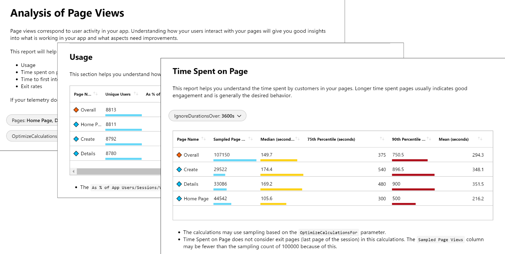
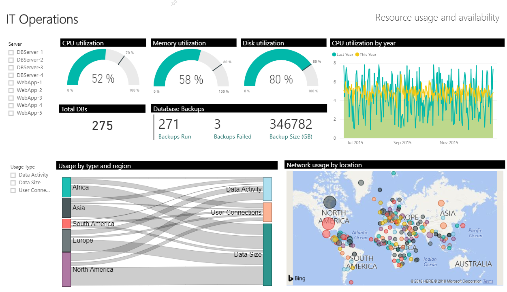

Visualizations, such as charts and graphs, can help you analyze your monitoring data to drill down on issues and identify patterns. Depending on the tool you use, you may also be able to share these visualizations with other users inside and outside of your organization.

In this unit, you explore some of the ways you can build a monitoring and status dashboard for your application. You'll look at:

* Azure dashboards
* Azure Monitor workbooks
* Application Insights workbooks
* Power BI
* Grafana
* Building your own custom application

## The meeting

**Amita:** I've been thinking about what Tim said, about how valuable monitoring the app and the infrastructure can be. I think it would be great to use that data in dashboards. I really like the visualizations for the pipeline. They're a great way to see what's happening quickly. Let's do the same for monitoring.

**Mara:** I love pictures. Do you have any ideas?

**Amita:** Of course. Let me tell you about Azure dashboards and some other tools.

## What are Azure dashboards?

Amita wants to visualize the monitoring data Tim's collecting and she has some ideas about how to do it.

[Dashboards](https://docs.microsoft.com/azure/azure-portal/azure-portal-dashboards?azure-portal=true) enable you to create a focused and organized view in the Azure portal of your cloud resources. They provide a "single pane of glass" over your Azure infrastructure and services, enabling you to identify important issues more quickly.

Here's an example dashboard:

### Advantages of Azure dashboards

Azure dashboards provide:

* Integration with Azure services. You can pin visualizations to your dashboard from multiple Azure pages including metrics analytics, log analytics, and Application Insights.
* Support for both metrics and log data.
* A way to combine data from multiple sources, including output from:
  * [Metrics Explorer](https://docs.microsoft.com/azure/azure-monitor/platform/metrics-charts?azure-portal=true)
  * [Log queries](https://docs.microsoft.com/azure/azure-monitor/log-query/log-query-overview?azure-portal=true)
  * [Application Map](https://docs.microsoft.com/azure/azure-monitor/app/app-map?azure-portal=true)
* An option for personal or shared dashboards. Dashboards are integrated with Azure [role based authentication](https://docs.microsoft.com/azure/role-based-access-control/overview?azure-portal=true) (RBAC).
* Automatic refresh.
* Parametrized metrics dashboards with timestamp and custom parameters.
* Flexible layout options.
* Full screen mode.

### Limitations of Azure dashboards

Azure dashboards do not provide:

* Full control over log visualizations.
* Custom parameters support for log charts.
* Log charts data older than 30 days.
* Interactivity with dashboard data.
* Full contextual drill-down.

## What are Azure Monitor workbooks?

[Views in Azure Monitor](https://docs.microsoft.com/azure/azure-monitor/platform/view-designer?azure-portal=true) enable you to create custom visualizations with log data. They are used by monitoring solutions to present the data they collect.

### Advantages of Azure Monitor workbooks

Azure Monitor workbooks provide:

* Rich visualizations for log data.
* Export and import views to transfer them to other resource groups and subscriptions.
* Integration with Log Analytic management model with workspaces and monitoring solutions.
* [Filters](https://docs.microsoft.com/azure/azure-monitor/platform/view-designer-filters?azure-portal=true) for custom parameters.
* Interactive views that can drill down into other views.

### Limitations of Azure Monitor workbooks

Azure Monitor workbooks do not:

* Support metrics data.
* Provide personal views. Rather, views are available to all users with access to the workspace.
* Refresh data automatically.
* Provide full layout options.
* Provide support for querying across multiple workspaces or Application Insights applications.
* Allow response sizes to exceed 8 MB or query execution time to exceed 110 seconds.

## What are Application Insights workbooks?

[Workbooks](https://docs.microsoft.com/azure/application-insights/app-insights-usage-workbooks?azure-portal=true) are interactive documents that provide deep insights into your data, investigation, and collaboration inside the team. Workbooks can serve as a troubleshooting guide or to capture details from an incident postmortem.

Here's a diagram to give you a sense of what a workbook looks like.

### Advantages of Application Insights workbooks

Application Insights workbooks:

* Support both metrics and logs.
* Support parameters that enable you to build interactive reports.

    For example, you might select an element in a table to dynamically update other charts and visualizations.
* Provide a document-like flow.
* Provide options for personal or shared workbooks.
* Provide templates that support public GitHub template galleries.

### Limitations of Application Insights workbooks

Application Insights workbooks do not:

* Refresh data automatically.
* Provide a dense layout like dashboards provide. This makes workbooks less useful as a "single pane of glass".

## What is Power BI?

[Power BI](https://powerbi.microsoft.com/documentation/powerbi-service-get-started/?azure-portal=true) enables you to create business-centric dashboards and reports, as well as reports analyzing long-term KPI trends. You can [import the results of a log query](https://docs.microsoft.com/azure/log-analytics/log-analytics-powerbi?azure-portal=true) into a Power BI dataset so you can combine data from different sources and share reports on the web and on mobile devices.

Here's what Power BI looks like:

### Advantages of Power BI

Power BI provides:

* Rich visualizations.
* Extensive interactivity including zoom and cross-filtering.
* An easy way to share reports with your organization.
* Integration with multiple data sources.
* High performance with results cached in a cube.

### Limitations of Power BI

Power BI does not:

* Support log data.
* Integrate with Azure services. For example, you can't manage dashboards or models through Azure Resource Manager.
* Refresh data more than eight times per day.

## Grafana

[Grafana](https://grafana.com/?azure-portal=true) is an open platform that provides operational dashboards. It helps you detect, isolate, and triage operational incidents. You can add the [Grafana Azure Monitor data source plugin](https://docs.microsoft.com/azure/azure-monitor/platform/grafana-plugin?azure-portal=true) to your Azure subscription to visualize your Azure metrics data.

Here's what Grafana looks like:

### Advantages of Grafana

Grafana provides:

* Rich visualizations.
* A rich ecosystem of data sources.
* Data interactivity, including zoom.

### Limitations of Grafana

Grafana does not:

* Support metrics data.
* Integrate with Azure services. For example, you can't manage dashboards or models through Azure Resource Manager.

## Build your own custom application

You can access log and metric data in Azure Monitor through its API by using REST calls. This feature enables you to build your own custom websites and applications.

### Advantages of building your own custom application

With a custom application, you have:

* Complete flexibility in the presentation (UI), visualization, interactivity, and features.
* Control over which metrics and log data you combine with other data sources.

### Limitations of building your own custom application

With a custom application, it's up to you to build the functionality that you need. Significant engineering effort may be required.

## The decision

**Mara:** That's a lot of options. Where do you want to start?

**Amita:** I think I'll start with Azure dashboards. I think it's straightforward to make one, and I like that you can control the time range. Also, it's easy to share the dashboard. Tim, do you want to get together so we can decide what the dashboard should show?

**Tim:** Sounds great. Off the top of my head, I think CPU, network, and disk operations might make a good starting point but let's talk about it.
