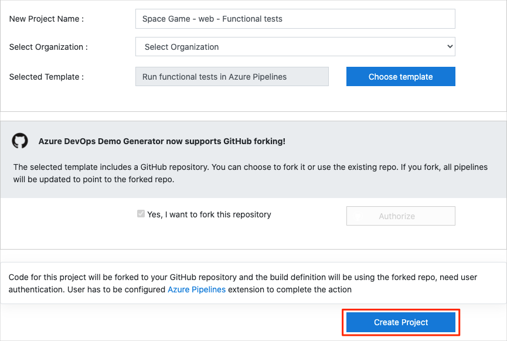
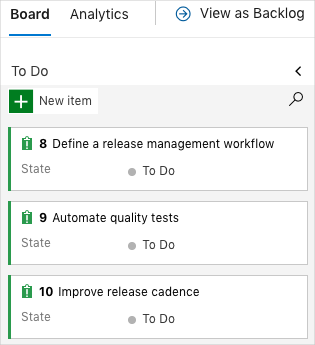
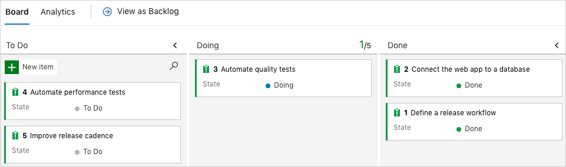
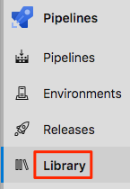

In this section, you make sure that your Azure DevOps organization is set up to complete the rest of this module. You also create the Azure App Service environments that you'll deploy to.

To accomplish these tasks, you:

> [!div class="checklist"]
> * Add a user to ensure that Azure DevOps can connect to your Azure subscription.
> * Set up an Azure DevOps project for this module.
> * Move the work item for this module on Azure Boards to the **Doing** column.
> * Create the Azure App Service environments by using the Azure CLI in Azure Cloud Shell.
> * Create pipeline variables that define the names of your App Service environments.
> * Create a service connection that enables Azure Pipelines to securely access your Azure subscription.

## Add a user to Azure DevOps

To complete this module, you need your own [Azure subscription](https://azure.microsoft.com/free/?azure-portal=true). You can get started with Azure for free.

Although you don't need an Azure subscription to work with Azure DevOps, here you'll use Azure DevOps to deploy to resources that exist in your Azure subscription. To simplify the process, sign in to both your Azure subscription and your Azure DevOps organization under the same Microsoft account.

If you use different Microsoft accounts to sign in to Azure and Azure DevOps, add a user to your DevOps organization under the Microsoft account that you use to sign in to Azure. For more information, see [Add users to your organization or project](https://docs.microsoft.com/azure/devops/organizations/accounts/add-organization-users?tabs=browser&azure-portal=true). When you add the user, choose the **Basic** access level.

Then sign out of Azure DevOps and sign in again under the Microsoft account that you use to sign in to your Azure subscription.

## Get the Azure DevOps project

Here you make sure that your Azure DevOps organization is set up to complete the rest of this module. You accomplish this task by running a template that creates a project in Azure DevOps.

The modules in this learning path form a progression as you follow the Tailspin web team through their DevOps journey. For learning purposes, each module has an associated Azure DevOps project.

### Run the template

Run a template that sets up everything in your Azure DevOps organization.

> [!div class="nextstepaction"]
> [Run the template](https://azuredevopsdemogenerator.azurewebsites.net/?name=run-functional-tests&azure-portal=true)

From the Azure DevOps Demo Generator site, follow these steps to run the template:

1. Select **Sign In** and accept the usage terms.
1. On the **Create New Project** page, select your Azure DevOps organization. Then enter a project name, such as *Space Game - web - Functional tests*.

    

1. Select **Yes, I want to fork this repository**. Then select **Authorize**.
1. Select **Create Project**.

    The template takes a few moments to run.
1. Select **Navigate to project** to go to your project in Azure DevOps.

> [!IMPORTANT]
> The [Clean up your Azure DevOps environment](/learn/modules/run-functional-tests-azure-pipelines/7-clean-up-environment?azure-portal=true) page in this module contains important cleanup steps. Cleaning up helps ensure that you don't run out of free build minutes. Be sure to perform the cleanup steps even if you don't complete this module.

[!include[](../../shared/includes/project-visibility.md)]

## Move the work item to Doing

In this part, in Azure Boards you assign yourself a work item that relates to this module. You also move the work item to the **Doing** state. In practice, your team would create work items at the start of each sprint, or work iteration.

Assigning work in this way gives you a checklist to work from. It gives your team visibility into what you're working on and how much work is left. It also helps the team enforce limits on work in progress (WIP) to avoid taking on too much work at one time.

Recall that the team settled on these top issues for the current sprint:



> [!NOTE]
> Within an Azure DevOps organization, work items are numbered sequentially. In your project, the number for each work item might not match what you see here.

Here you move the third item, **Automate quality tests**, to the **Doing** column. Then you assign yourself to the work item. **Automate quality tests** relates to automating UI tests for the _Space Game_ website.

To set up the work item:

1. From Azure DevOps, go to **Boards**, and then select **Boards** from the menu.

    

1. On the **Automate quality tests** work item, select the down arrow at the bottom of the card. Then assign the work item to yourself.

    
1. Move the work item from the **To Do** column to the **Doing** column.

    

At the end of this module, after you complete the task, you move the card to the **Done** column.

[!include[](../../shared/includes/deploy-local-setup.md)]

## Create the Azure App Service environments

Here you create the environments that define the pipeline stages. You create one App Service instance that corresponds to each stage: _Dev_, _Test_, and _Staging_.

In the [Create a multistage pipeline by using Azure Pipelines](/learn/modules/create-multi-stage-pipeline?azure-portal=true) module, you used the Azure CLI to create your App Service instances. Here you'll do the same.

> [!IMPORTANT]
> You need your own Azure subscription to complete the exercises in this module.

### Bring up Cloud Shell through the Azure portal

1. Go to the [Azure portal](https://portal.azure.com?azure-portal=true) and sign in.
1. From the menu bar, select **Cloud Shell**. When you're prompted, select the **Bash** experience.

### Select an Azure region

Here you specify the default _region_, or geographic location, where your Azure resources are to be created.

1. From Cloud Shell, run the following `az account list-locations` command to list the regions that are available from your Azure subscription.

    ```azurecli
    az account list-locations \
      --query "[].{Name: name, DisplayName: displayName}" \
      --output table
    ```

1. From the **Name** column in the output, choose a region that's close to you. For example, choose **eastasia** or **westus2**.

1. Run `az configure` to set your default region. Replace **\<REGION>** with the name of the region you chose.

    ```azurecli
    az configure --defaults location=<REGION>
    ```

    Here's an example that sets **westus2** as the default region:

    ```azurecli
    az configure --defaults location=westus2
    ```

### Create the App Service instances

Here you create the App Service instances for the three stages you'll deploy to: _Dev_, _Test_, and _Staging_.

> [!NOTE]
> For learning purposes, here you use the default network settings. These settings make your site accessible from the internet. In practice, you could configure an Azure virtual network that places your website in a network that's not internet routable and that's accessible only to you and your team. Later, when you're ready, you could reconfigure your network to make the website available to your users.

1. From Cloud Shell, generate a random number that makes your web app's domain name unique.

    ```bash
    webappsuffix=$RANDOM
    ```

1. Run the following `az group create` command to create a resource group that's named **tailspin-space-game-rg**.

    ```azurecli
    az group create --name tailspin-space-game-rg
    ```

1. Run the following `az appservice plan create` command to create an App Service plan that's named **tailspin-space-game-asp**.

    ```azurecli
    az appservice plan create \
      --name tailspin-space-game-asp \
      --resource-group tailspin-space-game-rg \
      --sku B1
    ```

    The `--sku` argument specifies the **B1** plan, which runs on the **Basic** tier.

    > [!IMPORTANT]
    > If the **B1** SKU isn't part of your Azure subscription, [choose a different plan](https://azure.microsoft.com/pricing/details/app-service/linux/?azure-portal=true), such as **S1** (**Standard**).

1. Run the following `az webapp create` commands to create the three App Service instances, one for each of the  _Dev_, _Test_, and _Staging_ environments.

    ```azurecli
    az webapp create \
      --name tailspin-space-game-web-dev-$webappsuffix \
      --resource-group tailspin-space-game-rg \
      --plan tailspin-space-game-asp

    az webapp create \
      --name tailspin-space-game-web-test-$webappsuffix \
      --resource-group tailspin-space-game-rg \
      --plan tailspin-space-game-asp

    az webapp create \
      --name tailspin-space-game-web-staging-$webappsuffix \
      --resource-group tailspin-space-game-rg \
      --plan tailspin-space-game-asp
    ```

    For learning purposes, here you apply the same App Service plan, **B1 Basic**, to each App Service instance. In practice, you would assign a plan that matches your expected workload.

1. Run the following `az webapp list` command to list the host name and state of each App Service instance.

    ```azurecli
    az webapp list \
      --resource-group tailspin-space-game-rg \
      --query "[].{hostName: defaultHostName, state: state}" \
      --output table
    ```

    Note the host name for each running service. You'll need these host names later when you verify your work. Here's an example:

    ```output
    HostName                                                 State
    -------------------------------------------------------  -------
    tailspin-space-game-web-dev-21017.azurewebsites.net      Running
    tailspin-space-game-web-test-21017.azurewebsites.net     Running
    tailspin-space-game-web-staging-21017.azurewebsites.net  Running
    ```

1. As an optional step, go to one or more of the names to verify that they are running and that the default home page appears.

    You see this page:

    

> [!IMPORTANT]
> The [Clean up your Azure DevOps environment](/learn/modules/run-functional-tests-azure-pipelines/7-clean-up-environment?azure-portal=true) page in this module contains important cleanup steps. Cleaning up helps ensure that you're not charged for Azure resources after you complete this module. Be sure to perform the cleanup steps even if you don't complete this module.

## Create pipeline variables in Azure Pipelines

In the [Create a multistage pipeline by using Azure Pipelines](/learn/modules/create-multi-stage-pipeline?azure-portal=true), you added one variable for each of the App Service instances, which correspond to the _Dev_, _Test_, and _Staging_ stages in your pipeline. Here you do the same.

Each stage in your pipeline configuration uses these variables to identify which App Service instance to deploy to.

To add the variables:

1. In Azure DevOps, go to your **Space Game - web - Functional tests** project.
1. Under **Pipelines**, select **Library**.

    
1. Select **+ Variable group**.
1. Under **Properties**, for the variable group name, enter *Release*.
1. Under **Variables**, select **+ Add**.
1. For the name of your variable, enter *WebAppNameDev*. For its value, enter the name of the App Service instance that corresponds to your _Dev_ environment, such as *tailspin-space-game-web-dev-1234*.
1. Repeat steps 5 and 6 twice more to create variables for your _Test_ and _Staging_ environments, as shown in this table:

    | Variable name         | Example value                            |
    |-----------------------|------------------------------------------|
    | *WebAppNameTest*    | *tailspin-space-game-web-test-1234*    |
    | *WebAppNameStaging* | *tailspin-space-game-web-staging-1234* |

    Be sure to replace each example value with the App Service instance that corresponds to your environment.

    > [!IMPORTANT]
    > Set the name of the App Service instance, not its host name. In this example, you would enter *tailspin-space-game-web-dev-1234* and not *tailspin-space-game-web-dev-1234.azurewebsites.net*.

1. Near the top of the page, select **Save** to save your variable to the pipeline.

    Your variable group resembles this one:

    

## Create a service connection

Here you create a service connection that enables Azure Pipelines to access your Azure subscription. Azure Pipelines uses this service connection to deploy the website to App Service. You created a similar service connection in the previous module.

> [!IMPORTANT]
> Make sure that you're signed in to both the Azure portal and Azure DevOps under the same Microsoft account.

1. In Azure DevOps, go to your **Space Game - web - Functional tests** project.
1. From the bottom corner of the page, select **Project settings**.
1. Under **Pipelines**, select **Service connections**.
1. Select **New service connection**, then choose **Azure Resource Manager**, then select **Next**.
1. Near the top of the page, **Service principal (automatic)**. Then select **Next**.
1. Fill in these fields:

    | Field                   | Value                                      |
    |-------------------------|--------------------------------------------|
    | Scope level             | **Subscription**                           |
    | Subscription            | Your Azure subscription                    |
    | Resource Group          | **tailspin-space-game-rg**                 |
    | Service connection name | *Resource Manager - Tailspin - Space Game* |

    During the process, you might be prompted to sign in to your Microsoft account.

1. Ensure that **Grant access permission to all pipelines** is selected.

1. Select **Save**.

    Azure DevOps performs a test connection to verify that it can connect to your Azure subscription. If Azure DevOps can't connect, you have the chance to sign in a second time.