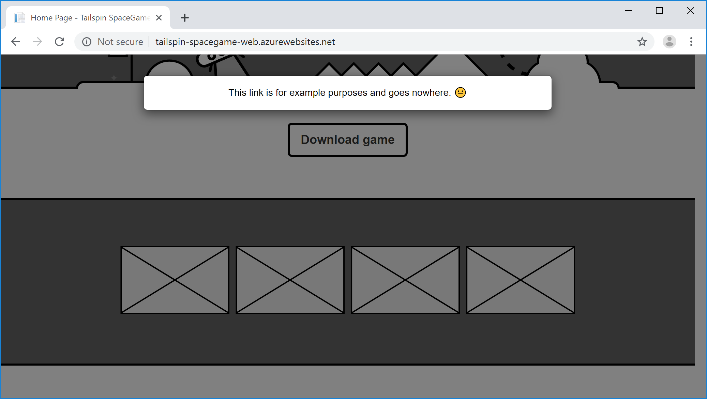
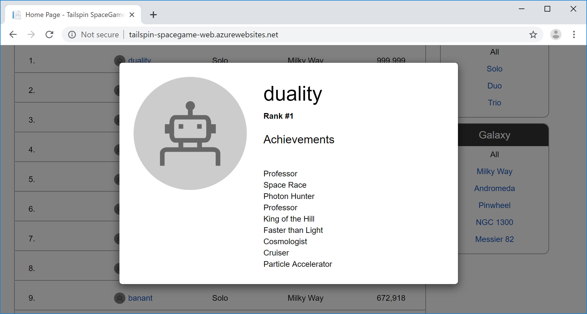
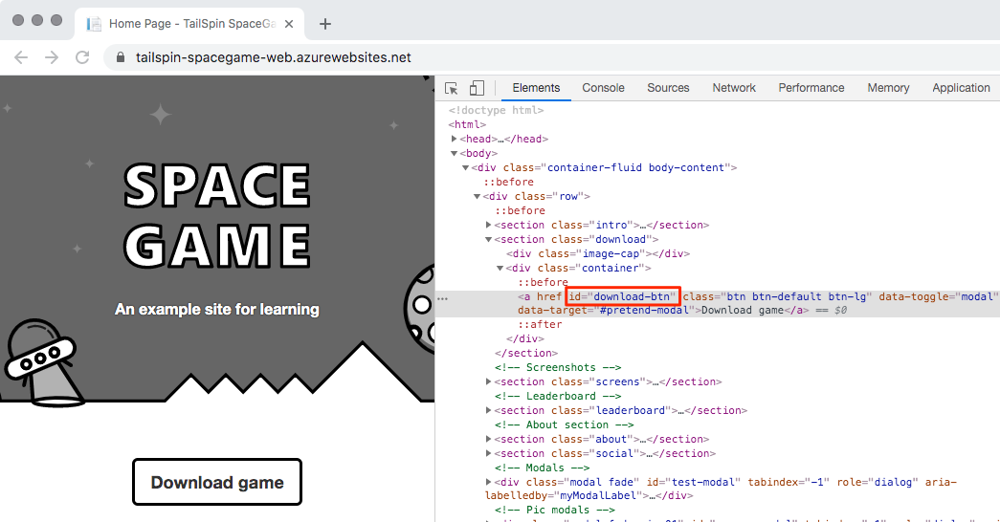

In this section, you follow along with Amita and Andy as they talk about how to incorporate Selenium UI tests into the release pipeline. They begin by walking through the tests that Amita normally does manually. Then they map Amita's manual steps to automated test cases.

## Run UI tests manually

Amita is waiting for Andy to show up. Andy is going to help Amita write a UI test that will be added to the _Test_ stage of the pipeline. When he arrives, Andy sees Amita scribbling in her notebook, crossing out something, muttering, and then tearing out the page. 

**Andy:** Hi. You don't look happy.

**Amita:** I'm not happy. I'm trying to figure out how to write an automated test, but I don't know where to start. I don't code. I feel like I'm obsolete.

**Andy:** Wow, I don't think it's that bad. For one thing, we'll always need someone who has the user's perspective in mind. There's no way to automate that. For another, no one starts out knowing how to automate tests. We were all beginners at some point. Hopefully, I can make the learning process a bit easier.

I think the best way to start is to automate something you regularly do manually. Pick a UI test. Then let's walk through it and write down the steps. Next we'll figure out how to automate those steps. What test should we pick?

Amita takes a deep breath.

**Amita:** Let's automate the modal window tests. When I click certain things, like the **Download game** button for example, I want to verify that the correct modal window appears. Then when I click away from the modal window, I want to verify that the modal window disappears and that the main window is active again.

**Andy:** That sounds like a great place to start. You run the test. I'll write down the procedure.

Amita opens a Windows laptop and launches Google Chrome. She goes to the web app and verifies that the home page opens.

> [!TIP]
> For reference, Microsoft hosts a version of the [Space Game](http://tailspin-spacegame-web.azurewebsites.net?azure-portal=true) website. Go there if you want to follow along with Amita's manual tests. Otherwise, you can just read along.

**Andy:** OK. What do you check next?

**Amita:** I check that when I click the **Download game** button, the correct modal window appears.

Amita clicks the **Download game** button. The modal window appears.

**Andy:** Great. What modal windows do you check next?

**Amita:** Next I check the four game screens. After that, I click the top player on the leaderboard. I verify that the player's profile appears.

Amita clicks each of the four thumbnail images to show the example game screens.

Next Amita clicks the top player on the leaderboard. The player's profile appears.

**Amita:** That covers the modal window tests. I run these tests on Windows because that's what most players use to visit our site. I run the tests on Chrome, and when I have time I also run them on Firefox and Microsoft Edge.

If I had time, I would run all the tests again on macOS and Linux, just to ensure we're compatible with any operating system that the players use to visit the site. But I need to run many other tests.

## Get the XPath expressions for the HTML elements

Here you follow along with Amita and Andy as they collect the XPath expressions for the buttons that Amita clicks and for the resulting modal windows. XPath is a query language that lets you locate an XML element and retrieve information about it. XPath also works with HTML.

**Andy:** I can see why these tests take so long and can be so frustrating. You're going to love automating them. I promise. 

Here's what we'll do. We'll get the XPath expression for each button you click and for the modal window that appears. The automated tests that we write can use these expressions to know which buttons to click and which modal windows to expect.

Let's start by getting the XPath expression for the **Download game** button.

> [!NOTE]
> You can follow these steps if you want to, or just read along. The next section provides all of the XPath expressions that you need when you run the automated tests.

1. In Google Chrome, go to the _Space Game_ home page.
1. Right-click the **Download game** button. Then select **Inspect**.

    The developer tools window opens. The HTML code for the **Download game** button is highlighted.

    

1. Right-click the highlighted text. Point to **Copy** and then select **Copy XPath**.
1. Paste the text into a document. We'll use it later.

    The XPath expression for the **Download game** button is `/html/body/div/div/section[2]/div[2]/a`.

1. Select the **Download game** button. Then repeat steps 2 through 4 to get the XPath expression for the modal window that appears.
1. Repeat the process for the four game screens and the top player on the leaderboard.

Amita opens Microsoft Word and adds a table. The table contains the XPath expression for each link and the XPath expression for the corresponding modal window. To keep the table basic, Amita records:

* The **Download game** button.
* Just one of the game screens.
* The top player on the leaderboard.

Here's what Amita's table looks like:

> [!div class="mx-tableFixed"]
> | Feature                  | Link XPath                                                             | Modal XPath                            |
> |--------------------------|------------------------------------------------------------------------|----------------------------------------|
> | **Download game** button | `/html/body/div/div/section[2]/div[2]/a`                               | `//*[@id=\"pretend-modal\"]/div/div`   |
> | First game screen        | `/html/body/div/div/section[3]/div/ul/li[1]/a`                         | `/html/body/div[1]/div/div[2]`         |
> | Top leaderboard player   | `/html/body/div/div/section[4]/div/div/div[1]/div[2]/div[2]/div/a/div` | `//*[@id=\"profile-modal-1\"]/div/div` |

## Plan the automated tests

**Amita:** OK. We have the XPath expression for each button I click. We also have the resulting modal window. What's next?

**Andy:** I think we're ready to write our tests. Here's what we'll do:

1. Create an NUnit project that includes Selenium. The project will be stored in the directory along with the app's source code.
1. Write a test case that uses automation to click the specified link. The test case verifies that the expected modal window appears.
1. Use the XPath data we saved to specify the parameters to the test case method. This task creates a sequence, or series, of tests.
1. Configure the tests to run on Chrome, Firefox, and Microsoft Edge. This task creates a matrix of tests.
1. Run the tests and watch each web browser come up automatically.
1. Watch Selenium automatically run through the series of tests for each browser.
1. In the console window, verify that all the tests pass.

**Amita:** I'll be excited to see how quickly the tests run. Can we try the tests now?

**Andy:** Absolutely. Let's move over to my laptop. I have the app code ready.
