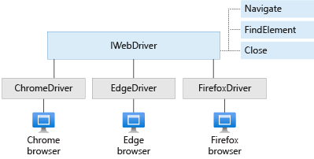

In this section, you help Andy and Amita write Selenium tests that verify the UI behaviors that Amita described.

Although Amita normally runs her tests on Chrome, Firefox, and Microsoft Edge, you'll set up tests that run on Chrome, Firefox, and Internet Explorer. For learning purposes, we choose these browsers because the Microsoft-hosted agent you'll use comes preconfigured to work with them. It does not yet support Microsoft Edge.

You can checkout [Use a Microsoft-hosted agent](https://docs.microsoft.com/azure/devops/pipelines/agents/hosted?view=azure-devops&azure-portal=true#use-a-microsoft-hosted-agent) to see what kinds of agents Microsoft hosts and their capabilities. In practice, you can install additional software on your agent or provide your own agent that has the software you need preinstalled.

## Fetch the branch from GitHub

In this section, you fetch the `selenium` branch from GitHub and check out, or switch to, that branch. This will help you follow along with the tests that Andy and Amita write.

This branch contains the _Space Game_ project that you worked with in previous modules and an Azure Pipelines configuration to start with.

1. In Visual Studio Code, open the integrated terminal.
1. To download a branch named `selenium` from the Microsoft repository and switch to that branch, run the following `git fetch` and `git checkout` commands:

    ```bash
    git fetch upstream selenium
    git checkout -b selenium upstream/selenium
    ```

    Recall that *upstream* refers to the Microsoft GitHub repository. Your project's Git configuration understands the upstream remote, because you set up that relationship when you forked the project from the Microsoft repository and cloned it locally.

    Shortly, you'll push this branch up to your GitHub repository, known as `origin`.

1. Optionally, in Visual Studio Code, open the *azure-pipelines.yml* file, and familiarize yourself with the initial configuration.

    The configuration resembles the ones that you created in the previous modules in this learning path. It builds only the application's **Release** configuration. For brevity, it also omits the triggers, manual approvals, and tests you set up in previous modules.

    [!include[](../../shared/includes/pipeline-branches-note.md)]

## Write the unit test code

Amita is excited about learning to write code that controls the web browser. 

She and Andy will work together to write the Selenium tests. Andy has an empty NUnit project already set up. Throughout the process, they refer to the Selenium documentation, a few online tutorials, and the notes they took when Amita performed the tests manually. (We'll point you to more resources at the end of this module.)

Let's review the process Andy and Amita use to write their tests. You can follow along by opening *HomePageTest.cs* under the *Tailspin.SpaceGame.Web.UITests* directory in Visual Studio Code.

### Define the HomePageTest class

**Andy:** The first thing we need to do is define our test class. There are a few naming conventions we can use, but let's call our class `HomePageTest`. We can put all of our tests that relate to the home page in this class.

Andy adds this code to *HomePageTest.cs*:

```cs
public class HomePageTest
{
}
```

**Andy:** We need to mark this class as `public` so that it's available to the NUnit framework.

### Add the IWebDriver member variable

**Andy:** The next thing we need is an `IWebDriver` member variable. `IWebDriver` is the programming interface you use to launch a web browser and interact with web page content.

**Amita:** I've heard of interfaces in programming, but can you tell me more?

**Andy:** Think of an interface as a specification or blueprint for how a component should behave. An interface provides the methods, or behaviors, of that component, but does not provide any of the underlying details. You or someone else would then create one or more _concrete classes_ that implement that interface. Selenium provides the concrete classes that we need.

Here's a diagram that shows the `IWebDriver` interface and a few of the classes that implement this interface:



This diagram shows three of the methods `IWebDriver` provides: `Navigate`, `FindElement`, and `Close`.

The three classes shown here, `ChromeDriver`, `FirefoxDriver`, and `InternetExplorerDriver`, each implement `IWebDriver` and its methods. There are also other classes that implement `IWebDriver`, such as `SafariDriver`. Each driver class can control the web browser it represents.

Andy adds a member variable named `driver` to the `HomePageTest` class, like this:

```cs
public class HomePageTest
{
    private IWebDriver driver;
}
```

### Define the test fixtures

**Andy:** We want to run the entire set of tests on Chrome, Firefox, and Internet Explorer. In NUnit, we can use _test fixtures_ to run the entire set of tests multiple times, one time for each browser we want to test on.

In NUnit, you use the `TestFixture` attribute to define your test fixtures. Andy adds these three test fixtures to the `HomePageTest` class:

```cs
[TestFixture("Chrome")]
[TestFixture("Firefox")]
[TestFixture("IE")]
public class HomePageTest
{
    private IWebDriver driver;
}
```

**Andy:** Next, we need to define a constructor for our test class. The constructor is called when NUnit creates an instance of this class. The constructor takes as its argument the string that we attached to our test fixtures. Here's what that looks like:

```cs
[TestFixture("Chrome")]
[TestFixture("Firefox")]
[TestFixture("IE")]
public class HomePageTest
{
    private string browser;
    private IWebDriver driver;

    public HomePageTest(string browser)
    {
        this.browser = browser;
    }
}
```

**Andy:** We add the `browser` member variable so that we can use the current browser name in our setup code. Let's write the setup code next.

### Define the Setup method

**Andy:** Next, we need to assign our `IWebDriver` member variable to a class instance that implements this interface for the current browser we're testing on. The `ChromeDriver`, `FirefoxDriver`, and `InternetExplorerDriver` classes implement this interface for Chrome, Firefox, and Internet Explorer, respectively.

Let's create a method, named `Setup`, which sets the `driver` variable. We use the `OneTimeSetUp` attribute to tell NUnit to run this method one time per test fixture.

```cs
[OneTimeSetUp]
public void Setup()
{
}
```

In the `Setup` method, we can use a `switch` statement to assign the `driver` member variable to the appropriate concrete implementation, based on the browser name. Let's add that code now.

```cs
// The NuGet package for each browser installs driver software
// under the bin directory, alongside the compiled test code.
// This tells the driver class where to find the underlying driver software.
var cwd = Environment.CurrentDirectory;

// Create the driver for the current browser.
switch(browser)
{
    case "Chrome":
        driver = new ChromeDriver(cwd);
        break;
    case "Firefox":
        driver = new FirefoxDriver(cwd);
        break;
    case "IE":
        driver = new InternetExplorerDriver(cwd);
        break;
    default:
        throw new ArgumentException($"'{browser}': Unknown browser");
}
```

### Define the helper methods

**Andy:** There are two actions that I know we'll need to repeat throughout the tests. They are:

1. Finding elements on the page, such as the links we click and the modal windows we expect to appear.
1. Clicking elements on the page, such as the links that reveal the modal windows and the button that closes each modal.

Let's write two helper methods, one for each action. Let's start with the method that finds an element on the page.

#### Write the FindElement helper method

When you locate an element on the page, it's typically in response to some other event, such as the page loading or the user entering information. Selenium provides the `WebDriverWait` class, which enables you to wait for a condition to be true. If the condition is not true within the given time period, `WebDriverWait` throws an exception, or error. We can use the `WebDriverWait` class to wait for a given element to be displayed and ready to receive user input.

To locate an element on the page, you use the `By` class. The `By` class provides methods that enable you to find an element by its CSS class name, its HTML tag, or in our case, by its XPath.

Andy and Amita code up the `FindElement` helper method. It looks like this:

```cs
private IWebElement FindElement(By locator, IWebElement parent = null, int timeoutSeconds = 10)
{
    // WebDriverWait enables us to wait for the specified condition to be true
    // within a given time period.
    return new WebDriverWait(driver, TimeSpan.FromSeconds(timeoutSeconds))
        .Until(c => {
            IWebElement element = null;
            // If a parent was provided, find its child element.
            if (parent != null)
            {
                element = parent.FindElement(locator);
            }
            // Otherwise, locate the element from the root of the DOM.
            else
            {
                element = driver.FindElement(locator);
            }
            // Return true once the element is displayed and able to receive user input.
            return (element != null && element.Displayed && element.Enabled) ? element : null;
        });
}
```

#### Write the ClickElement helper method

**Andy:** Next, let's write a helper method that clicks links. Selenium provides a few ways to do that. One of them is the `IJavaScriptExecutor` interface. With it, we can programmatically click links using JavaScript. This approach works well because it can click links without first scrolling them into view.

`ChromeDriver`, `FirefoxDriver`, and `InternetExplorerDriver` each implement `IJavaScriptExecutor`. We need to cast the driver to this interface and then call `ExecuteScript` to run the JavaScript `click()` method on the underlying HTML object.

Andy and Amita code up the `ClickElement` helper method. It looks like this:

```cs
private void ClickElement(IWebElement element)
{
    // We expect the driver to implement IJavaScriptExecutor.
    // IJavaScriptExecutor enables us to execute JavaScript code during the tests.
    IJavaScriptExecutor js = driver as IJavaScriptExecutor;

    // Through JavaScript, run the click() method on the underlying HTML object.
    js.ExecuteScript("arguments[0].click();", element);
}
```

**Amita:** I like the idea of adding these helper methods. They seem general enough to use in almost any test. We can add more helper methods later as we need them.

### Define the test method

**Andy:** Now we're ready to define the test method. Based on the manual tests we ran earlier, let's call this method `ClickLinkByXPath_ShouldDisplayModalByXPath`. It's a good practice for test methods to have descriptive names that define precisely what the test accomplishes. Here, we want to click a link, defined by its XPath, and verify that the proper modal window appears, also by its XPath.

Andy adds starter code for their test method, like this:

```cs
public void ClickLinkByXPath_ShouldDisplayModalByXPath(string linkXPath, string modalXPath)
{
}
```

**Andy:** Before we add any more code, let's define what this test should do.

**Amita:** I can handle this part. We want to:

1. Locate the link by its XPath and then click the link.
1. Locate the resulting modal.
1. Close the modal.
1. Verify that the modal was displayed successfully.

**Andy:** Great. We'll also need to handle a few other things, such as ignoring the test if the driver couldn't be loaded and closing the modal only if the modal was successfully displayed.

After refilling their coffee mugs, Andy and Amita add code to their test method. They use the helper methods they wrote to handle locating page elements and clicking links and buttons. Here's the result:

```cs
public void ClickLinkByXPath_ShouldDisplayModalByXPath(string linkXPath, string modalXPath)
{
    // Skip the test if the driver could not be loaded.
    // This happens when the underlying browser is not installed.
    if (driver == null)
    {
        Assert.Ignore();
        return;
    }

    // Locate the link by its XPath and then click the link.
    ClickElement(FindElement(By.XPath(linkXPath)));

    // Locate the resulting modal.
    IWebElement modal = FindElement(By.XPath(modalXPath));

    // Record whether the modal was successfully displayed.
    bool modalWasDisplayed = (modal != null && modal.Displayed);

    // Close the modal if it was displayed.
    if (modalWasDisplayed)
    {
        // Click the close button that's part of the modal.
        ClickElement(FindElement(By.ClassName("close"), modal));

        // Wait for the modal to close and for the main page to again be clickable.
        FindElement(By.TagName("body"));
    }

    // Assert that the modal was displayed successfully.
    // If it wasn't, this test will be recorded as failed.
    Assert.That(modalWasDisplayed, Is.True);
}
```

**Amita:** This looks great so far. But how do we connect this test to the XPath expressions we collected earlier?

**Andy:** Great question. We'll handle that next.

### Define test case data

**Andy:** In NUnit, there are a few ways to provide data to your tests. Here, we can use the `TestCase` attribute. This attribute takes arguments that it later passes back to the test method when it runs. We can have multiple `TestCase` attributes that each test a different feature of our app. Each `TestCase` attribute produces a test case that's included in the report that appears at the end of a pipeline run.

Andy adds these `TestCase` attributes to the test method. These attributes describe the **Download game** button, one of the game screens, and the top player on the leaderboard. Each attribute specifies two XPath expressions: one for the link to click and one for the corresponding modal window.

```cs
// Download game
[TestCase(
    "/html/body/div/div/section[2]/div[2]/a",
    "//*[@id=\"pretend-modal\"]/div/div")]
// Screen image
[TestCase(
    "/html/body/div/div/section[3]/div/ul/li[1]/a",
    "/html/body/div[1]/div/div[2]")]
// Top player on the leaderboard
[TestCase(
    "/html/body/div/div/section[4]/div/div/div[1]/div[2]/div[2]/div/a/div",
    "//*[@id=\"profile-modal-1\"]/div/div")]
public void ClickLinkByXPath_ShouldDisplayModalByXPath(string linkXPath, string modalXPath)
{

...
```

**Andy:** For each `TestCase` attribute, the first parameter is the XPath to the link to click on. The second parameter is the XPath to the modal window that we expect to appear. You can see how these parameters correspond to the two string arguments in our test method.

**Amita:** I do see that. With some practice, I think I'll be able to add my own tests. So, when can we see these tests running in our pipeline?

**Andy:** Before we push changes through the pipeline, let's first verify that the code compiles and runs locally. We'll only commit and push changes to GitHub and see them move through the pipeline after we verify that everything works. Let's run the tests locally next.