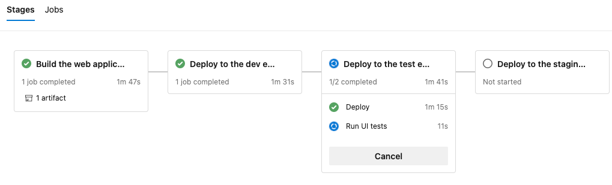
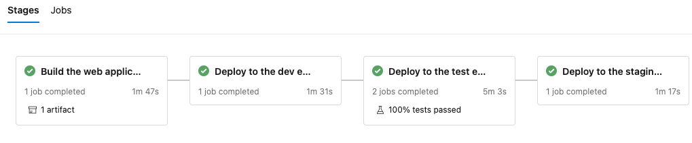
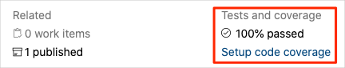
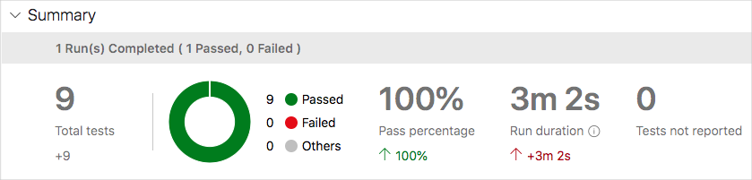

Before Andy and Amita run their tests in the pipeline, they want to verify that their new UI tests do what they should. In this section, you follow along by first running the Selenium UI tests locally and then in the pipeline.

Writing automated tests is an iterative process, just like writing any other kind of code. For your own apps, you'll likely need to try a few different approaches, refer to reference documentation and other example code, and fix build errors.

## Run the UI tests locally

The `Setup` method in *HomePageTest.cs* navigates to the _Space Game_ homepage after it sets the `driver` member variable.

Although you could hardcode the site URL, here we read the URL from an environment variable named `SITE_URL`. This way, you can run the tests multiple times against different URLs.

```cs
// Navigate to the site.
// The site name is stored in the SITE_URL environment variable to make 
// the tests more flexible.
string url = Environment.GetEnvironmentVariable("SITE_URL");
driver.Navigate().GoToUrl(url + "/");
```

Because you haven't yet deployed the _Space Game_ website to your App Service environment, you'll use the site that Microsoft hosts to run the tests locally.

To run the tests locally:

1. In Visual Studio Code, open the integrated terminal.
1. From the terminal, ensure you're in your project's root directory. The location of this directory depends on where you cloned it locally. Here's an example:

    ```bash
    cd ~/mslearn-tailspin-spacegame-web-deploy
    ```
1. Export the `SITE_URL` environment variable.

    ```bash
    export SITE_URL="http://tailspin-spacegame-web.azurewebsites.net"
    ```

    This variable points to the _Space Game_ website that Microsoft hosts.

1. Run the UI tests.

    ```bash
    dotnet test --configuration Release Tailspin.SpaceGame.Web.UITests
    ```

    This runs the tests that are located in the *Tailspin.SpaceGame.Web.UITests* project.

    As the tests run, you see one or more browsers appear. Selenium controls each browser and performs the test steps that you defined.

    > [!NOTE]
    > Don't worry if you don't see all three browsers appear. For example, you won't see the tests run on Chrome if you don't have Chrome installed. You also won't see Internet Explorer tests run on macOS or Linux. Seeing just one browser will help give you confidence that your tests are working. In practice, you might set up all browsers you want to test against in your local development environment so that you can verify that your tests behave as expected in each configuration before you run your tests in the pipeline.
1. From the terminal, trace the output of each test. Also note the test run summary at the end.

    Here's an example that shows how out of the nine total tests, six succeeded and three were skipped.

    ```output
    Test Run Successful.
    Total tests: 9
         Passed: 6
        Skipped: 3
     Total time: 12.5375 Seconds
    ```

## Add the SITE_URL variable to Azure Pipelines

Earlier, you set the `SITE_URL` environment variable locally so that your tests know where to point each browser. You can add this variable to Azure Pipelines, similarly to how you added variables for your App Service instances earlier. When the agent runs, this variable is automatically exported to the agent as an environment variable.

Let's add the pipeline variable now, before you update your pipeline configuration. To do so:

1. In Azure DevOps, go to your **Space Game - web - Functional tests** project.
1. Under **Pipelines**, select **Library**.
1. Select the **Release** variable group.
1. Under **Variables**, select **+ Add**.
1. Enter **SITE_URL** as the name of your variable. Enter the URL of the App Service instance that corresponds do your **test** environment, such as **http://tailspin-space-game-web-dev-10529.azurewebsites.net**, as its value.
1. Select **Save** near the top of the page to save your variable to the pipeline.

    Your variable group resembles this one:

    

## Modify the pipeline configuration

In this section, you modify the pipeline configuration to run your Selenium UI tests during the _Test_ stage.

1. In Visual Studio Code, open the *azure-pipelines.yml* file. Then modify the file like this:

    > [!TIP]
    > This file contains a few changes, so we recommend that you replace the entire file with what you see here.

    [!code-yml[](code/6-azure-pipelines.yml?highlight=3,57,110-134)]

    The file includes these three changes:

    * The `dotnetSdkVersion` variable is moved to the top of the file so that multiple stages can access it. Here, the _Build_ and _Test_ stages require this version of .NET Core.
    * The _Build_ stage publishes only the _Space Game_ website package as the build artifact. Previously, you published the artifacts like this:

        [!code-yml[](code/6-azure-pipelines-publish.yml?highlight=5)]

        This task generates two build artifacts: the _Space Game_ website package and the compiled UI tests. We build the UI tests during the _Build_ stage to ensure they will compile during the _Test_ stage. But we don't need to publish the compiled test code because we build it again during the _Test_ stage when the tests are run.
    * The _Test_ stage includes a second job that builds and runs the tests. This job resembles the one you used in the [Run quality tests in your build pipeline by using Azure Pipelines](https://docs.microsoft.com/learn/modules/run-quality-tests-build-pipeline/4-add-unit-tests?azure-portal=true) module, where you ran NUnit tests that verified the leaderboard's filtering functionality.

        Recall that a _deployment job_ is a special type of job that plays an important role in your deployment stages. The second job is a normal job that runs the Selenium tests on a Windows Server 2019 agent. Although we use a Linux agent to build the application, here we use a Windows agent to run the UI tests because Amita performs her manual tests on Windows, because that's what most customers use.

        The `RunUITests` job depends on the `Deploy` job to ensure that the jobs are run in the correct order. You need to deploy the website to App Service before you can run the UI tests. If you don't specify this dependency, jobs within the stage can run in any order or run in parallel.

1. In the integrated terminal, add *azure-pipelines.yml* to the index, commit the changes, and push the branch up to GitHub.

    ```bash
    git add azure-pipelines.yml
    git commit -m "Run Selenium UI tests"
    git push origin selenium
    ```

## Watch Azure Pipelines run the tests

Here you watch the pipeline run, including the Selenium UI tests, during the _Test_ stage.

1. In Azure Pipelines, go to the build and trace the build as it runs.

    During the build, you see the automated tests run after the website is deployed.

    

1. After the build completes, go to the summary page.

    

    You see that the deployment and the UI tests completed successfully.
1. Near the top of the page, note the summary.

    You see that the build artifact for the _Space Game_ website is published just like always. Also note the **Tests** section, which shows that the Selenium tests have passed.

    

1. Select the test summary to see the full report.

    The report shows that all nine tests have passed (three tests across three browsers.)

    

    If any test were to fail, you would see detailed results of the failure. From there, you can investigate the source of the failure, fix it locally, and then push up the necessary changes to make the tests pass in the pipeline.

**Amita:** This is exciting! I now have UI tests that I can run in the pipeline. This will really save us time in the long run. I've also got a pattern I can follow to add more tests. Best of all, this gives us added confidence in our code quality.

**Andy:** All true. Remember, tests that you find yourself repeatedly performing manually are good candidates for automation. Good luck adding more. If you get stuck or need a code reviewer, you know where to find me.