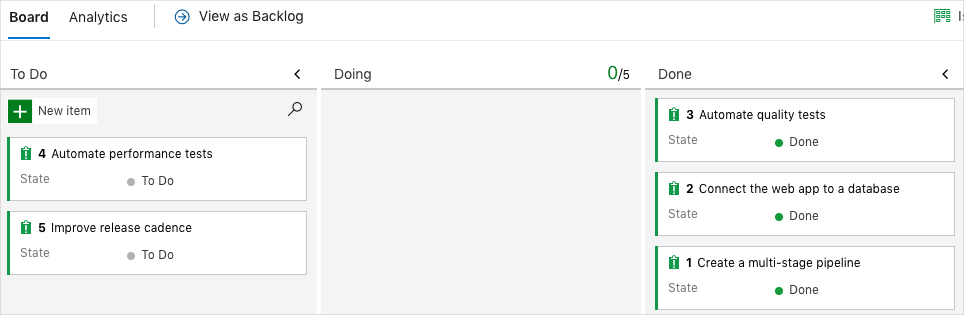

You're done with the tasks for this module. Here you'll clean up your Azure resources, move the work item to the **Done** state in Azure Boards, and clean up your Azure DevOps environment.

> [!IMPORTANT]
> This page contains important cleanup steps. Cleaning up helps ensure that you don't run out of free build minutes. It also helps ensure that you're not charged for Azure resources after you complete this module.

## Clean up Azure resources

Here you delete your Azure App Service instances. The easiest way to delete the instances is to delete their parent resource group. Deleting a resource group deletes all resources in that group.

To clean up your resource group:

1. Go to the [Azure portal](https://portal.azure.com?azure-portal=true) and sign in.
1. From the menu, select **Cloud Shell**. When you're prompted, select the **Bash** experience.

    

1. Run the following `az group delete` command. The command deletes the resource group that you used in this module, **tailspin-space-game-rg**.

    ```bash
    az group delete --name tailspin-space-game-rg
    ```

    When you're prompted, enter *y* to confirm the operation.

1. As an optional step, run the following `az group list` command after the previous command finishes.

    ```bash
    az group list --output table
    ```

    You see that the resource group **tailspin-space-game-rg** no longer exists.

## Move the work item to Done

Here you'll finish the work item that you assigned to yourself earlier in this module. You'll move **Automate quality tests** to the **Done** column.

In practice, *done* often means putting working software into the hands of your users. For learning purposes, here you'll mark this work as complete because you set up working UI tests in your pipeline.

At the end of each *sprint*, or work iteration, your team might want to hold a retrospective meeting. In the meeting, you share the work you completed, what went well in the sprint, and what you could improve.

To complete the work item:

1. In Azure DevOps, navigate to **Boards** and then select **Boards** from the menu.
1. Move the **Automate quality tests** work item from the **Doing** column to the **Done** column.

    

## Disable the pipeline or delete your project

Each module in this learning path provides a template. You can run the template to create a clean environment for the duration of the module.

Running multiple templates gives you multiple Azure Pipelines projects, each pointing to the same GitHub repository. This setup can trigger multiple pipelines to run each time you push a change to your GitHub repository. These runs can consume free build minutes on our hosted agents. So it's important to disable or delete your pipeline before you continue to the next module.

Choose one of the following options.

### Option 1 - Disable the pipeline

This option disables the pipeline so that it doesn't process further build requests. You can reenable the build pipeline later if you want to. Choose this option if you want to keep your DevOps project and your build pipeline for future reference.

To disable the pipeline:

1. In Azure Pipelines, navigate to your pipeline.
1. Select the **Edit** button.

    
1. Select **Edit**. From the menu in the upper corner, select **Settings**.

    
1. Under **Processing of new run requests**, select **Disabled** and then select **Save**.

    Your pipeline will no longer process build requests.

### Option 2 - Delete the Azure DevOps project

This option deletes your Azure DevOps project, including the content on Azure Boards and in your build pipeline. In future modules, you can run another template that brings up a new project in a state where this template leaves off. Choose this option if you don't need your DevOps project for future reference.

To delete the project:

1. In Azure DevOps, navigate to your project. Earlier, we recommended that you name this project **Space Game - web - Functional tests**.
1. Select the gear icon next to the project name.

    The icon might not appear until you move your mouse over that area.

    
1. At the bottom of the **Project details** area, select **Delete**.

    
1. In the window that appears, enter the project name and select **Delete** again.

    Your project is now deleted.