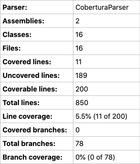
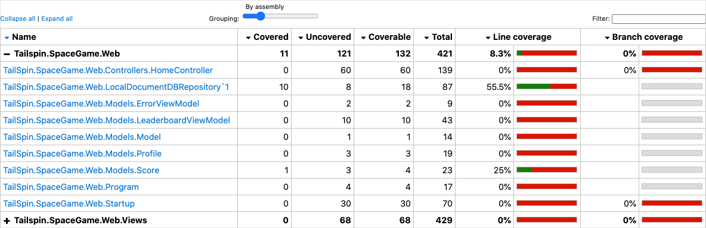
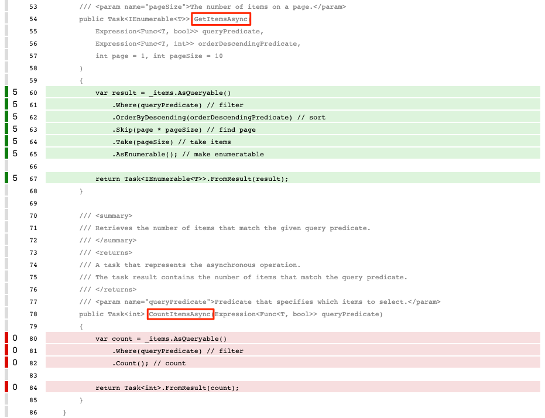
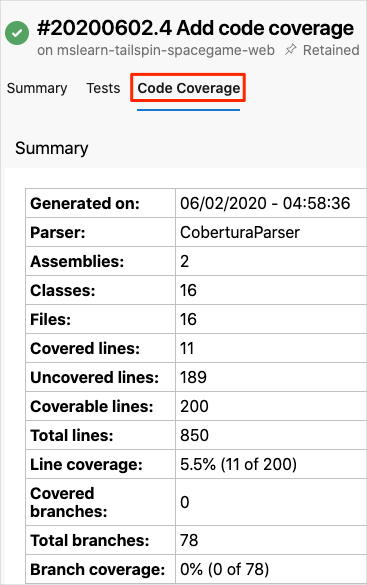
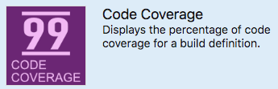
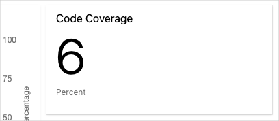

Much like the tool you use for unit testing, the tool you use for code coverage depends on the programming language and application framework you use.

When you target .NET Core applications to run on Linux, [coverlet](https://github.com/tonerdo/coverlet?azure-portal=true) is a popular option. Coverlet is a cross-platform, code-coverage library for .NET Core. Before we add code coverage to the pipeline, let's check in with the team.

Amita feels much better. She's seeing actual progress in catching bugs and in easily viewing test results. What's more, it hasn't taken long for Andy and Mara to implement the improvements. Amita, Andy, and Mara talk a bit more about unit testing.

**Andy**: I like the idea of unit testing, but I've never found a good way to know when we're done, when we have complete coverage. Are there any good tools we can use with Azure Pipelines?

**Mara**: We can add in _code coverage_. That will tell us the percentage of our code that has unit tests. We can use a tool called "coverlet" to collect coverage information when the tests run.

**Andy**: That's cool. Sounds like we can establish a baseline and improve over time.

**Mara**: That's right. Eventually we can even configure the build to fail if we don't meet a given threshold. That would help keep us honest. But for now, we can just see how much is covered.

**Andy**: Great. Getting reports on how much code is covered by unit tests will help us to identify code paths that aren't covered. We can increase the coverage gradually, and that will help save us from feeling overwhelmed by how much there is to do.

**Amita**: I'm really excited about the unit tests. I mostly do manual testing. I focus on the customer's perspective. I don't just look for bugs. I make sure the software does what it's specified to do, that the UI works, and that the user has a good experience.

**Mara**: That perspective is so important and definitely needs a human being. Right now, Andy and I are working on automated tests, software that tests the software. We're concentrating on tests that execute as the software moves through the build pipeline.

That means the two types of tests we've already talked about. The unit tests test individual components and are really fast. Code coverage tells us how much of our code has associated unit tests.

**Andy**: We should also think about doing lint testing from the command line, before the build. Lint testing can help us catch bugs, programming errors, and coding style problems really early.

**Amita**: What about regression tests?

**Mara**: I think of regression tests and unit tests as almost the same thing. After we fix a bug, we should run the unit tests again. This ensures that our changes haven't broken any units that were already tested.

**Amita**: OK, so does that leave integration testing?

**Andy**: Integration testing is a bit different. We do integration testing after the build, on the server. Although unit tests help you verify a single component like a function or method, integration testing verifies that multiple components work together. I don't think we're ready for integration tests quite yet. 

But at some point we also need to think about security and compliance. We should work with the security team to figure out how we can test against their security policies. I remember that was a concern of Tim's and I'd like to bring him into the process more.

**Mara**: Lots to do.

**Amita**: Thanks for the rundown! I'm off. Keep me posted.

**Andy**: Ready to do some code coverage?

**Mara**: Let's get started.

## How is code coverage done in .NET Core?

The way you collect code coverage depends on what programming language and frameworks you're using, as well as what code coverage tools are available.

Mara and Andy do some investigation around code coverage for .NET Core applications. Here's what they find:

* The unit test project requires the [coverlet.msbuild](https://www.nuget.org/packages/coverlet.msbuild?azure-portal=true) NuGet package.

    A reference to this package is already included in *Tailspin.SpaceGame.Web.Tests.csproj*.

* Visual Studio on Windows provides a way to perform code coverage.
* However, because the team is building on Linux, they can use [coverlet](https://github.com/tonerdo/coverlet?azure-portal=true), a cross-platform code coverage library for .NET Core.
* Code coverage results are written to an XML file so that they can be processed by another tool. Azure Pipelines supports [Cobertura](http://cobertura.github.io/cobertura?azure-portal=true) and [JaCoCo](https://www.eclemma.org/jacoco?azure-portal=true) coverage result formats. 

    Mara and Andy decide to try Cobertura.
* To convert Cobertura coverage results to a format that's human-readable, they can use a tool called [ReportGenerator](https://github.com/danielpalme/ReportGenerator?azure-portal=true).
* ReportGenerator provides a number of formats, including HTML. The HTML formats create detailed reports for each class in a .NET project.

    Specifically, there's an HTML format called **HtmlInline_AzurePipelines**, which provides a visual appearance that matches Azure Pipelines.

## Run code coverage locally

Before Mara and Andy write any pipeline code, they decide to try things manually to verify the process. Follow along with their process:

1. In Visual Studio Code, open the integrated terminal.
1. Run the following `dotnet tool install` command to install ReportGenerator:

    ```bash
    dotnet tool install --global dotnet-reportgenerator-globaltool --version 4.1.1
    ```

1. Run the following `dotnet test` command to run your unit tests and collect code coverage:

    ```bash
    dotnet test --no-build \
      --configuration Release \
      /p:CollectCoverage=true \
      /p:CoverletOutputFormat=cobertura \
      /p:CoverletOutput=./TestResults/Coverage/
    ```

    If the command fails, try running it like this:

    ```bash
    MSYS2_ARG_CONV_EXCL="*" dotnet test --no-build \
      --configuration Release \
      /p:CollectCoverage=true \
      /p:CoverletOutputFormat=cobertura \
      /p:CoverletOutput=./TestResults/Coverage/
    ```

    This command resembles the one you ran previously. The `/p:` flags tell coverlet which code coverage format to use and where to place the results.

1. Run the following `reportgenerator` command to convert the Cobertura file to HTML:

    ```bash
    $HOME/.dotnet/tools/reportgenerator -reports:./Tailspin.SpaceGame.Web.Tests/TestResults/Coverage/coverage.cobertura.xml -targetdir:./CodeCoverage -reporttypes:HtmlInline_AzurePipelines
    ```

    A number of HTML files appear in the **CodeCoverage** folder at the root of the project.
1. In Visual Studio Code, expand the **CodeCoverage** folder, right-click **index.htm**, and then select **Reveal in Explorer** (**Reveal in Finder** on macOS or **Open Containing Folder** on Linux).
1. In Windows Explorer (Finder on macOS), double-click **index.htm** to open it in a web browser.

    You see the coverage report summary.

    

1. Scroll to the bottom of the page to see a coverage breakdown by class type.

    

1. Select the link to ``TailSpin.SpaceGame.Web.LocalDocumentDBRepository`1`` to view further details.

    Notice that the `GetItemsAsync` method is covered by unit tests, but the `CountItemsAsync` method has no coverage.

    

    This makes sense, because the `FetchOnlyRequestedGameRegion` test method calls the `GetItemsAsync` method but does not call the `CountItemsAsync` method. (To review the test code, see the *DocumentDBRepository_GetItemsAsyncShould.cs* file.)

## Create a branch

Now that you can build a code coverage report locally, you're ready to add tasks to your build pipeline, which performs the same tasks.

In this part, you create a branch named `code-coverage`, based on the `unit-tests` branch, to hold your work. In practice, you would ordinarily create this branch from the `master` branch.

1. In Visual Studio Code, open the integrated terminal.
1. In the terminal, run the following `git checkout` command to create a branch named `code-coverage`:

    ```bash
    git checkout -b code-coverage
    ```

## Add build tasks

In this section, you add tasks that measure code coverage to your build pipeline.

1. In Visual Studio Code, modify *azure-pipelines.yml* like this:

    [!code-yml[](code/6-azure-pipelines.yml?highlight=45-68)]

    This version builds upon your existing configuration. Here's a summary of what's new:

    | Azure Pipelines task           | Display name                           | Description                                                         |
    |--------------------------------|----------------------------------------|---------------------------------------------------------------------|
    | `DotNetCoreCLI@2`              | Install ReportGenerator                |  Installs the ReportGenerator tool                                  |
    | `DotNetCoreCLI@2`              | Run unit tests - $(buildConfiguration) | Runs unit tests and also collects code coverage in Cobertura format |
    | `script`                       | Create code coverage report            |  Converts Cobertura output to HTML                                  |
    | `PublishCodeCoverageResults@1` | Publish code coverage report           | Publishes the report to the pipeline                                |

## Push the branch to GitHub

Here you push your changes to GitHub and see the pipeline run. Recall that you're currently in the `code-coverage` branch.

In the integrated terminal, add *azure-pipelines.yml* to the index, commit the changes, and push the branch up to GitHub.

    ```bash
    git add azure-pipelines.yml
    git commit -m "Add code coverage"
    git push origin code-coverage
    ```

## Watch Azure Pipelines run the tests

Here you see the tests run in the pipeline and then visualize the results from Azure Test Plans.

1. In Azure DevOps, trace the build through each of the steps.
1. When the build finishes, select the **Code Coverage** tab.

    You view the same results that you did when you ran the tests locally.

    

    As an optional step, you can explore the results from Azure Pipelines.

## Add the dashboard widget

In the previous part, you added the **Test Results Trend** widget to your dashboard, which lets others quickly review test result trends over time.

Here you'll add a second widget that summarizes code coverage.

1. In a new browser tab, go to [marketplace.visualstudio.com](https://marketplace.visualstudio.com?azure-portal=true).
1. On the **Azure DevOps** tab, search for **code coverage**.
1. Select **Code Coverage Widgets**.
1. Select **Get it free**.
1. In the drop-down list, select your Azure DevOps organization.
1. Select **Install**.
1. Go to the **Azure DevOps** tab.
1. Go to **Overview** > **Dashboards**.
1. Select **Edit**.
1. Search for **Code Coverage**, and then select **Code Coverage**.

    
1. Drag **Code Coverage** to the canvas.
1. Select the gear icon to configure the widget.
1. Keep all the default settings, except for:
    * Size: Enter **2 x 1**.
    * Build definition: Select your pipeline.
    * Coverage measurement: Enter **Lines**.
1. Select **Save**.
1. Select **Done Editing**.

    The widget shows the percentage of code your unit tests cover.

    

You now have code coverage set up in your pipeline. Although your existing code coverage is low, you have a baseline that you can improve over time.

Later, you can configure coverlet to check to see whether your tests provide a minimum threshold of coverage. Your threshold might be 30 percent, 50 percent, or 80 percent coverage, depending on your requirements. The build will fail if less than this amount is covered by your tests.

## Remove code coverage files

Recall that when you ran **reportgenerator** earlier, a number of HTML files appeared in the *CodeCoverage* folder at the root of the project.

These HTML files are not intended to be included in source control, and you no longer need them. Although the project's *.gitignore* file is already set up to ignore anything in the *CodeCoverage* directory, it's a good idea to delete these files so that they're not added to your Git repository in future modules.

In Visual Studio Code, go to the terminal window and then, in your project's root directory, run this command:

```bash
rm -rf CodeCoverage/
```
