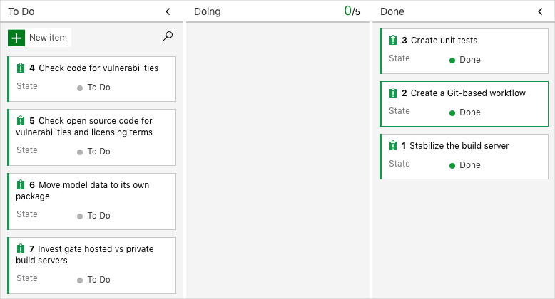
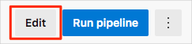

You're all done with the tasks for this module. You can now move the work item to the **Done** state on Azure Boards and clean up your Azure DevOps environment.

> [!IMPORTANT]
> This page contains important cleanup steps. Cleaning up helps ensure that you don't run out of free build minutes. Be sure to perform the cleanup steps if you ran the template earlier in this module.

## Move the work item to Done

In this part, you move the work item that you assigned to yourself earlier in this module, **Create unit tests**, to the **Done** column.

In practice, the definition of "Done" often means that working software is in the hands of your users. In this unit, for learning purposes, you mark this work as complete because you have working unit tests and code coverage tests set up in your build pipeline.

At the end of each sprint, or work iteration, you and your team might hold a retrospective meeting, where you share the work you completed, what went well in the sprint, and what could be improved.

To complete the work item:

1. In Azure DevOps, go to **Boards** and then, in the left pane, select **Boards**.
1. Move the **Create unit tests** work item from the **Doing** column to the **Done** column.

    

## Disable the pipeline or delete your project

> [!IMPORTANT]
> You can skip this part if you plan to continue to the next module and use the same Azure DevOps project.

Each module in this learning path provides a template that you can run to create a clean environment for the duration of the module.

Running multiple templates gives you multiple Azure Pipelines projects, each pointing to the same GitHub repository. This can trigger multiple pipelines to run each time you push a change to your GitHub repository, which can cause you to run out of free build minutes on our hosted agents. Therefore, it's important that you disable or delete your pipeline before you move on to the next module.

Choose one of the following options.

### Option 1: Disable the pipeline

This option disables the pipeline so that it doesn't process further build requests. You can reenable the build pipeline later if you want to. Choose this option if you want to keep your Azure DevOps project and your build pipeline for future reference.

To disable the pipeline:

1. In Azure Pipelines, go to your pipeline.
1. Select **Edit**.

    
1. At the top right, select **Settings**.

    
1. Under **Processing of new run requests**, select **Disabled**, and then select **Save**.

    Your pipeline will no longer process build requests.

### Option 2: Delete the Azure DevOps project

This option deletes your Azure DevOps project, including what's on Azure Boards and your build pipeline. In future modules, you'll be able to run another template that brings up a new project in a state where this one leaves off. Choose this option to delete your Azure DevOps project if you don't need it for future reference.

To delete the project:

1. In Azure DevOps, go to your project. Earlier, we recommended that you name this project **Space Game - web - Tests**.
1. Select the gear icon next to the project name.

    The icon might not appear until you move your mouse over that area.

    
1. In the **Project details** area, scroll to the bottom, and then select **Delete**.

    
1. In the window that appears, enter the project name, and then select **Delete** a second time.

    Your project is now deleted.
