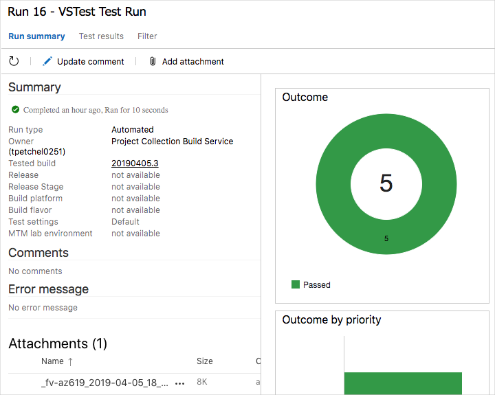

Talk track:

* Amita mentioned an increased workload and some pain she's been seeing with recent builds.
  * Recall that the leaderboard keeps breaking.
  * Specifically, the filtering functionality wasn't working correctly. The wrong game mode would show.
  * (Do we need a screenshot that demonstrates this? I can brew one up. In fact, I think we do need it. Here it is. Notice that although Milky Way is selected, the results contain Andromeda.)
      
* Mara wants to help. Although Mara and Andy think they fixed the bug, Mara wants to make sure it stays that way.
* The web application uses a document database to store high scores and player profiles.
* The app currently uses local test data. They later plan to connect the app to a real database.
* She decides that unit tests are a good way to verify the leaderboard functionality.
* There are a number of unit test frameworks available for C# applications. Mara chooses NUnit because it's popular with the community and she's used it before.

The unit test framework you choose largely depends on what programming language you use. We won't go into complete detail, but here's the unit test you'll work with.

```csharp
[TestCase("Milky Way")]
[TestCase("Andromeda")]
[TestCase("Pinwheel")]
[TestCase("NGC 1300")]
[TestCase("Messier 82")]
public void ReturnRequestedGameMode(string gameMode)
{
    const int PAGE = 0; // take the first page of results
    const int MAX_RESULTS = 10; // sample up to 10 results

    // Form the query predicate.
    // This expression selects all scores for the provided game mode.
    Expression<Func<Score, bool>> queryPredicate = score => (score.GameMode == gameMode);

    // Fetch the scores.
    Task<IEnumerable<Score>> scoresTask = _scoreRepository.GetItemsAsync(
        queryPredicate, // the predicate defined above
        score => 1, // we don't care about the order
        PAGE,
        MAX_RESULTS
    );
    IEnumerable<Score> scores = scoresTask.Result;

    // Verify that each score's game mode matches the provided game mode.
    Assert.That(scores, Is.All.Matches<Score>(score => score.GameMode == gameMode));
}
```

Recall that you can filter the leaderboard by any combination of game type and game map.

This test queries the leaderboard for high scores and verifies that each result matches the provided game mode.

In an NUnit test, `TestCase` provides inline data to use to test that method. Here, NUnit calls the `ReturnRequestedGameMode` unit test method like this:

```csharp
ReturnRequestedGameMode("Milky Way");
ReturnRequestedGameMode("Andromeda");
ReturnRequestedGameMode("Pinwheel");
ReturnRequestedGameMode("NGC 1300");
ReturnRequestedGameMode("Messier 82");
```

Notice the call to the `Assert.That` method at the end of the test. This method verifies whether the result matches the given condition. NUnit records the result as a passing or failing test.

Many unit test frameworks provide verification methods that resemble natural language. This helps make tests easy to read and maps the test to the application's requirements.

Consider the assertion made in this example.

```csharp
Assert.That(scores, Is.All.Matches<Score>(score => score.GameMode == gameMode));
```

You might read this line as:

> Assert that the game mode of each returned score matches the provided game mode.

-----

OLD COPY. MAY OR MAY NOT BE USEFUL.

In this part, Mara adds unit tests to the _Space Game_ web application. Mara chooses NUnit, a popular open-source unit testing framework for .NET. In this part, you'll follow along.

In practice, the unit test framework you choose depends on the programming language your library or application is written in. So for learning purposes, here you'll use unit tests we provide for you.

Here's the process you'll follow.

1. Fetch a branch from Microsoft's GitHub repository that contains the unit tests.
1. Run the tests locally to verify that they pass.
1. Add tasks to your pipeline configuration to run the tests and collect the results.
1. Push the branch to your GitHub repository.
1. Watch your Azure Pipelines project automatically build the application and run the tests.

-----

## Fetch the branch from GitHub

Here you'll fetch the `unit-tests` branch from GitHub and checkout, or switch to, that branch.

This branch contains the _Space Game_ project you worked with in the previous modules and an Azure Pipelines configuration to start with.

1. From Visual Studio Code, open the integrated terminal.
1. Run the following `git fetch` command to download the `unit-tests` branch from Microsoft's repository.

    ```bash
    git fetch upstream unit-tests
    ```

    The `git fetch` command downloads a branch from a given repository. The repository name is known as a _tracked repository_ or _remote_. Here, `upstream` refers to Microsoft's GitHub repository. Shortly, you'll push this branch up to your GitHub repository, known as `origin`.

    Your project's Git configuration understands the `upstream` remote because that relationship is set up when you fork the project from Microsoft's repository.

1. Run the following `git checkout` command to switch to the `unit-tests` branch.

    ```bash
    git checkout unit-tests
    ```

## Run the tests locally

It's a good idea to run all tests locally before you submit any tests to the pipeline. Here you'll do that.

1. Run `dotnet build` to build each project in the solution.

    ```bash
    dotnet build
    ```

1. Run the following `dotnet test` command to run the unit tests.

    ```bash
    dotnet test Tailspin.SpaceGame.Web.Tests --no-build
    ```

    The "Tailspin.SpaceGame.Web.Tests" part specifies to run the unit tests in the **Tailspin.SpaceGame.Web.Tests** project.

    The `--no-build` flag specifies not to build the project before running it. You don't need to build the project because you built it in the previous step.

    You see that all five tests pass.

    ```output
    Starting test execution, please wait...

    Total tests: 5. Passed: 5. Failed: 0. Skipped: 0.
    Test Run Successful.
    Test execution time: 1.0939 Seconds
    ```

    In this example, the tests took about one second to run.

1. Run the tests a second time. This time, provide the `--logger` option to write the results to a log file.

    ```bash
    dotnet test Tailspin.SpaceGame.Web.Tests --no-build --logger trx
    ```

    A .trx file is an XML document that contains the results of a test run. It's a popular format for NUnit tests because Visual Studio and other tools can help you visualize the results.

    Later, you'll see how Azure Pipelines can help you visualize and track your tests results as they run through the pipeline.

## Add tasks to your pipeline configuration

Recall that when you set up the pipeline, you used a template to define repeatable build tasks.

Here, you'll repeat a similar process to run the unit tests tests and collect the results.

1. From the integrated terminal, create a file named **test.yml** in the **templates** directory.

    **PowerShell**

    ```powershell
    TBD
    ```

    **Bash**

    ```bash
    touch templates/test.yml
    ```

    <!-- TODO: Add PowerShell equivalent -->

1. From Visual Studio Code, add this to **test.yml**.

    ```yml
    parameters:
      buildConfiguration: 'Release'

    steps:
    - task: DotNetCoreCLI@2
      displayName: 'dotnet test ${{ parameters.buildConfiguration }}'
      inputs:
        command: 'test'
        arguments: '--no-build --configuration ${{ parameters.buildConfiguration }}'
        publishTestResults: true
        projects: '**/*.Tests.csproj'
    ```

    This task uses the `DotNetCoreCLI@2` build task and resembles the task you used to build the application (you can compare this task to what's in **templates/build.yml**.)

    Notice that this task does not specify the `--logger trx` argument that you used when you ran the tests manually. The `publishTestResults` argument adds that for you. This argument tells the pipeline to generate the TRX file to a temporary directory, accessible through the `$(Agent.TempDirectory)` built-in variable, where the pipeline can pick it up later.

    The `projects` argument specifies all C# projects that match "**/*.Tests.csproj". The "\*\*" part matches all directories and the "\*.Tests.csproj" part matches all projects whose file name ends with ".Tests.csproj". The `unit-tests` branch contains one unit test project, Tailspin.SpaceGame.Web.Tests.csproj. But specifying a pattern enables you to run additional test projects without the need to modify your build configuration.

1. From Visual Studio Code, modify **azure-pipelines.yml** like this to run the unit tests.

    ```yml
    pool:
      vmImage: 'Ubuntu-16.04'
      demands:
        - npm

    variables:
      wwwrootDir: 'Tailspin.SpaceGame.Web/wwwroot'
      dotnetSdkVersion: '2.1.505'

    steps:
    - task: DotNetCoreInstaller@0
      displayName: 'Use .NET Core SDK $(dotnetSdkVersion)'
      inputs:
        version: '$(dotnetSdkVersion)'

    - task: Npm@1
      displayName: 'npm install'
      inputs:
        verbose: false

    - script: './node_modules/.bin/node-sass $(wwwrootDir) --output $(wwwrootDir)'
      displayName: 'node-sass $(wwwrootDir)'

    - task: gulp@1
      displayName: 'gulp'

    - script: 'echo "$(Build.DefinitionName), $(Build.BuildId), $(Build.BuildNumber)" > buildinfo.txt'
      workingDirectory: $(wwwrootDir)
      displayName: 'output build info'

    - task: DotNetCoreCLI@2
      inputs:
        command: 'restore'
        projects: '**/*.csproj'

    - template: templates/build.yml
      parameters:
        buildConfiguration: 'Debug'

    - template: templates/build.yml
      parameters:
        buildConfiguration: 'Release'

    - template: templates/test.yml
      parameters:
        buildConfiguration: 'Debug'

    - task: PublishTestResults@2
      condition: succeeded()
      inputs:
        testRunner: 'NUnit'
        testResultsFiles: '**/*.trx'

    - task: PublishBuildArtifacts@1
      condition: succeeded()
      displayName: 'Publish Artifact: drop'
    ```

    This version adds these build tasks.

    ```yml
    - template: templates/test.yml
      parameters:
        buildConfiguration: 'Debug'

    - task: PublishTestResults@2
      condition: succeeded()
      inputs:
        testRunner: 'NUnit'
        testResultsFiles: '**/*.trx'
    ```

    The first task calls the tasks you just defined in **templates/test.yml**. Here, we run the tests only using the Debug build configuration. But you could also call the template a second time using the Release configuration.

    The second task uses the `PublishTestResults@2` build task to publish the test results to the pipeline. Similar to the `PublishBuildArtifacts@1` build task you used earlier, this task copies all .trx files from the build server to the pipeline so you can access them later. You'll see how to understand and analyze test results in just a bit.

## Push the branch to GitHub

Here you'll push your changes to GitHub and see the pipeline run. Recall that you're currently on the `unit-tests` branch.

1. From the integrated terminal, add **azure-pipelines.yml** and **templates/test.yml** to the index, commit the changes, and push the branch up to GitHub.

    ```bash
    git add azure-pipelines.yml templates/test.yml
    git commit -m "Run and publish unit tests"
    git push origin unit-tests
    ```

## Watch Azure Pipelines run the tests

Here you'll see the tests run in the pipeline and then visualize the results from Azure Test Plans.

<!-- TODO: We really haven't talked about Azure Test Plans yet. Add it to the knowledge unit? -->

1. From Azure DevOps, trace the build through each of the steps.
    **TODO**: Say something more here. Perhaps show a screenshot showing our new tasks.

1. From Azure DevOps, select **Test Plans**. Then select **Runs**.

    <!-- TODO: Screenshot to orient the learner where to find it? -->

    You see the most recent test runs, including the one you just ran.

1. Double click the most recent test run.

    You see a summary of the results.

    

    In this example, all five tests have passed. If any tests failed, you could navigate to the build task to get additional details.

    You can also download the .trx file so you can examine it through Visual Studio or another visualization tool.

<!-- TODO: When/if do we create a PR and merge the `unit-tests` branch? -->
<!-- TODO: Later: I think we should do this now so the learner can git checkout -b from master -->

TODO: Perhaps mention that although we only have one test, it's better than nothing. Mara's team now has a place to put them and a way to run them. They can add more in the future.