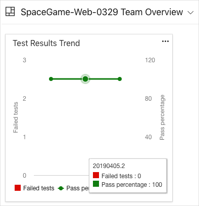

Andy and Mara are excited to show Amita the progress they've made. They've already set up a dashboard so they can monitor pull requests and visualize the health of their builds.

Amita takes a look and she's excited.

Amita: This is great progress. Thank you! Not to sound ungrateful, but is there any way I can just see a brief overview of the test results over time?

Mara: Yes! Azure DevOps lets you add widgets to your dashboards. It only takes a few minutes. Let me show you both.

## Add the widget to the dashboard

1. From your Azure DevOps project, select **Overview** and then **Dashboards**.
1. Click **Add a widget**.
1. From the **Add Widget** pane, search for **Test Results Trend**.
1. Drag **Test Results Trend** to the canvas.
1. Click the gear icon to configure the widget.
    1. Under **Build pipeline**, select your pipeline.
    1. Keep all other settings at their default.
1. Click **Save**.
1. Click **Done Editing**.

Although the widget shows only one test run, you now have a way to visualize and track test runs over time.

If you begin to see test failures, you can click on a point in the graph to navigate directly to that build.