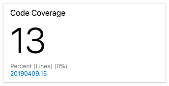

Amita feels much better. She's seeing actual progress in catching bugs and in easily seeing test results. What's more, it hasn't taken long for Andy and Mara to implement the improvements. She, Andy and Mara talk a bit more about unit testing.

Andy: I like the idea of unit testing, but I've never found a good way to know when we're done, when we have complete coverage. Are there any good tools we can use with Azure Pipelines?

Mara: We can add in _code coverage_. That will tell us the percentage of our code that has unit tests. We can use a tool called Coverlet to collect coverage information when the tests run.

Andy: That's cool. Sounds like we can establish a baseline and improve over time.

Mara: That's right. Eventually we can even configure the build to fail if we don't meet a given threshold. That would help keep us honest. But for now, we can just see how much is covered.

Andy: Great. Getting reports on how much code is covered by unit tests will help us to identify code paths that aren't covered. We can increase the coverage gradually and that will help us from feeling overwhelmed by how much there is to do.

Amita: I'm really excited about the unit tests. I mostly do manual testing. I focus on the customer's perspective. I don't just look for bugs. I make sure the software does what it's specified to do, that the UI works and that the user has a good experience.

Mara: That perspective is so important and definitely needs a human being. Right now, Andy and I are working on automated tests &mdash; software that tests the software. We're concentrating on tests that execute as the software moves through the build pipeline.

That means the two types of tests we've already talked about. The unit tests test individual components and are really fast. Code coverage tells us how much of our code has associated unit tests.

Andy: We should also think about doing lint testing from the command line, before the build. Lint testing can help us catch bugs, programming errors and coding style problems really early.

Amita: What about regression tests?

Mara: I think of regression tests and unit tests as almost the same thing. Once we fix a bug, we should run the unit tests again. This ensures that our changes haven't broken any units that were already tested.

Amita: OK, so does that leave integration testing?

Andy: Integration testing is a bit different. We do integration testing after the build, on the server. While unit tests help you verify a single component like a function or method, integration testing verifies that multiple components work together. I don't think we're ready for integration tests quite yet. 

But some point we also need to think about security and compliance. We should work with the security team to figure out how we can test against their security policies.

Mara: Lots to do.

Amita: Thanks for the rundown! I'm off. Keep me posted.

Andy: Ready to do some code coverage?

Mara: Let's get started.


## Use a code coverage tool

Much like unit testing, the tool you use for code coverage depends on the programming language and application framework you use.

When targeting .NET Core applications to run on Linux, [coverlet](https://github.com/tonerdo/coverlet?azure-portal=true) is a popular option. Coverlet is a cross platform code coverage library for .NET Core.

-----

## Create a branch

TODO: I'll provide a lead-in sentence. I also need to explain each step in greater detail.

1. From Visual Studio Code, open the integrated terminal.
1. From the terminal, run the following `git checkout` command to switch to the `master` branch.

    ```bash
    git checkout master
    ```

1. Run the following `git pull` command to bring in the latest changes from GitHub.

    ```bash
    git pull origin master
    ```

    This step is important because you merged your pull request of the `unit-tests` branch into `master`. You need to bring down the latest version of `master` that contains the merged changes.

1. Run the following `git checkout` command to create a branch named `code-coverage`.

    ```bash
    git checkout -b code-coverage
    ```

## Add build tasks

TODO: Explain the overall process first.

1. From Visual Studio Code, open **azure-pipelines.yml**.
1. Add this code to **azure-pipelines.yml** (TODO: Specify exactly where).

    ```yml
    - task: DotNetCoreCLI@2
      displayName: 'Install reportgenerator'
      inputs:
        command: custom
        custom: tool
        arguments: 'install -g dotnet-reportgenerator-globaltool'

    - script: |
        reportgenerator -reports:$(Build.SourcesDirectory)/**/coverage.cobertura.xml -targetdir:$(Build.SourcesDirectory)/CodeCoverage -reporttypes:HtmlInline_AzurePipelines
      displayName: 'Create code coverage report'
    ```

1. Add this code to **azure-pipelines.yml** (TODO: Specify exactly where).

    ```yml
    - task: PublishCodeCoverageResults@1
      displayName: 'Publish code coverage report'
      inputs:
        codeCoverageTool: 'cobertura'
        summaryFileLocation: '$(Build.SourcesDirectory)/**/coverage.cobertura.xml'
        reportDirectory: '$(Build.SourcesDirectory)/CodeCoverage'
    ```

1. In **templates/test.yml**, modify the `DotNetCoreCLI@2` task like this.

    ```yml
    parameters:
      buildConfiguration: 'Release'

    steps:
    - task: DotNetCoreCLI@2
      displayName: 'dotnet test ${{ parameters.buildConfiguration }}'
      inputs:
        command: 'test'
        arguments: '--configuration ${{ parameters.buildConfiguration }} /p:CollectCoverage=true /p:CoverletOutputFormat=cobertura'
        publishTestResults: true
        projects: '**/*.Tests.csproj'
        nobuild: true
    ```

    TODO: Explain what's different (the switches and whatnot.)

## Push the branch to GitHub

Here you'll push your changes to GitHub and see the pipeline run. Recall that you're currently on the `code-coverage` branch.

1. From the integrated terminal, add **azure-pipelines.yml** and **templates/test.yml** to the index, commit the changes, and push the branch up to GitHub.

    ```bash
    git add azure-pipelines.yml templates/test.yml
    git commit -m "Add code coverage"
    git push origin code-coverage
    ```

## Watch Azure Pipelines run the tests

Here you'll see the tests run in the pipeline and then visualize the results from Azure Test Plans.

<!-- TODO: Flesh this out a bit more. -->

1. From Azure DevOps, trace the build through each of the steps.
    **TODO**: Say something more here. Perhaps show a screenshot showing our new tasks.

1. Navigate to **Test Plans**, **Runs**.
1. Select the most recent run.
1. You see the tests continue to pass.
1. In the **Attachments** section, you see two files

    * The .trx file is ... (maybe explain this in the previous unit?)
    * The .coverage file holds the results of the code coverage run.

You can download this file and view in from Visual Studio. You can also use a free dashboard widget provided by the community.

## Add dashboard widget

TODO: Flesh this out a bit more.

TODO: Describe how you might discover this widget.
- Navigate to [marketplace.visualstudio.com](https://marketplace.visualstudio.com)
- Search for "code coverage".

1. From a new browser tab, navigate to [Code Coverage Widgets](https://marketplace.visualstudio.com/items?itemName=shanebdavis.code-coverage-dashboard-widgets&azure-portal=true).
1. Click **Get it free**.
1. Select your Azure DevOps organization from the drop-down.
1. Click **Install**.
1. Navigate to the Azure DevOps tab.
1. Navigate to **Overview**, **Dashboards**
1. Click **Edit**
1. Click **Add a widget**
1. Search for **Code Coverage**. Select **Code Coverage**.
1. Drag **Code Coverage** to the canvas.
1. Click the gear icon to configure the widget.
1. Keep all the settings at their default, except for:
    * Size: **2 x 1**
    * Build definition: (Select your pipeline)
    * Coverage measurement: **Lines**
1. Click **Save**.
1. Click **Done Editing**.

TODO: Describe what the widget does and what you can do with it.



Existing code coverage is low, but you have a baseline that you can improve over time.