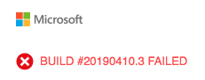
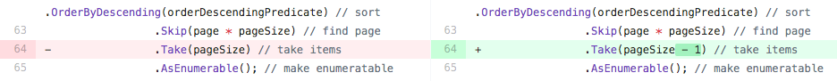

<!-- TODO: Show the build badge turn red. You set that up in the previous module but I neglected to add it to my flow here. -->

Talk track:

* In this part, you'll fix a test that failed in the pipeline.
* Let's say Andy was working on a feature and accidentally checked in code without running the tests.
* Luckily, the pipeline can help us catch issues early when there are unit tests.

TODO: Position this as a new unit test the learner will work with.

```csharp
[TestCase(0, ExpectedResult=0)]
[TestCase(1, ExpectedResult=1)]
[TestCase(10, ExpectedResult=10)]
public int ReturnRequestedCount(int count)
{
    const int PAGE = 0; // take the first page of results

    // Fetch the scores.
    Task<IEnumerable<Score>> scoresTask = _scoreRepository.GetItemsAsync(
        score => true, // return all scores
        score => 1, // we don't care about the order
        PAGE,
        count // fetch this number of results
    );
    IEnumerable<Score> scores = scoresTask.Result;

    // Verify that we received the specified number of items.
    return scores.Count();
}
```

Recall that in an NUnit test, `TestCase` provides inline data to use to test that method. NUnit calls the `ReturnRequestedCount` unit test method like this:

```csharp
ReturnRequestedCount(0);
ReturnRequestedCount(1);
ReturnRequestedCount(10);
```

<!-- TODO: Rebase against code-coverage branch and force push everything up. -->

Here you'll download sample code from Microsoft's GitHub repository, upload that code to your repository, and see unit tests fail when they run in the pipeline.

TODO: Overall process:

1. Get starter code from Microsoft's GitHub repository.
1. Push the code up to your repository.
1. Watch the tests fail when the pipeline runs.
1. Verify the failure locally.
1. Analyze and fix the break.
1. Push up a fix and watch the build go green again.
 
-----

## Fetch the branch from GitHub

TODO: Add lead-in text.
TODO: Call out that we name the branch `failed-test` for learning purposes. In practice, you would name a branch after its purpose or feature.

1. From Visual Studio Code, open the integrated terminal.
1. Run the following `git fetch` command to download the `failed-test` branch from Microsoft's repository.

    ```bash
    git fetch upstream failed-test
    ```

1. Run the following `git checkout` command to switch to the `failed-test` branch.

    ```bash
    git checkout failed-test
    ```

1. Run the following `git push` command to upload the branch to your GitHub repository.

    ```bash
    git push origin failed-test
    ```

## See the failure in the pipeline

TODO: Add lead-in text.

1. From Azure Pipelines, trace the build as it runs through the pipeline.
1. TODO: Talk about where it fails.

    TODO: Talk more about the failure. Then convert these bullets to use the row/column extension.

    There are several indicators that it failed.
    * Email notification

        
    * Test Plans

        * From Azure DevOps, select **Test Plans**, **Runs**. You see the recent test runs, including the one that just ran.
        * Select the latest completed test. You see that one tests failed. (Show screenshot?)

        
    * Dashboard

        
    * Build badge

        

## Analyze the test failure

TODO: Flesh out the analysis more. Talking points:

* At this point, you have two choices, depending on the nature of the failure.

    1. If the test revealed a defect in the code, fix the code.
    1. If functionality changed, adjust the test to match the new requirements.

### Reproduce the failure locally

TODO: Add lead-in text.

1. From the integrated terminal, build the application.

    ```bash
    dotnet build
    ```

1. From the terminal, run the unit tests.

    ```bash
    dotnet test Tailspin.SpaceGame.Web.Tests --no-build
    ```

    You see the same errors. Here's part of the output you see.

    ```output
    Failed   ReturnRequestedCount(10)
    Error Message:
       Expected: 10
      But was:  9

    Stack Trace:
       at NUnit.Framework.Internal.Commands.TestMethodCommand.Execute(TestExecutionContext context)
       at NUnit.Framework.Internal.Commands.BeforeAndAfterTestCommand.Execute(TestExecutionContext context)
       at NUnit.Framework.Internal.Execution.SimpleWorkItem.PerformWork()
       at NUnit.Framework.Internal.Execution.CompositeWorkItem.RunChildren()
       at NUnit.Framework.Internal.Execution.CompositeWorkItem.RunChildren()
       at NUnit.Framework.Internal.Execution.TestWorker.TestWorkerThreadProc()
       at System.Threading.Thread.ThreadMain_ThreadStart()


    Total tests: 8. Passed: 6. Failed: 2. Skipped: 0.
    Test Run Failed.
    Test execution time: 1.2035 Seconds
    ```

You notice that the errors are off by one.

You look at the source code for the (document DB class), the method being tested, and you notice this.

<!-- TODO: Reference the upstream repo instead and code highlight the `pageSize - 1` line. 
https://review.docs.microsoft.com/en-us/help/contribute/code-in-docs?branch=master#in-repo-snippet-references
-->

```csharp
public Task<IEnumerable<T>> GetItemsAsync(
    Expression<Func<T, bool>> queryPredicate,
    Expression<Func<T, int>> orderDescendingPredicate,
    int page = 1, int pageSize = 10
)
{
    var result = _items.AsQueryable()
        .Where(queryPredicate) // filter
        .OrderByDescending(orderDescendingPredicate) // sort
        .Skip(page * pageSize) // find page
        .Take(pageSize - 1) // take items
        .AsEnumerable(); // make enumeratable

    return Task<IEnumerable<T>>.FromResult(result);
}
```

You suspect that `pageSize - 1` is returning one fewer result and that this should be just `pageSize`.

You examine the file on GitHub and notice that this has changed recently.



You talk to Andy. Andy remembers changing this while trying something out, but forgot to revert it back.

You decide to change it back and verify that your unit tests continue to pass.

> [!TIP]
> Mara: Discussion can also happen on GitHub. You can comment on a pull request or open an issue.

## Fix the error

TODO: Add lead-in text.

1. From Visual Studio Code, open **Tailspin.SpaceGame.Web/LocalDocumentDBRepository.cs** from the file explorer.
1. Modify the `GetItemsAsync` method like this.

    ```csharp
    public Task<IEnumerable<T>> GetItemsAsync(
        Expression<Func<T, bool>> queryPredicate,
        Expression<Func<T, int>> orderDescendingPredicate,
        int page = 1, int pageSize = 10
    )
    {
        var result = _items.AsQueryable()
            .Where(queryPredicate) // filter
            .OrderByDescending(orderDescendingPredicate) // sort
            .Skip(page * pageSize) // find page
            .Take(pageSize) // take items
            .AsEnumerable(); // make enumeratable

        return Task<IEnumerable<T>>.FromResult(result);
    }
    ```

    This version changes `pageSize - 1` to `pageSize`.

1. Save the file.
1. From the integrated terminal, build the application.

    ```bash
    dotnet build
    ```

    You see that the build succeeds.

    In practice, you might run the app and briefly try it out. For learning purposes, we'll skip that for now.

1. From the terminal, run the unit tests.

    ```bash
    dotnet test Tailspin.SpaceGame.Web.Tests --no-build
    ```

    You see that the tests pass.

    ```output
    Starting test execution, please wait...

    Total tests: 8. Passed: 8. Failed: 0. Skipped: 0.
    Test Run Successful.
    Test execution time: 1.0413 Seconds
    ```

1. From the integrated terminal, add each modified file to the index, commit the changes, and push the branch up to GitHub.

    ```bash
    git add .
    git commit -m "Return correct number of items"
    git push origin failed-test
    ```

1. Return to Azure Pipelines. Watch the change move through the pipeline. You see the tests pass.

    All "red" indicators now turn "green". Here's the dashboard widget, for example.

    

TODO: Summarize anything?