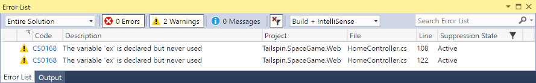
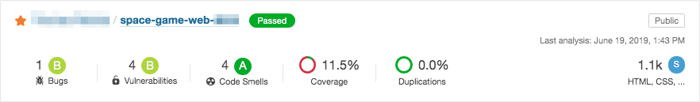

[!include]

It's important that your code doesn't open the door to an attacker. A vulnerability that's exploitable in your codebase is an operations nightmare. In this part, you learn about a vulnerability found in the _Space Game_ code. You see how the team plans to make sure that a vulnerability doesn't happen again.

Let's check in on the discussion.

## What happens when a vulnerability is found?

Tim finds Andy and Mara talking in the break room.

**Tim:** Andy, do you have a minute? We need to talk.

**Andy:** Sure, you've been a hard guy to locate today, Tim. I've been hearing about some issue with the game code. Is that what this is about?

**Tim:** You got it. Someone found a code vulnerability in the _Space Game_ game code last night. We've been code red in operations and development all day. We think we have it patched up, but it's causing quite a stir among the leadership teams. They've brought in a consultant on code security and integrity. And, well, that's where you come in.

**Andy:** Me? I didn't write any of that code!

**Tim:** No, but I've been tasked with reporting on potential vulnerabilities in our entire codebase, and that *does* include you. So, I need a report on the quality and safety of our team's code. We need something with real numbers and concrete examples.

**Mara:** That's a big request! I don't think we have any way to analyze our code easily.

**Andy:** I saw something at a user group meeting I went to a few weeks ago. I saved a document with some links.

## What tools or frameworks can we use?

There are many tools and processes you can use to analyze your code. You can evaluate each to find the one that best suits the kinds of software you create. Here are a few.

### OWASP

The Open Web Application Security Project ([OWASP](https://www.owasp.org?azure-portal=true)) is a not-for-profit organization focused on improving the security of software. OWASP hosts global and regional events where practitioners from all industries can meet to share and learn the latest best practices around security management.

OWASP also provides tools, code, and documentation to help practitioners understand potential threats in their code and to take action.

One notable project is the [OWASP Top Ten](https://owasp.org/www-project-top-ten/). The OWASP Top Ten lists the top critical security risks to web applications as identified by the world's leading security experts. While there are hundreds of potential security risks out there, the Top Ten details some of the most important and most common risks that many organizations can tackle first.

You see the OWASP Top Ten in action when you scan the _Space Game_ project later in this module.

### Roslyn analyzers

Roslyn refers to the .NET Compiler Platform. [Roslyn analyzers](https://docs.microsoft.com/visualstudio/code-quality/roslyn-analyzers-overview?view=vs-2017#source-code-analysis-versus-legacy-analysis) highlight potential problems in your code. Categories include code style, quality and maintainability, and design.

You can run Roslyn analyzers from Visual Studio or from the command line. The following image shows an example of running the Roslyn analyzers on the _Space Game_ web project from Visual Studio.

### SonarCloud

[SonarCloud](https://sonarcloud.io?azure-portal=true) by SonarSource helps you analyze code for both vulnerabilities and code smells.

A _code smell_ refers to a code construct that, although it might be syntactically correct, can indicate a deeper problem in how that code is designed or how easy it is to maintain.

Code smells are subjective and can vary from one programming language to another. For example, many languages support the `goto` statement as a way to control the flow of operations. Even if the `goto` statements in the code are syntactically correct, using a lot of them can result in "spaghetti code" that's difficult for others to read and maintain. Constructs such as loops, return codes, and exception handling are a few ways you might express `goto` constructs more clearly.

SonarCloud works with programming languages like Java, C++, C#, and Python. SonarCloud provides tools that can analyze your code from the command line or your build pipeline.

When the analysis completes, SonarCloud can upload the results so that they're available from its web interface. Here's an example that shows the summary for an analysis run on the _Space Game_ web project.

You can select a category to learn more about the potential bugs or vulnerabilities the scan discovered.

In this module, you run SonarCloud locally and then from Azure Pipelines.

## What are CWE, CVE, and CVSS?

There are few standard classification systems that many security tools use. These classification systems help provide a common way for both people and tools to categorize and compare a vulnerability's impact.

Here we'll discuss three important classification systems: CWE, CVE, and CVSS.

### CWE

The [Common Weakness Enumeration](https://cwe.mitre.org/index.html?azure-portal=true) (CWE) is a list of common software security weaknesses and vulnerabilities maintained by the security community.

For example, [CWE-259](https://cwe.mitre.org/data/definitions/259.html?azure-portal=true) relates to the use of hard-coded passwords in source code. If the password becomes compromised, anyone who knows the password can access the system or service, such as a database or web server. Because the password is hard-coded, it can be difficult to update each installation that uses it after a security breach is discovered.

Many tools scan for CWE recommendations and provide pointers to those recommendations as part of the generated report. These recommendations provide developers and security practitioners with a common language for describing software security weaknesses.

### CVE

A list of cybersecurity vulnerabilities that's related to the Common Weakness Enumeration is the [Common Vulnerabilities and Exposures](https://cve.mitre.org/cve/?azure-portal=true) (CVE).

While the CWE defines security vulnerabilities in the general sense, the CVE focuses on specific instances in software that's generally available. A CVE commonly refers to a security weakness that allows an attacker to compromise the system through techniques such as arbitrary code execution and buffer overflows.

We won't call out any specific CVEs here, but they apply to a wide range of software that includes web browsers, databases, and productivity software. When a CVE is discovered, it's the responsibility of the maintainer of that software to provide users with a security patch. End users and administrators are responsible for installing that patch to help ensure they're no longer exposed to that threat.

Like the CWE, many tools scan for CVE recommendations. Common CVEs that development teams face relate to the use of open-source components. When a scan reveals a CVE in your software, you and your team assess the risk and prioritize a fix. A fix might include updating to a newer version of that open-source component that doesn't contain the vulnerability or possibly removing that component and providing its functionality in some other way.

### CVSS

Also related to the CWE and the CVE is the Common Vulnerability Scoring System (CVSS). The CVSS is a scoring system for security vulnerabilities.

The CVSS assigns a score from 0 to 10 to give you a sense of the severity of the vulnerability. Vulnerabilities with higher scores are more severe than ones with lower scores.

As an example, Shellshock was a vulnerability in the Unix Bash shell that allowed an attacker to gain control of a vulnerable system. It was originally reported as CVE-2014-6271. The more general flaw is categorized as CWE-78: OS Command Injection. Its CVSS score is 10.0, which indicates the highest severity.

A vulnerability's CVSS score isn't the only factor to consider, but it can help teams prioritize which issues to address first.

## What does the team choose?

**Mara:** Do any of these tools work with our current build strategy?

**Andy:** All of them do. It just depends on when and where. For example, we can use Roslyn analyzers to find issues as we go. Roslyn analyzers can help us identify and fix potential issues in our development environment, before any potential issues make their way into QA or production.

**Tim:** I'm looking for something that will give me a report I can show to leadership.

**Andy:** In that case, let's try SonarCloud. SonarCloud gives you a report on your codebase with the numbers and specific code lines that you're looking for. SonarCloud provides its own security rules and also reports issues from the CWE and the OWASP Top Ten. It also works with a lot of different code languages. We can try it out locally first, and if it works for what we need, we can add it to our build pipeline.

**Mara:** I remember reading something about SonarCloud. I thought it was just for finding technical debt.

**Tim:** What's technical debt?

**Mara:** Technical debt, whether deliberate or accidental, refers to fast or poor choices made up front that require significant time to fix later. For example, when pressured for time, it's easy to let a proof-of-concept become production code. If the proof-of-concept isn't designed well, it can cause extra work when we want to add new features later.

**Andy:** Yes, SonarCloud can help us maintain our technical debt. The demo I saw used it as part of Azure Pipelines so that scans are done on a regular basis. The presenter called that *shifting-left* because scans are done early in the development cycle. Let's go with this one and see what we find.

**Tim:** If it helps us get the report we need, I'm all for it. I can see this being nearly impossible otherwise.

## How do you handle security in a DevOps world?

The Tailspin team has identified some of the tools and scoring systems they can use to identify potential vulnerabilities in their code.

But how do these tools fit into a DevOps world? In this short video, Abel Wang, Cloud Advocate at Microsoft, explains how.

**Ask Abel**

> [!VIDEO https://www.microsoft.com/en-us/videoplayer/embed/RE4LR1Y]

## The importance of a secure development strategy

It's now commonplace that security for applications is extremely important. News services frequently carry stories about some company's systems that have been breached and private company and customer data that was stolen.

So, what are the issues to think about when planning a secure development strategy? Clearly, we need to protect information from being disclosed to people that should not have access to it. But more importantly than that, we need to ensure that the information isn't inappropriately altered or destroyed, and that it is actually destroyed when it's supposed to be.

We need to make sure we properly authenticate who is accessing the data and that they have the correct permissions to do so. Through historical or archival data or logs, we need to be able to find evidence when something has gone wrong.

There are many aspects to building and deploying secure applications. First, there is a general knowledge problem. Many developers and other staff members assume they understand security, but they don't. Cybersecurity is a constantly evolving discipline. A program of ongoing education and training is essential.

Second, we need to ensure that the code is created correctly, and securely implements the required features. We also need to make sure that the features were designed with security in mind in the first place.

Third, we need to ensure that the application complies with the rules and regulations that it's required to meet. We have to test for compliance while building the code and retest periodically, even after deployment.

Security isn't something you can just add to an application or a system later. Secure development must be part of every stage of the software development life cycle. This is even more important for critical applications and those that process sensitive or highly confidential information.

Application security concepts haven't been a focus for developers in the past. Apart from the education and training issues, it's because their organizations have emphasized fast development of features.

With the introduction of DevOps practices however, security testing is much easier to integrate into the pipeline. Rather than being a task performed by security specialists, security testing should just be part of the day-to-day delivery processes.

Overall, when the time for rework is taken into account, adding security to your DevOps practices can actually reduce the overall time it takes to develop quality software.
