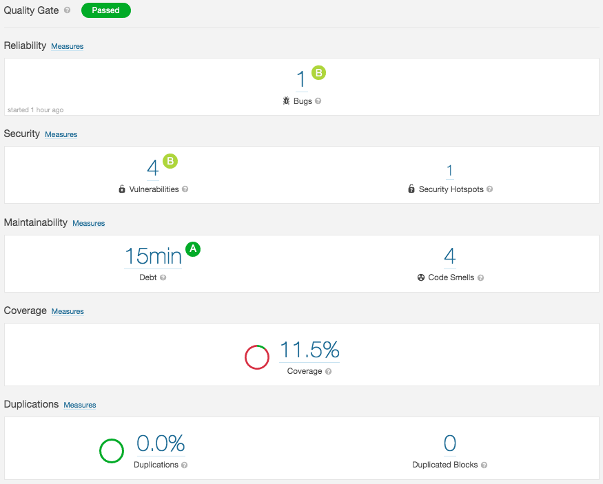

Here you create a project on SonarCloud so you can analyze the _Space Game_ website code. You also get starter code from GitHub to scan. You upload the results to SonarCloud and analyze them.

## Create the project on SonarCloud

Let's set up a project on SonarCloud. You need to save some information, such as a token and keys, from the SonarCloud portal to set up your scan later.

1. From a browser tab, go to [SonarCloud](https://sonarcloud.io/?azure-portal=true) and sign in.
1. In the upper corner, select **+** and then select **Analyze new project**.
1. Go to the **Setup manually** tab.
    * Your organization is filled in automatically.
    * For **Project key**, create a unique name. For example, **space-game-web-333**.
    * The **Display name** is filled in with the same text as the **Project key**.
    * Keep **Public** selected.
    * Select **Set Up**.

    

1. From the **Analyze your project** screen:
    1. Under **Provide a token**:
        * Select **Generate**.
        * Save the generated token somewhere safe.
        * Notice **Project Key** and **Organization Key** on the right. Save those values as well.
        * Select **Continue**.
    1. Under **Run analysis on your project**:
        * Select **C# or VB .NET**.

           You see a few ways to run the scanner. We'll follow a slightly different process.

At this point, your SonarCloud project is created. You need to do a few more things before you can analyze your code.

## Fetch the branch from GitHub

Here you get a copy of the _Space Game_ web project and work from a branch.

1. From Visual Studio Code, open the integrated terminal.
1. Run the following `git` commands to fetch a branch named `security-scan` from Microsoft's repository and switch to that branch.

    ```bash
    git fetch upstream security-scan
    git checkout security-scan
    ```

    As you did in previous modules, the format of this command enables you to get starter code from Microsoft's GitHub repository, known as `upstream`. Shortly, you push this branch up to your GitHub repository, known as `origin`.
1. As an optional step, open **azure-pipelines.yml** from Visual Studio code and familiarize yourself with the initial configuration.

    The configuration resembles the one you created in the [Run quality tests in your build pipeline](/learn/modules/run-quality-tests-build-pipeline?azure-portal=true) module. It builds the application's Release configuration, runs unit tests, and produces a code coverage report.

## Scan locally

Here you set up the SonarCloud scanner and scan your code locally. You then upload the scan data to SonarCloud so that you can analyze the results.

The SonarCloud scanner runs Java code during the scanning process. So, you start by making sure your environment is set up to run Java code.

> [!IMPORTANT]
> We mention Java in the prerequisites, but if you don't have it installed, now is a good time. Install the latest version of [Java SE](https://www.oracle.com/technetwork/java/javase/downloads/index.html?azure-portal=true).

1. From the integrated terminal, check whether the `JAVA_HOME` environment variable is set.

    ```bash
    echo $JAVA_HOME
    ```

    If the command doesn't output a path, you need to set and export this variable.

    To do so, you first need to locate where Java is installed on your system. Then you set and export the `JAVA_HOME` variable.

    Here's an example on Windows:

    ```bash
    export JAVA_HOME="C:\Program Files\Java\jdk-12.0.1"
    ```

    Here's an example on macOS that uses the **java_home** utility to get the path to the default version of Java installed on your system:

    ```bash
    export JAVA_HOME=$(/usr/libexec/java_home)
    ```

    Here's an example on Linux:

    ```bash
    export JAVA_HOME=/usr/bin
    ```

    For more information on how to set this variable, see [Set JAVA_HOME on Windows 7, 8, 10, Mac OS X, and Linux](https://www.baeldung.com/java-home-on-windows-7-8-10-mac-os-x-linux?azure-portal=true).

1. Run the following `dotnet tool install` command to install **dotnet-sonarscanner**:

    ```bash
    dotnet tool install --global dotnet-sonarscanner
    ```

    There are a few ways to install the SonarCloud tools. Using **dotnet-sonarscanner** is an easy way to scan .NET Core code.

1. Create the variables you need to run a scan. The values for these variables are the keys you saved earlier.

    Replace the placeholder values you see with yours. Don't include the parentheses.

    ```bash
    SONAR_TOKEN=(your token)
    SONAR_KEY=(your project key)
    SONAR_ORGANIZATION=(your organization key)
    ```

    Here's an example:

    ```bash
    SONAR_TOKEN=abcdefabcdefabcdefabcdefabcdefabcdef
    SONAR_KEY=space-game-web-0000
    SONAR_ORGANIZATION=username-github
    ```

1. Run the following `dotnet-sonarscanner begin` command to prepare the scanner to collect build and test data:

    ```bash
    $HOME/.dotnet/tools/dotnet-sonarscanner begin \
      /k:"$SONAR_KEY" \
      /d:sonar.host.url="https://sonarcloud.io" \
      /d:sonar.login="$SONAR_TOKEN" \
      /d:sonar.cs.opencover.reportsPaths="./Tailspin.SpaceGame.Web.Tests/TestResults/Coverage/coverage.opencover.xml" \
      /d:sonar.exclusions="**/wwwroot/lib/**/*" \
      /o:"$SONAR_ORGANIZATION"
    ```

    If the command fails, try running it like this:

    ```bash
    MSYS2_ARG_CONV_EXCL="*" $HOME/.dotnet/tools/dotnet-sonarscanner begin \
      /k:"$SONAR_KEY" \
      /d:sonar.host.url="https://sonarcloud.io" \
      /d:sonar.login="$SONAR_TOKEN" \
      /d:sonar.cs.opencover.reportsPaths="./Tailspin.SpaceGame.Web.Tests/TestResults/Coverage/coverage.opencover.xml" \
      /d:sonar.exclusions="**/wwwroot/lib/**/*" \
      /o:"$SONAR_ORGANIZATION"
    ```

    This command uses the information you stored in variables and other information to help the scanner know where to store the results:

      * `/k:` specifies your project key.
      * `/d:sonar.host.url` specifies where to upload the results.
      * `/d:sonar.login` specifies your token.
      * `/d:sonar.cs.opencover.reportsPaths` specifies where to find code coverage information.
      * `/d:sonar.exclusions` specifies code paths to exclude from the scan.
      * `/o:` specifies your SonarCloud organization.

    In [Run quality tests in your build pipeline](/learn/modules/run-quality-tests-build-pipeline?azure-portal=true), you analyzed the amount of code covered by unit tests. SonarCloud can also display this coverage. The `/d:sonar.cs.opencover.reportsPaths` specifies where to find that code coverage information.

    When you run this kind of analysis, it's common to scan only the source code your team has written so that you can more easily focus on just your code. This example uses wildcards to exclude all source code under the **wwwroot/lib** directory. This directory includes open-source components such as Bootstrap and JQuery.

    You learn how to discover potential vulnerabilities in open-source components in a future module.

1. Run this `dotnet build` command to build the application under the Release configuration:

    ```bash
    dotnet build --no-incremental --configuration Release
    ```

    The `--no-incremental` part ensures your app is built from scratch.

    You see more warnings than usual. That's because **sonarscanner** modified the build process to be able to scan your code.

1. Run this `dotnet test` command to run unit tests and collect code coverage results:

    ```bash
    dotnet test --no-build \
      --configuration Release \
      /p:CollectCoverage=true \
      /p:CoverletOutputFormat="cobertura%2copencover" \
      /p:CoverletOutput=./TestResults/Coverage/
    ```

    If the command fails, try running it like this, as you did previously:

    ```bash
    MSYS2_ARG_CONV_EXCL="*" dotnet test --no-build \
      --configuration Release \
      /p:CollectCoverage=true \
      /p:CoverletOutputFormat="cobertura%2copencover" \
      /p:CoverletOutput=./TestResults/Coverage/
    ```

    This command varies slightly from the one you used in the previous module to collect code coverage. Previously, you used `/p:CoverletOutputFormat="cobertura"` to collect code coverage in Cobertura format. SonarCloud needs the results to be in OpenCover format. This version of the command outputs code coverage results in both formats.

    (The `%2c` part represents the comma `,` character and makes it easier for the command to parse the string.)

1. Run this `dotnet-sonarscanner end` command to complete the scanning session and upload the results to SonarCloud:

    ```bash
    $HOME/.dotnet/tools/dotnet-sonarscanner end /d:sonar.login="$SONAR_TOKEN"
    ```

    If the command fails, try running it like this, as you did previously:

    ```bash
    MSYS2_ARG_CONV_EXCL="*" $HOME/.dotnet/tools/dotnet-sonarscanner end /d:sonar.login="$SONAR_TOKEN"
    ```

    You see that scanning results are written to the `.sonarqube` directory under the root of your project. These are intermediate files that SonarCloud uses to collect and analyze the results. These files aren't meant to be included in source control. We've already added an entry in the `.gitignore` file to exclude this directory on the `security-scan` branch.

## Examine the results

Here you see the results from the SonarCloud portal.

1. From a web browser, go to the SonarCloud home page.

    You see your project with a summary of the scan.

    

1. Select the name of the project to be taken to the results page.

    There are several categories that you can examine. Start with **Reliability** at the top. If you have bugs, they show up here. We have one bug. Select it to see more details.

    

    This bug recommends that you replace the bold `<b>` tag with the `<strong>` tag.

    

    You can select **See Rule** to learn more about the rationale behind this recommendation.

    In practice, your team assesses each bug and prioritizes whether to fix it. This bug is categorized as **Minor**. You can use this information to rank its importance among other reported issues.

1. As an optional step, return to the **Overview** tab and explore the results from other categories.

    For example, in the **Security** section, you can examine reported vulnerabilities and security hot spots.

    The **Maintainability** section provides an estimate of your technical debt time and your code smells.

    The **Coverage** section provides a summary of your code coverage.

**Mara:** I was a bit nervous, but the results aren't that bad. It doesn't look like we have any major security issues, but we have some technical debt here.

**Tim:** This is just what I was looking for. But is there a way to keep this report up to date?

**Andy:** Now that we understand the process, we can add it to the build pipeline. That way, we can scan the code on a regular basis. As we resolve the reported issues, the results will improve. Anyone with access can sign in and see the latest report whenever they need to.

**Tim:** Let's see how that works.

## Remove intermediate files

Recall that when you ran **dotnet-sonarscanner** earlier, the process created a number of intermediate files in the **.sonarqube** folder in the root of the project.

These files aren't intended to be included in source control, and you no longer need them. Although the project's **.gitignore** file is already set up to ignore anything in the **.sonarqube** directory, it's a good idea to delete these files so they're not added to your Git repository in future modules.

From Visual Studio Code, go to the terminal window. Then run this command from your project's root directory:

```bash
rm -rf .sonarqube/
```