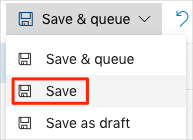

In this part, you add tasks to your Azure Pipelines configuration to run the SonarCloud scanner during the build.

Here you will:

> [!div class="checklist"]
> * Install the SonarCloud Marketplace extension.
> * Create a SonarCloud service connection.
> * Add variables to your Azure Pipeline.
> * Add scan tasks to your Azure Pipeline.
> * Analyze the results on SonarCloud.

## Install the Marketplace extension

The SonarCloud Marketplace extension provides the service connection type you need in the next step. The extension also provides the built-in task types that you use in your build pipeline.

1. From a new browser tab, go to [marketplace.visualstudio.com](https://marketplace.visualstudio.com?azure-portal=true).
1. On the **Azure DevOps** tab, search for "SonarCloud."
1. Select **SonarCloud** from the results.

    

1. Select **Get it free**.
1. Select your Azure DevOps organization from the drop-down box.
1. Select **Install**.

## Create a SonarCloud service connection

Your pipeline tasks require access to SonarCloud. Here you create a service connection from the Azure DevOps portal.

1. From Azure DevOps, navigate to your project.
1. Select **Project settings** in the lower corner.
1. Under **Pipelines**, select **Service connections**.
1. Select **New service connection**, and then select **SonarCloud**.

    SonarCloud appears here because you installed the SonarCloud extension in the previous step.
1. In the dialog box that appears, enter these fields:

    * **Connection name**: **SonarCloud connection 1**
    * **SonarCloud Token**: This token is the one that you copied from the SonarCloud portal when you created your project.
1. Select **Verify connection**.

    You see that the connection is verified. 
1. Select **OK**.

## Create pipeline variables

You're almost ready to add pipeline tasks to your pipeline configuration. First, you add a few variables to your pipeline. You define these pipeline variables directly from Azure Pipelines and not from your **azure-pipelines.yml** file as you did previously.

Recall that the SonarCloud Marketplace extension provides built-in task types that perform the scan. The first task you use, named `SonarCloudPrepare@1`, requires some information specific to your SonarCloud project, such as your project name and project key.

Although your project name and project key aren't necessarily sensitive information, creating variables for these values makes your configuration more reusable in other projects.

Let's add a few variables to the pipeline.

1. From Azure DevOps, navigate to your pipeline and select **Edit**.
1. Select the ellipsis on the right, and choose **Variables**.

    

1. Select **+ Add**.
1. In the dialog box that appears, set the name to **projectKey** and the value to the project key you generated when you created your SonarCloud project.

    Notice the lock icon. If you select that icon, the value for your variable is encrypted when it's standing still. This is a good way to store secrets like tokens, but you don't need to do that here.
1. Create another variable and name it **projectName**. Then specify your project name as its value.

    If you used the default value when you set up the SonarCloud project, this value will be the same value as **projectKey**.
1. Create another variable, and call it **organization**. Set the value to the organization you created when you set up your SonarCloud project.

    
1. On the menu, select **Save** (don't select **Save & queue**). In the comment box, enter **Add SonarCloud variables**.

    

## Add tasks to the pipeline configuration

Here you add the tasks that perform the scan to **azure-pipelines.yml**.

Recall that when you scanned locally, you used the **dotnet-sonarscanner** tool. Here's the `dotnet-sonarscanner begin` command you ran to prepare the scanner to collect build and test data. (You don't need to run this command right now.)

```bash
$HOME/.dotnet/tools/dotnet-sonarscanner begin \
  /k:"$KEY" \
  /d:sonar.host.url="https://sonarcloud.io" \
  /d:sonar.login="$SONAR_TOKEN" \
  /d:sonar.cs.opencover.reportsPaths="./Tailspin.SpaceGame.Web.Tests/TestResults/Coverage/coverage.opencover.xml" \
  /d:sonar.exclusions="**/wwwroot/lib/**/*" \
  /o:"$ORGANIZATION"
```

Although you could run this same command in your build pipeline, you would need to secure access to the `/d:sonar.login` argument, which defines your access token.

An easier way is to use these built-in task types provided by the SonarCloud extension:

* `SonarCloudPrepare@1`
* `SonarCloudAnalyze@1`
* `SonarCloudPublish@1`

`SonarCloudPrepare@1` maps to the `dotnet-sonarscanner begin` command you ran earlier. This task uses the service connection you created earlier, rather than directly using your access token. This arrangement ensures that your access token doesn't appear in the build output.

The other two commands map to the `dotnet-sonarscanner end` command, which analyzes the results and uploads the report to SonarCloud.

1. From Visual Studio Code, open **azure-pipelines.yml** and replace its contents with this code. The new parts are highlighted.

    [!code-yml[](code/5-azure-pipelines.yml?highlight=38-48,68,76-80)]

    Notice that `SonarCloudPrepare@1` appears before the project is built or any tests are run. Similarly, `SonarCloudAnalyze@1` and `SonarCloudPublish@1` appear after the project is built and all tests are run. This is the same process you used when you scanned locally from the command line.

    Also notice that `SonarCloudPrepare@1` contains information specific to your account and uses the pipeline variables you created a moment ago.

    ``` bash
    organization: '$(organization)'
    projectKey: '$(projectKey)'
    projectName: '$(projectName)'
    ```

## Watch Azure Pipelines build the application

Here you push your changes to GitHub and see the pipeline run. Recall that you're currently on the `security-scan` branch.

1. From the integrated terminal, add **azure-pipelines.yml** to the index, commit the changes, and push the branch up to GitHub.

    ```bash
    git add azure-pipelines.yml
    git commit -m "Analyze code using SonarCloud"
    git push origin security-scan
    ```

1. Go to your Azure DevOps Pipeline browser tab, and watch the build.

## Analyze the results

Return to the SonarCloud portal and examine the results. You see the same results as when you scanned locally because the project sources haven't changed.

As you resolve issues from the report and add new features to your application, your report changes over time. Issues you resolve are removed from the report. Likewise, new issues might appear as you add features or the security community provides new recommendations.

Andy and Mara discuss their progress over lunch.

**Mara:** I'm glad we were able to help Tim prepare his report for the security consultant. It would have been so much more difficult if we didn't have an automated way to understand potential vulnerabilities.

**Andy:** I agree. Our DevOps investment is paying off. We can also bring this report to leadership. If a high-severity vulnerability appears or we find we have too much technical debt, we can use the report to justify spending time to resolve them before adding new features. Often, new features can wait when security is a high priority.