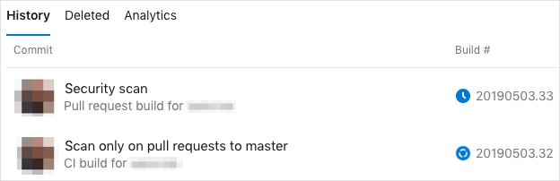
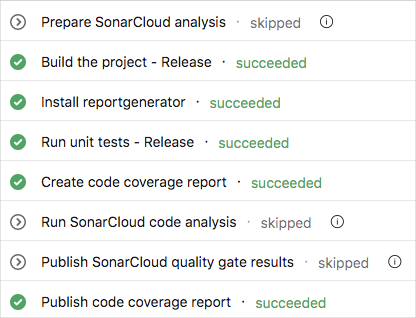
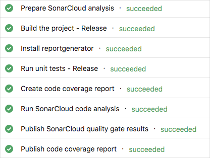

At this point, your build configuration scans your code whenever a change is pushed to the repository. But you might have noticed the scanning process adds time to the overall build process. You don't want to scan on every small commit. Instead, you want to scan less often, such as on pull requests only. You can use conditions in your pipeline to accomplish this.

In this part, you modify your build configuration to run the SonarCloud scanner only when the build is happening in response to a pull request.

**Andy:** Scanning our code in the pipeline is great, but look how much time it added.

**Mara:** Well, it's only a minute.

**Andy:** That's true, but it adds up. We want to get feedback on our builds as quickly as possible. Plus, the time will increase as we add more code and there's more to analyze.

**Mara:** Fair point. We don't need to run these checks on every build, but it's important that we validate changes before we merge them into master. I believe there's a way we can conditionally run the scans.

**Andy:** Perhaps when there's a pull request?

**Mara:** That's what I was thinking. Let's try it.

## What are conditions?

In Azure Pipelines, a _condition_ enables you to run a task or job based on the state of the pipeline. Some of the conditions you can specify are:

> [!div class="checklist"]
> * Only when all previous dependent tasks have succeeded.
> * Even if a previous dependency has failed, unless the run was canceled.
> * Even if a previous dependency has failed, even if the run was canceled.
> * Only when a previous dependency has failed.
> * Some custom condition.

Here's a basic example:

``` yml
steps:
  - script: echo Hello!
    condition: always()
```

The `always()` condition causes this task to print "Hello!" unconditionally, even if previous tasks failed.

Here's the condition that's used if you don't specify one:

```yml
condition: succeeded()
```

The `succeeded()` built-in function checks whether the previous task succeeded. If the previous task failed, this task and subsequent tasks with the same condition are skipped.

Here, you want to build a condition that specifies that:

* The previous task succeeded.
* The build is for a pull request.
* The pull request is against the `master` branch.

To build this condition, you use the built-in `and()` function. This function checks whether each of its conditions is true. If any condition isn't true, the overall condition fails.

To get the build reason, you use the built-in `Build.Reason` variable. This variable is set to `PullRequest` when the build is for a pull request.

To get the target branch for the pull request, you use the built-in `System.PullRequest.TargetBranch` variable. Here you want to check whether this variable is set to `master`.

There are a few ways to access variables within a condition. Here you use the `variables[]` syntax.

To test a variable's value, you can use the built-in `eq()` function. This function checks whether its arguments are equal.

With that in mind, here's the condition you apply to build tasks that relate to scanning using SonarCloud:

```yml
condition: |
  and
  (
    succeeded(),
    eq(variables['Build.Reason'], 'PullRequest'),
    eq(variables['System.PullRequest.TargetBranch'], 'master')
  )
```

The first condition in the `and()` function checks whether the previous task succeeded. The second condition checks whether the build reason is a pull request. The third function checks whether the target branch of the pull request is `master`.

In YAML, you use the `|` syntax to define a string that spans multiple lines. You could define the condition on a single line, but we write it this way to make it more readable.

## Scan only pull requests to the master branch

In this part, you provide a condition to each build task that relates to SonarCloud. This condition limits scans to only when the build is for a pull request to the `master` branch.

1. From Visual Studio Code, modify **azure-pipelines.yml** like this:

    [!code-yml[](code/6-azure-pipelines.yml?highlight=49-55,85-91,95-101)]

    The highlighted parts show you where the conditions are applied to the SonarCloud build tasks.

1. From the integrated terminal, add **azure-pipelines.yml** to the index, commit the changes, and push the branch up to GitHub.

    ```bash
    git add azure-pipelines.yml
    git commit -m "Scan only on pull requests to master"
    git push origin security-scan
    ```

1. From a browser, go to [github.com](https://www.github.com?azure-portal=true) and sign in.
1. Go to your **mslearn-tailspin-spacegame-web** repository.
1. On the drop-down menu, go to your `security-scan` branch.

1. Select the **New pull request** button to start your pull request.

1. Ensure that **base** specifies your forked repository and not Microsoft's repository.

    > [!IMPORTANT]
    > This step is important because you won't be able to merge your changes into Microsoft's repository. When you work directly with your own repository, and not a fork, your `master` branch is selected by default.

1. Specify a title for your pull request and add a description.

    * Title:
    > _Run SonarCloud only on pull requests to master_
    * Description:
    > _Run SonarCloud less often to reduce build times for normal CI builds._

1. Select the **Create pull request** button to complete your pull request.

    Remember, this step doesn't merge any code. It tells others that you have changes that you're proposing be merged.

    Just like when you push a branch to GitHub, by default a pull request triggers Azure Pipelines to build your application.

1. From Azure DevOps, watch the build.

    You see that the build happens two times.

    

    The build shown on the bottom is the first build. Recall that Azure Pipelines builds your application each time you push up a branch. This build relates to the `git push` command you just ran. This kind of build is called a _CI build_.

    The build shown on top is the second build. When you submit a pull request on GitHub, Azure Pipelines builds your application. This kind of build is called a _pull request build_.

    Click through to each build task, starting with the CI build.

    You see that the SonarCloud tasks are skipped. That's because the CI build is a normal build against the `security-scan` branch.

    

    You see that all tasks, including the SonarCloud tasks, are run in the pull request build. That's because your pull request targets the `master` branch.

    

For brevity, you won't merge your pull request here. But in practice, you might merge your pull request only after all build checks pass and another team member approves your changes.