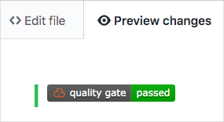
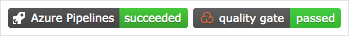

In this part, you add a quality badge to your GitHub README file so that there's a way to quickly see the status of your code quality.

Let's check in with the team to see how this happens.

**Tim:** This is all impressive, but is there a way that I can get a quick sense of the security of the codebase without having to sign in to another portal?

**Amita:** It would be great if Tim could get a quick status on GitHub just like I can with the build results. Is there a badge?

**Mara:** I'll look into that. Perhaps there's a way.

In the [Implement a code workflow in your build pipeline using Git and GitHub](/learn/modules/implement-code-workflow?azure-portal=true) module, you added a build badge that shows the status of the build on your GitHub repository.

You can add other kinds of badges to your repository, such as a quality badge that shows the status of the latest SonarCloud scan. You do that here.

Here's an example quality badge:

## Add the quality badge

Previously, you got the Markdown code for your build badge from Azure Pipelines. You then added that code directly to your README.md file through GitHub.

Here, you follow a similar process. You get the Markdown code you need from SonarCloud.

1. From SonarCloud, navigate to your project.
1. Select **Get project badges** from the lower corner.
1. Select **Quality Gate Status** from the **Metric** drop-down list.

    > [!TIP]
    > Later, you can add additional badges, such as for code coverage or total lines of code.

1. Select **Markdown** from the **Format** drop-down list.
1. Select **Copy** to copy the Markdown code to your clipboard.
1. From GitHub, navigate to your project page.
1. Make sure you're on the `master` branch. Then locate README.md from the files area, and select the file to open it.
1. Select the pencil icon to open the file in the editor.
1. At the top of the page, paste the contents of the clipboard. You can add the quality badge on the same line as your build badge or on a separate line. It's common to maintain all badges on the same line.
1. Select the **Preview changes** tab to see your proposed changes.

    GitHub renders the Markdown file and shows you the quality badge.

    

## Commit your changes to master

Here you commit your changes to the `master` branch on GitHub.

1. Scroll to the bottom of the page and specify a commit message, such as "Add quality badge."
1. Leave the "Commit directly to the `master` branch" option selected, and select **Commit changes** to commit your changes to the `master` branch.

    You see your quality badge on the README.md page.

    

    This process is a more basic way to merge code into GitHub. Instead of committing directly, you also can  create a pull request with your changes for others to review.

    In practice, you switch to the `master` branch and pull the latest changes from GitHub the next time you need to add a feature or address a bug.
