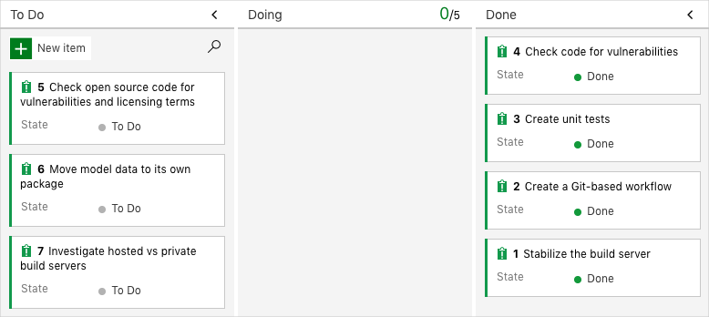

[!include]

You're all done with the tasks for this module. Here, you move the work item to the **Done** state on Azure Boards and clean up your Azure DevOps environment.

> [!IMPORTANT]
> This page contains important cleanup steps. Cleaning up helps ensure that you don't run out of free build minutes. Be sure to perform the cleanup steps if you ran the template earlier in this module.

## Move the work item to Done

Here, you move the work item you assigned to yourself earlier in this module, **Check code for vulnerabilities**, to the **Done** column.

In practice, the definition of "Done" often means putting working software into the hands of your users. For learning purposes, mark this work as complete because you can scan your code for potential vulnerabilities in your build pipeline.

At the end of each sprint, or work iteration, you and your team might hold a retrospective meeting, where you share the work you completed, what went well in the sprint, and what could be improved.

To complete the work item:

1. From Azure DevOps, navigate to **Boards** and then select **Boards** from the menu.
1. Move the **Check code for vulnerabilities** work item from the **Doing** column to the **Done** column.

    

## Disable the pipeline or delete your project

Each module in this learning path provides a template you can run to create a clean environment for the duration of the module.

Running multiple templates gives you multiple Azure Pipelines projects, each pointing to the same GitHub repository. This situation can trigger multiple pipelines to run each time you push a change to your GitHub repository, which can cause you to run out of free build minutes on our hosted agents. It's important that you disable or delete your pipeline before you move on to the next module.

Choose one of the following options.

### Option 1: Disable the pipeline

This option disables the pipeline so that it does not process further build requests. You can re-enable the build pipeline later if you want to. Choose this option if you want to keep your DevOps project and your build pipeline for future reference.

To disable the pipeline:

1. In Azure Pipelines, navigate to your pipeline.
1. From the drop-down menu, select **Settings**:

    :::image type="content" source="../../shared/media/azure-pipelines-settings-button.png" alt-text="A screenshot of Azure Pipelines showing the location of the Settings menu.":::
1. Under **Processing of new run requests**, select **Disabled** and then select **Save**.

    Your pipeline will no longer process build requests.

### Option 2: Delete the Azure DevOps project

This option deletes your Azure DevOps project, which includes what's on Azure Boards and your build pipeline. In future modules, you'll be able to run another template that brings up a new project in a state where this one leaves off. Choose this option if you don't need your DevOps project for future reference.

To delete the project:

1. From Azure DevOps, navigate to your project. Earlier, we recommended that you name this project **Space Game - web - SonarCloud**.
1. Select the gear icon next to the project name.

    The icon might not appear until you move your mouse over that area.

    :::image type="content" source="../../shared/media/azure-devops-project-gear.png" alt-text="A screenshot of Azure Pipelines showing the location of the gear icon.":::
1. From the **Project details** area, scroll to the bottom and select **Delete**.

    :::image type="content" source="../../shared/media/azure-devops-delete-project.png" alt-text="A screenshot of Azure Pipelines showing the location of the Delete button.":::
1. From the window that appears, enter the project name and select **Delete** a second time.

    Your project is now deleted.