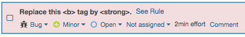

[!include]

In this module, you helped the team to shift left to search for code vulnerabilities and technical debt. They can now find problems early in the development process, which makes it easier to write code that's secure and maintainable. Because the scans are a part of the automated pipeline, they know the results are current. Not only that, but Tim now has an easy way to understand the state of the code for security and quality. 

What happens if you find a vulnerability? You need to investigate it to determine if it's a security issue and a real threat. Some vulnerabilities are reported because one of your dependencies is out of date. This may or may not be a security issue. Address possible vulnerabilities on a case-by-case basis.

Let's check in with the team.

**Tim:** I like what we've done here, but now that we know what the issues are, what do I tell leadership about fixing them?

**Amita:** Right! Do we need to fix all of these issues right away?

**Andy:** Yes, there are some issues to fix. But at least now we know where the issues are. We can discuss and prioritize fixing them based on their severity. We can even start with a few easy ones just to get a feel for the process.

**Mara:** We may never get a completely clean report given that the community will always have new recommendations and some issues are low severity. But getting a handle on things will go a long way to managing our technical debt.

**Tim:** It's great that we're able to identify and fix issues so early in the process. I don't know how I would have found this information on my production systems. I'll take this report to our security consultant. Perhaps we can all work together to identify and fix the most important issues.

Mara smiles. She feels like her efforts around DevOps are starting to pay off.

If you build .NET applications, as an optional exercise you can practice fixing one or more of the errors SonarCloud reported. You can apply the same ideas to your own projects.

A relatively easy bug to fix relates to replacing the bold `<b>` tag with the `<strong>` tag, as you saw earlier.

See if you can locate this issue in the source code based on the report. After you fix the issue and commit the change to the `master` branch on GitHub, you see the issue disappear the next time the scanner runs.

## Learn more

Thinking about security is part of every phase of your development lifecycle. Microsoft provides a place to go to learn more about security and privacy in all phases of development. We recommend that you check out [Microsoft Security Development Lifecycle](https://www.microsoft.com/securityengineering/sdl/?azure-portal=true).

In this module, you learned about some of the tools and processes you can use to analyze your code. Here's where you can learn more:

* [OWASP](https://www.owasp.org?azure-portal=true)
* [Roslyn analyzers](https://docs.microsoft.com/visualstudio/code-quality/roslyn-analyzers-overview?view=vs-2017#source-code-analysis-versus-legacy-analysis)
* [Common Weakness Enumeration](https://cwe.mitre.org/index.html?azure-portal=true) (CWE)
* [Common Vulnerabilities and Exposures](https://cve.mitre.org/cve/?azure-portal=true) (CVE)
* [Microsoft Security Development Lifecycle](https://www.microsoft.com/securityengineering/sdl/?azure-portal=true)

Here are some resources that relate to Azure Pipelines features you used in this module:

* [Specify conditions](https://docs.microsoft.com/azure/devops/pipelines/process/conditions?view=azure-devops&tabs=yaml&azure-portal=true) in Azure Pipelines
* [Secret variables](https://docs.microsoft.com/azure/devops/pipelines/process/variables?view=azure-devops&tabs=yaml%2Cbatch#secret-variables) in Azure Pipelines

## Appendix

The following sections are optional. They provide additional information beyond what's covered in this module.

### The reasons for technical debt

This module introduced the term _technical debt_, which is a real problem for most development teams if they're not working on a brand new project. Let's talk a little bit more about it.

Technical debt is a term that describes the future cost that will be incurred by choosing an easy solution today instead of using better practices that take longer to complete. It's one of the main reasons that projects fail to meet their deadlines.

Technical debt can build up to the point where developers are spending almost all their time sorting out problems and doing rework, either planned or unplanned, rather than adding value. There are many reasons technical debt accrues.

One of the most common is tight deadlines. When developers are forced to create code quickly, they'll often take shortcuts. As an example, instead of refactoring a method to include new functionality, developers will copy it to create a new version. The reasoning is they will only have to test the new code because they're using the original method. The problem is that there are now two copies of the same code that need to be maintained.

Other reasons for technical debt can be:

* A lack of technical skills and maturity among the developers.
* No clear product ownership or direction.
* Lack of coding standards.
* No code quality testing, whether manual or automated.
* Lack of clear requirements.
* Last minute changes.
* Delaying refactoring work.

In the end, technical debt makes it harder to deliver value to customers in a reasonable time frame and at a reasonable cost. This means it's important to integrate the assessment and measurement of technical debt and of code quality into your pipeline. You saw the Tailspin team do this by using SonarCloud.

### Manage secrets, tokens and certificates

Now that you're familiar with the tools and processes you can use with your pipeline to pinpoint vulnerabilities, let's focus on one tool that can help you manage your sensitive information. That tool is Azure Key Vault.

Azure Key Vault helps solve the following problems:

* Secrets Management - Azure Key Vault can be used to securely store and tightly control access to tokens, passwords, certificates, API keys, and other secrets.
* Key Management - Azure Key Vault can also be used as a key management solution. Azure Key Vault makes it easy to create and control the encryption keys used to encrypt your data.
Certificate Management - Azure Key Vault is also a service that lets you easily provision, manage, and deploy public and private Secure Sockets Layer/Transport Layer Security (SSL/TLS) certificates for use with Azure and your internal connected resources.
* Store secrets backed by Hardware Security Modules - The secrets and keys can be protected either by software or FIPS 140-2 Level 2 validates HSMs.

#### Centralize application secrets

Centralizing storage of application secrets in Azure Key Vault allows you to control their distribution. Key Vault greatly reduces the chances that secrets may be accidentally leaked. When using Key Vault, application developers no longer need to store security information in their application. This eliminates the need to make this information part of the code. For example, an application may need to connect to a database. Instead of storing the connection string in the app codes, store it securely in Key Vault.

Your applications can securely access the information they need by using URIs that allow them to retrieve specific versions of a secret after the application's key or secret is stored in Azure Key Vault. This happens without having to write custom code to protect any of the secret information.

#### Securely store secrets and keys

Secrets and keys are safeguarded by Azure, using industry-standard algorithms, key lengths, and hardware security modules (HSMs). The HSMs used are Federal Information Processing Standards (FIPS) 140-2 Level 2 validated.

Access to a key vault requires proper authentication and authorization before a caller (user or application) can get access. Authentication establishes the identity of the caller, while authorization determines the operations that they are allowed to perform.

Authentication is done via Azure Active Directory. Authorization may be done via role-based access control (RBAC) or Key Vault access policy. RBAC is used when dealing with the management of the vaults and key vault access policy is used when attempting to access data stored in a vault.

Azure Key Vaults may be either software- or hardware-HSM protected. For situations where you require added assurance you can import or generate keys in hardware security modules (HSMs) that never leave the HSM boundary. Microsoft uses Thales hardware security modules. You can use Thales tools to move a key from your HSM to Azure Key Vault.

Finally, Azure Key Vault is designed so that Microsoft does not see or extract your data.

#### Monitor access and use

Once you have created a couple of Key Vaults, you will want to monitor how and when your keys and secrets are being accessed. You can do this by enabling logging for Key Vault. You can configure Azure Key Vault to:

* Archive to a storage account.
* Stream to an event hub.
* Send the logs to Log Analytics.
* You have control over your logs and you can restrict access and delete logs.

#### Integrate with other Azure services

As a secure store in Azure, Key Vault has been used to simplify scenarios like Azure Disk Encryption, the always encrypted functionality in SQL server and Azure SQL Database, Azure web apps. Key Vault itself can integrate with storage accounts, event hubs and log analytics.

### Kubernetes and Azure Key Vault

Azure Key Vault and Kubernetes make a good combination. It may seem that Kubernetes alone is sufficient since Kubernetes supports both a ConfigMap store and Secret store. Remember, however, the principle around the separation of concerns and how we can ensure enhanced security by separating out configuration from secrets.

Having secrets in the same cluster as the configuration store can make them prone to higher risks. An additional benefit is maintainability. Azure Key Vault gives the ability to provide a distributed "Secure Store as a Service" option that provides not just secret management but also Certificates and Key management as part of the service. The SecOps engineers can lock down access to the store without need of cluster admins permissions which allows for clear delineation of responsibilities and access.