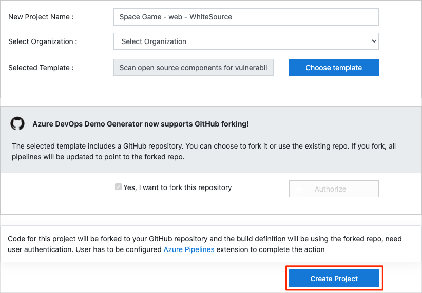
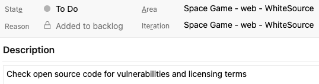
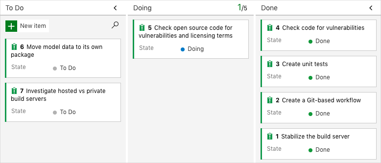

In this unit, you ensure that your Azure DevOps organization is set up to complete the rest of this module.

To do this, you:

> [!div class="checklist"]
> * Set up an Azure DevOps project for this module.
> * Move the work item for this module on Azure Boards to the **Doing** column.
> * Make sure your project is set up locally so that you can push changes to the pipeline.

## Get the Azure DevOps project

Here, you make sure that your Azure DevOps organization is set up to complete the rest of this module. You do this by running a template that creates a project for you in Azure DevOps.

The modules in this learning path form a progression, where you follow the Tailspin web team through their DevOps journey. For learning purposes, each module has an associated Azure DevOps project.

### Run the template

Run a template that sets up everything for you in your Azure DevOps organization.

> [!div class="nextstepaction"]
> [Run the template](https://azuredevopsdemogenerator.azurewebsites.net/?name=scan-open-source&azure-portal=true)

From the Azure DevOps Demo Generator site, take these steps to run the template.

1. Select **Sign In**, and then accept the usage terms.
1. From the **Create New Project** page, select your Azure DevOps organization.  Then enter a project name, such as *Space Game - web - WhiteSource*.
1. Select **Fork repository on GitHub**, and then select **Authorize**. If a window appears, authorize access to your GitHub account.

    > [!IMPORTANT]
    > You need to select this option for the template to connect to your GitHub repository. Select this option even if you've already forked the _Space Game_ web site project. The template uses your existing fork.
1. Select **Create Project**.

    

    It takes a few moments for the template to run.
1. Select **Navigate to project** to go to your project in Azure DevOps.

    > [!IMPORTANT]
    > The [Clean up your Azure DevOps environment](/learn/modules/scan-open-source/5-clean-up-environment?azure-portal=true) page in this module contains important cleanup steps. Cleaning up helps ensure that you don't run out of free build minutes. Be sure to perform the cleanup steps even if you don't complete this module.

[!include]

## Move the work item to Doing

In this part, you'll assign a work item to yourself that relates to this module on Azure Boards. You'll also move the work item to the **Doing** state. In practice, you and your team would create work items at the start of each sprint, or work iteration.

Assigning work in this way gives you a checklist to work from. It gives others on your team visibility into what you're working on and how much work is left. It also helps the team enforce Work in Progress, or WIP, limits so that the team doesn't take on too much work at one time.

Recall that the team settled on these seven top issues.

> [!NOTE]
> Within an Azure DevOps organization, work items are numbered sequentially. In your project, the number that's assigned to each work item might not match what you see here.

Here you move the fifth item, **Check open source code for vulnerabilities and licensing terms** to the **Doing** column and assign yourself to the work item.

Recall that **Check open source code for vulnerabilities and licensing terms** relates to scanning open-source components that are used in your application for known vulnerabilities and license ratings.

To set up the work item:

1. From Azure DevOps, go to **Boards** and then select **Boards** from the menu.

    

1. From the **Check open source code for vulnerabilities and licensing terms** work item, select the down arrow at the bottom of the card. Then assign the work item to yourself.

    
1. Move the work item from the **To Do** to the **Doing** column.

    

At the end of this module, you'll move the card to the **Done** column after you've completed the task.

[!include]