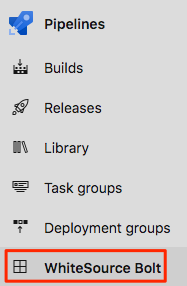
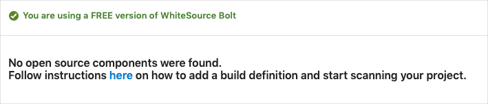
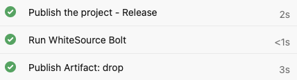
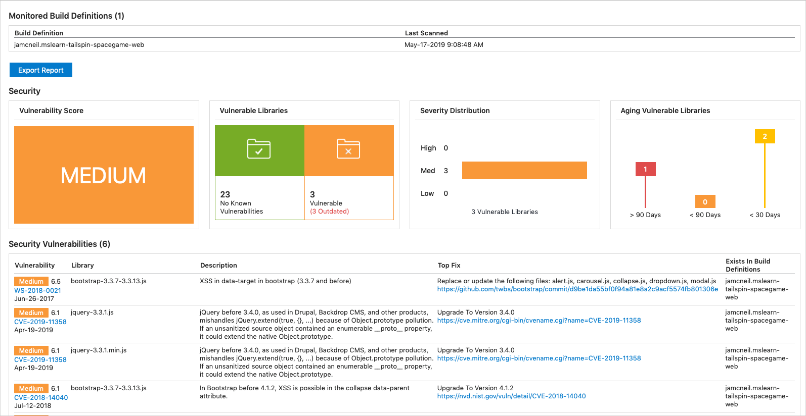
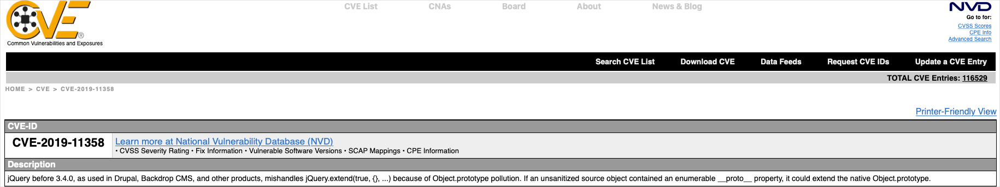
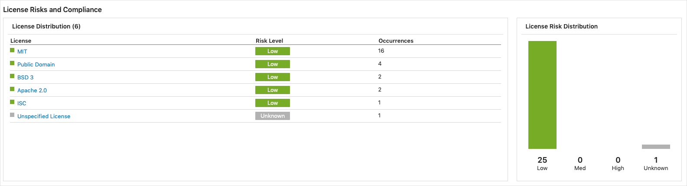

In this section, you'll add a task to your build pipeline that scans your dependencies for vulnerabilities and license ratings. You'll use Whitesource Bolt to do the scanning. You'll analyze the results of the scan from Azure Pipelines.

Here you'll:

> [!div class="checklist"]
> * Get starter code from GitHub
> * Add build tasks to your pipeline configuration
> * Analyze the results from Azure Pipelines

In practice, you might scan your project locally from the command line as you did in previous modules. Doing so helps you understand the process and see what results to expect.

For brevity, here you'll add a task directly to *azure-pipelines.yml* and run the change through your pipeline.

## Fetch the branch from GitHub

Here you'll get the starter code for the _Space Game_ web project from Microsoft's GitHub repository and switch to that branch.

1. From Visual Studio Code, open the integrated terminal.
1. Run the following `git` commands to fetch a branch named `scan-open-source` from Microsoft's repository, and then switch to that branch.

    ```bash
    git fetch upstream scan-open-source
    git checkout -b scan-open-source upstream/scan-open-source
    ```

    As in previous modules, the format of these commands enables you to get starter code from Microsoft's GitHub repository, known as `upstream`. Shortly, you'll push this branch up to your GitHub repository, known as `origin`.

1. As an optional step, open *azure-pipelines.yml*. Then inspect the initial configuration.

    For learning purposes, this configuration is very basic and omits running quality tests.

## Install the Marketplace extension

Here you'll install the **WhiteSource Bolt** extension for Microsoft Azure Pipelines. This extension provides you with the built-in task types you need in your pipeline definition. It also provides a way to visualize the scan results directly from Azure Pipelines.

1. Open a new browser tab and go to [marketplace.visualstudio.com](https://marketplace.visualstudio.com?azure-portal=true). Make sure you're on the **Azure DevOps** tab.
1. Search for "WhiteSource Bolt".
1. Select **WhiteSource Bolt** from the results.

    
1. Select **Get it free**.
1. Select your Microsoft Azure DevOps organization from the drop-down box.
1. Select **Install**.
1. From Azure DevOps, go to your project. Then go to **Pipelines**.
1. Go to the **WhiteSource Bolt** tab.

    

    You see a form that asks for your email address and company name.

   

    Enter the required information.
1. Select **Get Started**.

## Add tasks to the pipeline configuration

Here you'll use the built-in task `WhiteSource Bolt@20` that's provided by the WhiteSource Bolt extension to scan your open-source dependencies when the pipeline runs.

> [!IMPORTANT]
> The major version number for WhiteSource Bolt that you noted earlier must match the version number of the `WhiteSource Bolt` task. At the time of this writing the version was 20.

1. From Visual Studio Code, open *azure-pipelines.yml* and replace its contents with the following:

    [!code-yml[](code/4-azure-pipelines.yml?highlight=57-58)]

    The `WhiteSource Bolt@20` task, which runs before the `PublishBuildArtifacts@1` task, is highlighted. It analyzes your open-source dependencies for known vulnerabilities, as well as licenses and prepares reports that you can review directly from Azure Pipelines.

## Watch Azure Pipelines build the application

Here you'll push your changes to GitHub and see the pipeline run. Recall that you're currently on the `scan-open-source` branch.

1. From the integrated terminal, add *azure-pipelines.yml* to the index, commit the changes, and push the branch up to GitHub.

    ```bash
    git add azure-pipelines.yml
    git commit -m "Analyze OSS using WhiteSource Bolt"
    git push origin scan-open-source
    ```

1. From Azure Pipelines, watch the build.

    You see the scan task complete successfully.

    

1. Select the completed **Run WhiteSource Bolt** task, and then scroll to the bottom of the report details for that task.

    ![Screenshot of WhiteSource scan pipeline output ending with "##[section]Finishing: Run WhiteSource Bolt".](../media/4-scan-task-detail.png)

    You see that the data is being uploaded for the scan report.

1. When the build completes, navigate to the **WhiteSource Bolt Build Report** tab.

    

    This image is for illustration. You may see different results based on the current recommendations.

## Analyze the results

Take a moment to review the findings. You see that there are some issues to address.

1. In the **Security Vulnerabilities** section find the **jquery-3.3.1.js** entry. Then select the CVE link.

    

    This shows the vulnerability that is associated with this library.

1. Go back to the report and scroll down to the **License Risk and Compliance** section. Notice the list of licenses for the open-source dependencies. While they may all be green, it's  up to the legal team to decide if these are acceptable.

    

The team gets together to look at the results.

**Amita:** Wow, we use more open source than I thought!

**Tim:** And our vulnerability score is listed as medium. Is that okay?

**Andy:** It's too early to draw conclusions. For right now, our job is to identify what we're using, how each component is licensed, and which potential vulnerabilities we see.

**Tim:** I have some experience working with the CVE recommendations. I can take some more time to analyze the results and summarize what we're using ahead of our meeting with the legal team.

**Andy:** That sounds great. Let us know what you need. We haven't modified any of the open-source components that we use. I think that in our conversation with the legal team, we should verify that we can use software with those licenses. We can have a follow-up conversation with the security consultant to see which vulnerabilities we might want to address.

**Mara:** I thought that all these concerns around licensing only affected big companies. It's good to know this is something we should keep in mind as we evaluate and use open source.

## Limit scanning to pull requests

In this example, the scan took about 30 seconds to run. Although this doesn't add much time to the overall build, the time might increase as you use additional open-source libraries.

As an optional exercise, you can limit the scans to run only during pull request builds to the `master` branch. To do so, you can specify a _condition_ similar to this one:

```yml
condition: |
  and
  (
    succeeded(),
    eq(variables['Build.Reason'], 'PullRequest'),
    eq(variables['System.PullRequest.TargetBranch'], 'master')
  )
```

To learn more, see [Specify conditions](https://docs.microsoft.com/azure/devops/pipelines/process/conditions?tabs=yaml&azure-portal=true).

Doing so helps standard CI builds to finish more quickly while still helping you discover potential vulnerabilities and understand how you're licensing open-source components before you merge code into the `master` branch.
