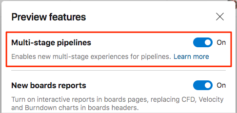

## Turn on multi-stage pipelines in Azure DevOps

Multi-stage pipelines are a preview feature of Azure Pipelines. Preview features provide early access to features that will soon become part of Azure DevOps. For now, you need to turn on this feature.

From Azure DevOps:

1. Select your profile.
1. Select the ellipsis (**...**) button, and then select **Preview features**.
1. Turn on **Multi-stage pipelines**.

    

1. Notice that separate **Pipelines** menu entries for **Release** and **Build** are now gone. This is because you'll now perform both build and release tasks from the same pipeline.