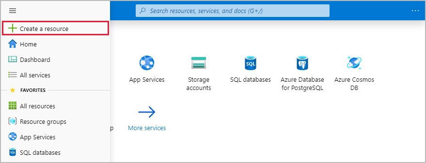
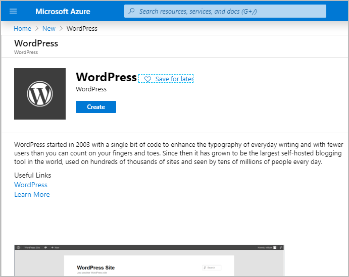
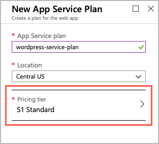
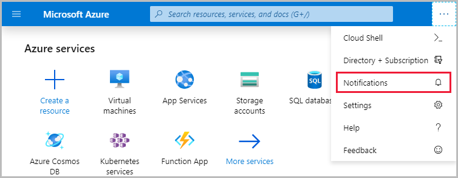
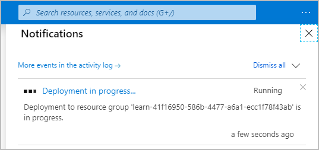
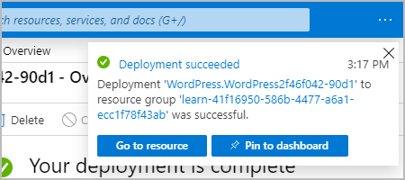

As a developer for Tailwind Traders, you likely have expertise creating applications. As you migrate to Azure, many of the steps that you'll follow to set up a website in the cloud will parallel the steps that you followed when you created websites in your company's datacenter. For example, you need to choose where you'll create your website, and then allocate the necessary resources. In Azure, the physical hardware is managed for you, so your tasks are to choose where your website will be located and which resources to provide.

In this exercise, you'll create an Azure App Service instance to host a WordPress website.

## Azure terminology and concepts

Before you get started, let's review and discuss some basic terms and concepts that you'll need to know when you create your website.

### What is App Service?

App Service is an HTTP-based service that enables you to build and host many types of web-based solutions without managing infrastructure. For example, you can host web apps, mobile back ends, and RESTful APIs in several supported programming languages. Applications developed in .NET, .NET Core, Java, Ruby, Node.js, PHP, or Python can run in and scale with ease on both Windows- and Linux-based environments.

For this exercise, we want to create a website in less than the time it takes to eat lunch. So, we're not going to write any code. Instead, you'll deploy a predefined application from Azure Marketplace.

### What is Azure Marketplace?

Azure Marketplace is an online store that hosts applications that are certified and optimized to run in Azure. Many types of applications are available, ranging from AI and machine learning to web applications. As you'll see in a couple of minutes, deployments from the store are done via the Azure portal by using a wizard-style user interface. This user interface makes evaluating different solutions easy.

We're going to use one of the WordPress application options from Azure Marketplace for our website.

### Create resources in Azure

Typically, the first thing we'd do is to create a *resource group* to hold all the things that we need to create. The resource group allows us to administer all the services, disks, network interfaces, and other elements that potentially make up our solution as a unit. We can use the Azure portal to create and manage our solution's resource groups. Keep in mind that you can also manage resources via a command line by using the Azure CLI. The Azure CLI is a useful option if you need to automate the process in the future.

In the free Azure sandbox environment, you'll use the pre-created resource group **<rgn>[sandbox resource group name]</rgn>**, and you don't need to do this step.

### Choose a location

[!include]

## Create a WordPress website

1. If you haven't done so already, verify that you've activated the sandbox.

    Activating the sandbox allocates the subscription and resource group you'll use in this exercise. This step is required for any Microsoft Learn exercises that use a sandbox.

1. Sign in to the [Azure portal](https://portal.azure.com/learn.docs.microsoft.com?azure-portal=true) by using the same account you used to activate the sandbox.

1. On the top left of the Azure portal pane, select **Create a resource**.

    

    This option takes you to **Azure Marketplace**.

    

1. Azure Marketplace has many services, solutions, and resources available for you to use. We know that we want to install WordPress, so we can do a quick search for it. In the **Search the Marketplace** box with the listed application options, enter **WordPress**. Select the default **WordPress** option from the list of options available.

    

1. In the pane that appears, you'll typically find more information about the item you're about to install, such as the publisher, a brief description of the resource, and links to more information. Make sure to review this information. Select **Create** to begin the process to create a WordPress app.

    

1. Several options to configure your deployment appear. Enter the following information:

    | Property  | Value  |
    |---|---|
    | App name | Choose a unique value for the app name. It will form part of a fully qualified domain name (FQDN). |
    | Subscription | Make sure **Concierge Subscription** is selected. |
    | Resource Group | Select the **Use existing** option, and then select the **<rgn>[sandbox resource group name]</rgn>** resource group from the dropdown. |
    | Database Provider | From the dropdown, select **MySQL in App**. |
    | App Service plan/Location | You'll change the App Service plan in the next step. |
    | Application Insights | Leave at the default configuration. |

    Your configuration should look like this example.

    :::image type="content" source="../media/config-info-create.png" alt-text="Screenshot of the Azure portal showing the new WordPress app service configured as instructed.":::
    
    > [!NOTE]
    > If you still see a section called **Database**, make sure you selected the correct **Database Provider** described in the preceding configuration.

1. Now let's configure the App Service plan to use a specific pricing tier. The App Service plan specifies the compute resources and location for the web app. Select **App Service plan/Location**.
    
    :::image type="content" source="../media/config-app-service-plan.png" alt-text="Screenshot of the Azure portal showing WordPress App Service creation with App Service plan/Location button highlighted.":::

1. In the **App Service plan** pane, select **Create new**.

    

1. In the **New App Service plan** pane, enter a name for the new service plan.

1. For **Location**, select **Central US** to make sure we choose a region that allows the service plan you'll choose. Normally, you'll select the region that's closest to your customers while offering the services you need.

1. Select **Pricing tier** to see the performance and feature options of the various types of service plans.

    

1. The **Spec Picker** enables us to select a new pricing tier for our application. This screen opens to the **Production** tab, with the S1 pricing tier selected. We'll select a new pricing tier from the **Dev / Test** tab for our website.

    Select the **Dev / Test** tab, then select the **F1** pricing tier, and then select **Apply**.

    

1. Back on the **New App Service Plan** pane, select **OK** to create the new plan.

1. Finally, select **Create** to start the deployment of your new site.

    > [!NOTE]
    > If you encounter an issue when you create the resources, verify you've selected the **F1** pricing tier in the new App Service plan. Using the F1 pricing tier is a requirement of the sandbox system when you create this WordPress site.

## Verify your website is running

The deployment of the new website can take a few minutes to complete. You're welcome to explore the portal further on your own.

We can track the progress of the deployment at any time.

1. Select the **Notifications** bell icon at the top of the portal. If your browser window width is smaller, it might be shown when you select the ellipsis (**...**) icon in the upper-right corner.

    

1. Select **Deployment in progress** to see the details about all the resources that are created.

    

    Notice how resources are listed as they're created and the status changes to a green check mark as each component in the deployment completes.

    

1. After the deployment status message changes to **Your deployment is complete**, you'll notice the status in the **Notifications** dialog box changes to **Deployment succeeded**. Select **Go to resource** to go to the App Service overview.

    

1. Find the **URL** in the **Overview** section.

    

1. Copy the **URL** information by selecting the **Copy to clipboard** icon at the end of URL.

1. Open a new tab in your browser, paste this URL, and press <kbd>Enter</kbd> to browse to your new WordPress site. You can now configure your WordPress site, and add content.

    :::image type="content" source="../media/configure-wordpress.png" alt-text="Screenshot showing preconfigured WordPress website waiting on language/location selection." loc-scope="third-party":::
