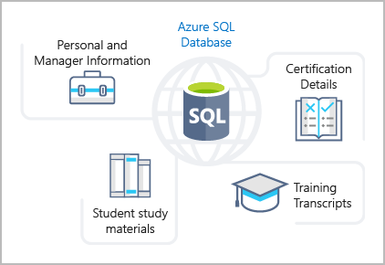

:::row:::
  :::column span="3":::
Azure SQL Database is a relational database based on the latest stable version of the Microsoft SQL Server database engine. SQL Database is a high-performance, reliable, fully managed, and secure database. You can use it to build data-driven applications and websites in the programming language of your choice, without needing to manage infrastructure.
  :::column-end:::
  :::column:::
    :::image type="icon" source="../media/icon-service-SQL-Database.png" border="false":::
  :::column-end:::
:::row-end:::

## Features

Azure SQL Database is a platform as a service (PaaS) database engine. It handles most of the database management functions, such as upgrading, patching, backups, and monitoring, without user involvement. SQL Database provides 99.99 percent availability. PaaS capabilities that are built into SQL Database enable you to focus on the domain-specific database administration and optimization activities that are critical for your business. SQL Database is a fully managed service that has built-in high availability, backups, and other common maintenance operations. Microsoft handles all updates to the SQL and operating system code. You don't have to manage the underlying infrastructure.

You can create a highly available and high-performance data storage layer for the applications and solutions in Azure. SQL Database can be the right choice for a variety of modern cloud applications because it enables you to process both relational data and non-relational structures, such as graphs, JSON, spatial, and XML.

You can use advanced query processing features, such as high-performance, in-memory technologies and intelligent query processing. In fact, the newest capabilities of SQL Server are released first to SQL Database, and then to SQL Server itself. You get the newest SQL Server capabilities, with no overhead for updates or upgrades, tested across millions of databases.

## Migration

Tailwind Traders currently uses several on-premises servers running SQL Server, which provide data storage for your public-facing website (for example, customer data, order history, and product catalogs). In addition, your on-premises servers running SQL Server also provide data storage for your internal-only training portal website. Tailwind Traders uses the website for new employee training materials (such as study materials, certification details, and training transcripts). The following illustration shows the types of data that your company might store in the Azure SQL Database training portal website.

You can migrate your existing SQL Server databases with minimal downtime by using the Azure Database Migration Service. The Microsoft Data Migration Assistant can generate assessment reports that provide recommendations to help guide you through required changes prior to performing a migration. After you assess and resolve any remediation required, you're ready to begin the migration process. The Azure Database Migration Service performs all of the required steps. You just change the connection string in your apps.
